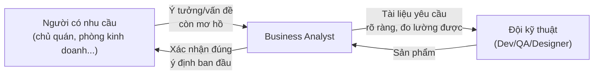

# Chương 1: BA là ai, làm gì? Vai trò cầu nối giữa nghiệp vụ và kỹ thuật

## Mục tiêu học

- Giải thích được BA (Business Analyst) là ai, làm công việc gì trong một dự án phần mềm — bằng
  ví dụ cụ thể, không phải định nghĩa hàn lâm.
- Phân biệt được BA với các vai trò dễ nhầm: PM (Project Manager), PO (Product Owner), BSA
  (Business System Analyst), Data Analyst.
- Hiểu vì sao BA tồn tại: vấn đề gì xảy ra nếu một dự án phần mềm **không có** BA.
- Làm quen với case study xuyên suốt cả cuốn sách: dự án "FoodNow".

## 1.1 Vấn đề mà BA giải quyết

Hãy tưởng tượng một tình huống rất thật: Giám đốc kinh doanh của một chuỗi nhà hàng nói với đội
kỹ thuật: *"Tôi muốn có một app để khách đặt đồ ăn online."* Chỉ với một câu đó, đội Dev bắt tay
vào code luôn thì gần như chắc chắn sẽ làm sai — vì câu nói đó **thiếu quá nhiều thông tin**:

- Khách đặt đồ ăn để **giao tận nơi**, hay chỉ để **đặt trước rồi đến lấy** tại quán?
- Thanh toán online hay chỉ nhận tiền mặt khi giao?
- Một nhà hàng hay áp dụng cho toàn bộ chuỗi nhiều chi nhánh?
- "Thành công" của app này được đo bằng gì — tăng doanh thu? Giảm thời gian chờ? Giảm nhân viên
  trực điện thoại nhận order?

Nếu Dev tự đoán rồi code, khả năng cao sẽ ra một sản phẩm **đúng theo hiểu của Dev, sai theo ý
định thật của người đưa ra yêu cầu** — và phát hiện ra điều đó sau khi đã tốn vài tháng code là
quá muộn, quá tốn kém để sửa.

**Business Analyst (BA)** là người đứng giữa, có nhiệm vụ:

1. Hỏi đúng câu hỏi để làm rõ **vấn đề nghiệp vụ thật sự** đằng sau một yêu cầu mơ hồ.
2. Chuyển hoá câu trả lời thành **tài liệu yêu cầu** mà cả người làm nghiệp vụ (đọc hiểu được) lẫn
   đội kỹ thuật (đủ chi tiết để code đúng) đều dùng chung được.
3. Theo sát suốt quá trình xây dựng để đảm bảo sản phẩm cuối cùng **giải quyết đúng vấn đề ban đầu**
   — không chỉ "chạy được" mà còn "đúng cái người ta cần".

Nói ngắn gọn: **BA không viết code, không thiết kế giao diện, không quản lý deadline** — việc của
BA là đảm bảo **cả đội hiểu đúng và hiểu giống nhau** về việc cần làm, trước và trong suốt quá
trình làm.

## 1.2 Một ngày làm việc điển hình của BA

Tuỳ công ty và giai đoạn dự án, nhưng thường xoay quanh:

- Họp với người dùng/khách hàng (stakeholder) để hỏi và làm rõ yêu cầu.
- Viết hoặc cập nhật tài liệu: user story, use case, sơ đồ quy trình nghiệp vụ.
- Làm việc với Dev để giải thích yêu cầu, trả lời câu hỏi phát sinh khi code.
- Làm việc với QA để đảm bảo test case bao phủ đúng ý định nghiệp vụ, không chỉ đúng theo mô tả kỹ thuật.
- Tham gia demo/nghiệm thu, xác nhận tính năng làm ra đúng như mong đợi.
- Theo dõi số liệu sau khi tính năng lên production, xem có đạt mục tiêu nghiệp vụ đề ra không.

Bạn sẽ thấy BA xuất hiện ở **mọi giai đoạn** trong vòng đời dự án (Chương 2 sẽ nói kỹ về SDLC) —
không chỉ ở đầu dự án lúc "thu thập yêu cầu" như nhiều người lầm tưởng.

## 1.3 Phân biệt BA với các vai trò dễ nhầm

| Vai trò | Trọng tâm công việc | Khác BA ở điểm nào |
|---|---|---|
| **Project Manager (PM)** | Quản lý tiến độ, ngân sách, rủi ro, nhân sự dự án | PM quan tâm "làm đúng hạn, đúng ngân sách"; BA quan tâm "làm đúng cái cần làm" |
| **Product Owner (PO)** | Đại diện chủ sản phẩm, quyết định ưu tiên trong backlog (thường trong Scrum) | PO có **quyền quyết định** ưu tiên/đánh đổi; BA **phân tích và đề xuất**, thường không phải người quyết cuối cùng. Ở nhiều công ty nhỏ, một người kiêm cả hai vai trò |
| **Business System Analyst (BSA)** | Thiên về phân tích hệ thống kỹ thuật đang có, thiết kế giải pháp tích hợp | BSA cần hiểu sâu kiến trúc hệ thống hơn; BA thuần thiên về nghiệp vụ hơn. Ranh giới này khác nhau tuỳ công ty |
| **Data Analyst** | Phân tích số liệu, xây dashboard, tìm insight từ dữ liệu có sẵn | Data Analyst làm việc với dữ liệu đã có; BA làm việc với **yêu cầu về hệ thống/sản phẩm** chưa tồn tại |

> Trong thực tế, ranh giới giữa các vai trò này khá mờ và khác nhau giữa các công ty — công ty nhỏ
> thường gộp BA + PO, thậm chí BA + PM làm một người. Sách này tập trung vào **bản chất công việc**
> của BA, để bạn áp dụng được dù chức danh thực tế ở công ty bạn có gọi khác đi.

## 1.4 Case study xuyên suốt: dự án "FoodNow"

Để mọi khái niệm trong sách không chỉ là lý thuyết suông, từ chương này trở đi chúng ta sẽ theo
sát **một dự án giả định duy nhất**, dùng lại xuyên suốt 40 chương và toàn bộ mẫu tài liệu ở phần
Phụ lục:

> **Bối cảnh dự án FoodNow**: Chuỗi nhà hàng "FoodNow" có 12 chi nhánh tại TP.HCM, hiện nhận đặt
> hàng qua điện thoại và các app giao đồ ăn bên thứ ba (mất 20-25% phí hoa hồng mỗi đơn). Ban giám
> đốc quyết định xây dựng **app đặt đồ ăn riêng của FoodNow** để: (1) giảm phụ thuộc vào app bên
> thứ ba, (2) xây dựng dữ liệu khách hàng riêng để làm chương trình khách hàng thân thiết,
> (3) tăng biên lợi nhuận trên mỗi đơn hàng.

Bạn sẽ thấy dự án FoodNow xuất hiện lại trong ví dụ ở hầu hết các chương sau — từ lúc còn là một
câu nói mơ hồ của ban giám đốc (như ví dụ ở mục 1.1) cho đến khi có đầy đủ BRD, SRS, backlog,
delivery plan, và cả tài liệu sau go-live (Chương 40 và Phụ lục A-D).

## Bài tập

1. Nghĩ về một sản phẩm/app bạn dùng hằng ngày (ví dụ app ngân hàng, app giao đồ ăn). Thử liệt kê
   3 câu hỏi mà bạn nghĩ một BA đã phải hỏi trước khi đội kỹ thuật bắt tay code tính năng đó.
2. Với bối cảnh dự án FoodNow ở mục 1.4, viết ra 5 câu hỏi bạn sẽ hỏi ban giám đốc FoodNow trước
   khi bắt đầu phân tích sâu hơn (gợi ý: ai dùng app, dùng để làm gì, đo thành công bằng gì...).

## Sai lầm thường gặp

- **Nhầm BA là người "ghi chép lại yêu cầu"**: BA không chỉ chép lại nguyên văn điều stakeholder
  nói — việc quan trọng hơn là **phát hiện ra điều họ chưa nói nhưng cần thiết**, và phát hiện mâu
  thuẫn giữa lời nói của các stakeholder khác nhau.
- **Nghĩ BA chỉ làm việc ở đầu dự án**: nhiều BA mới vào nghề nghĩ xong "giai đoạn thu thập yêu
  cầu" là hết việc — thực tế BA cần theo sát đến tận sau khi sản phẩm lên production (xem Chương 2).
- **Tự ý quyết định thay vì xác nhận lại với stakeholder**: khi gặp yêu cầu mơ hồ, BA mới thường tự
  suy đoán ý người dùng để "cho nhanh" thay vì hỏi lại — dễ dẫn tới sai lệch được phát hiện quá trễ.

## Tóm tắt & tiếp theo

BA là người đảm bảo cả đội — từ người có ý tưởng đến người code — hiểu đúng và hiểu giống nhau về
vấn đề cần giải quyết, xuyên suốt vòng đời dự án chứ không chỉ ở bước đầu. Chương 2 sẽ đặt công
việc của BA vào bức tranh lớn hơn: vòng đời phát triển phần mềm (SDLC) — để thấy rõ BA xuất hiện ở
giai đoạn nào, làm gì ở mỗi giai đoạn.
