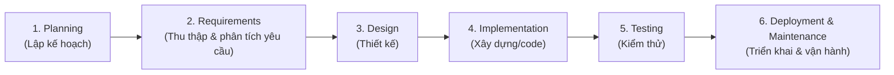
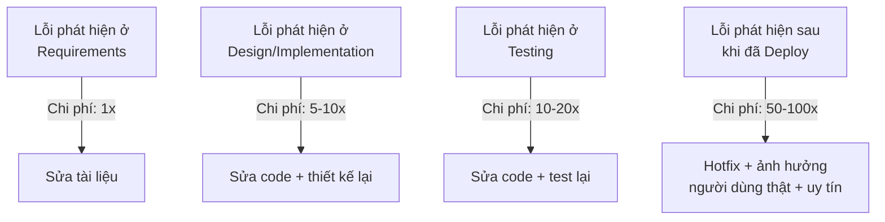

# Chương 2: Tổng quan SDLC: các giai đoạn, vì sao dự án phần mềm cần quy trình

## Mục tiêu học

- Gọi tên và giải thích được các giai đoạn chuẩn của SDLC (Software Development Life Cycle).
- Hiểu vì sao dự án phần mềm cần một quy trình có cấu trúc, thay vì "nghĩ gì làm nấy".
- Xác định được BA tham gia vào giai đoạn nào của SDLC, và đóng góp gì ở từng giai đoạn.
- Phân biệt được "mô hình SDLC" (Waterfall, Agile...) với "các giai đoạn SDLC" — hai khái niệm
  hay bị nhầm là một.

## 2.1 SDLC là gì?

**SDLC (Software Development Life Cycle — Vòng đời phát triển phần mềm)** là tập hợp các giai
đoạn mà một sản phẩm phần mềm phải trải qua, từ lúc còn là một ý tưởng/vấn đề cần giải quyết, đến
lúc phần mềm được xây dựng, kiểm thử, triển khai, vận hành, và cuối cùng có thể bị thay thế/ngừng
sử dụng.

Có 6 giai đoạn kinh điển, gần như mọi mô hình phát triển phần mềm (Waterfall, Agile, Scrum...) đều
là một cách **sắp xếp lại thứ tự và tần suất lặp lại** của 6 giai đoạn này — không mô hình nào bỏ
hẳn một giai đoạn:

| Giai đoạn | Câu hỏi chính | Ai chủ trì | BA làm gì |
|---|---|---|---|
| 1. Planning | Vấn đề nghiệp vụ là gì? Có đáng đầu tư không? | Ban lãnh đạo, PM | Hỗ trợ phân tích sơ bộ, ước tính giá trị nghiệp vụ, viết Business Case |
| 2. Requirements | Cần xây cái gì, cho ai, để làm gì? | **BA** | Chủ trì elicitation, viết BRD/PRD/SRS (Chương 12-24) |
| 3. Design | Xây như thế nào (kiến trúc, giao diện, dữ liệu)? | Kiến trúc sư, Designer, Dev lead | Giải thích yêu cầu, phản hồi thiết kế có đúng ý nghiệp vụ không |
| 4. Implementation | Code | Dev | Trả lời câu hỏi phát sinh, làm rõ yêu cầu chưa rõ khi code |
| 5. Testing | Có đúng yêu cầu không? Có lỗi không? | QA | Viết/duyệt test case dựa trên acceptance criteria, tham gia UAT (Chương 34) |
| 6. Deployment & Maintenance | Vận hành có ổn không? Có đạt mục tiêu nghiệp vụ không? | DevOps/Ops, PM | Theo dõi KPI sau go-live, thu thập feedback, đề xuất cải tiến (Chương 36) |

Điểm mấu chốt: **BA xuất hiện xuyên suốt cả 6 giai đoạn**, không chỉ ở giai đoạn 2. Đây là lý do
Chương 1 nói BA không phải "người ghi chép yêu cầu lúc đầu dự án rồi thôi".

## 2.2 Vì sao cần quy trình, không "nghĩ gì làm nấy"?

Không có SDLC, một dự án phần mềm thường gặp các vấn đề sau — tất cả đều có thể minh hoạ bằng dự
án FoodNow (Chương 1):

- **Xây sai thứ cần xây**: Dev code app đặt hàng nhưng không có tính năng thanh toán online vì
  không ai hỏi rõ ràng từ đầu — đến lúc demo mới phát hiện, phải làm lại.
- **Chi phí sửa lỗi tăng theo cấp số nhân**: một yêu cầu hiểu sai được phát hiện ở giai đoạn
  Requirements chỉ tốn vài giờ viết lại tài liệu; phát hiện ở giai đoạn Testing tốn vài ngày sửa
  code; phát hiện **sau khi đã lên production** có thể tốn hàng tuần và ảnh hưởng uy tín thương hiệu.
- **Không ai chịu trách nhiệm rõ ràng**: khi có vấn đề, không biết lỗi ở khâu nào — thu thập yêu
  cầu sai, thiết kế sai, hay code sai.
- **Không đo lường được tiến độ thực sự**: "sắp xong rồi" là một câu vô nghĩa nếu không có các cột
  mốc rõ ràng gắn với từng giai đoạn.

> Con số 1x/5x/10x/50x ở trên là ước lượng tương đối mang tính minh hoạ (dựa trên nguyên lý "chi
> phí sửa lỗi tăng theo giai đoạn phát hiện" được nhắc nhiều trong tài liệu kỹ thuật phần mềm),
> không phải số liệu đo được cố định cho mọi dự án — điều quan trọng cần nhớ là **xu hướng tăng**,
> không phải con số chính xác.

Đây chính là lý do công việc của BA — làm rõ yêu cầu **càng sớm càng tốt, càng kỹ càng tốt** — có
giá trị kinh tế trực tiếp, không chỉ là "thủ tục giấy tờ".

## 2.3 SDLC không phải là "làm tuần tự từ trên xuống"

Một hiểu lầm phổ biến: nhiều người mới nghĩ SDLC nghĩa là làm xong hẳn giai đoạn 1 mới sang giai
đoạn 2, làm xong hẳn giai đoạn 2 mới sang giai đoạn 3... Đó là cách làm của **một mô hình cụ thể**
gọi là Waterfall (Chương 6) — không phải bản chất của SDLC.

Trong các mô hình Agile (Chương 7-10), 6 giai đoạn này vẫn tồn tại đầy đủ, nhưng được **lặp lại
nhiều lần** trong các chu kỳ ngắn (sprint) — mỗi sprint đều có một chút Requirements, Design,
Implementation, Testing cho một phần nhỏ sản phẩm. Phần 1 của sách (Chương 6-11) sẽ đi sâu vào
từng mô hình cụ thể.

## Bài tập

1. Với dự án FoodNow, liệt kê 1 rủi ro cụ thể có thể xảy ra nếu bỏ qua hẳn giai đoạn "Testing"
   trước khi phát hành app cho khách hàng dùng thật.
2. Giả sử đội Dev của FoodNow phát hiện ra tính năng "thanh toán online" chưa được làm rõ **ngay
   khi đang code** (giai đoạn Implementation) thay vì lúc thu thập yêu cầu. Theo sơ đồ chi phí ở
   mục 2.2, điều này có ý nghĩa gì về mặt chi phí so với phát hiện sớm hơn?

## Sai lầm thường gặp

- **Nhầm "SDLC" với "Waterfall"**: SDLC là khái niệm bao trùm (các giai đoạn phải trải qua),
  Waterfall chỉ là một trong nhiều cách sắp xếp các giai đoạn đó.
- **Nghĩ BA chỉ cần giỏi ở giai đoạn Requirements**: như bảng ở mục 2.1, BA có vai trò cụ thể ở
  mọi giai đoạn — bỏ qua Design/Testing/Maintenance là bỏ lỡ phần lớn giá trị BA có thể mang lại.
- **Coi nhẹ giai đoạn Maintenance**: nhiều BA mới chỉ tập trung "ra mắt được sản phẩm" mà quên
  rằng phần lớn vòng đời thực tế của một phần mềm nằm ở giai đoạn vận hành sau go-live.

## Tóm tắt & tiếp theo

SDLC gồm 6 giai đoạn cố định (Planning, Requirements, Design, Implementation, Testing, Deployment
& Maintenance) mà mọi dự án phần mềm đều trải qua dưới hình thức này hay hình thức khác — BA có
vai trò xuyên suốt cả 6 giai đoạn. Chương 3 sẽ mở rộng góc nhìn ra toàn bộ **hệ sinh thái con người**
trong một dự án phần mềm: BA cần phối hợp với những vai trò nào, ở đâu, khi nào.
