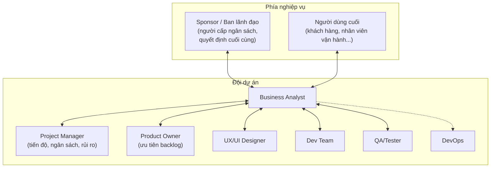

# Chương 3: Hệ sinh thái một dự án phần mềm: BA phối hợp với ai, khi nào

## Mục tiêu học

- Gọi tên được các vai trò chính trong một dự án phần mềm và trách nhiệm cốt lõi của từng vai trò.
- Biết BA cần trao đổi với vai trò nào ở giai đoạn nào, và trao đổi về nội dung gì.
- Phân biệt hai nhóm stakeholder: **nội bộ đội dự án** và **bên ngoài đội dự án** (khách hàng,
  người dùng cuối, đối tác, cơ quan quản lý...).
- Hiểu vì sao BA cần "nói được ngôn ngữ" của cả hai phía nghiệp vụ và kỹ thuật.

## 3.1 Sơ đồ tổng quan các vai trò

BA gần như là vai trò **giao tiếp với nhiều đầu mối nhất** trong một dự án — đây vừa là điểm thú
vị, vừa là thử thách lớn nhất của nghề: phải "nói được nhiều ngôn ngữ" khác nhau tuỳ người đang
trao đổi cùng.

## 3.2 Từng vai trò — trách nhiệm và điểm chạm với BA

### Sponsor / Ban lãnh đạo

Người cấp ngân sách, có quyền quyết định dự án có tiếp tục hay không. Trong ví dụ FoodNow, đây là
Ban giám đốc chuỗi nhà hàng. BA làm việc với Sponsor chủ yếu ở giai đoạn đầu (làm rõ mục tiêu
nghiệp vụ, Business Case — Chương 19) và cuối (báo cáo kết quả sau go-live — Chương 36).

**Nguyên tắc khi làm việc với Sponsor**: nói bằng ngôn ngữ **kết quả kinh doanh** (doanh thu, chi
phí, thời gian), không phải ngôn ngữ kỹ thuật. Sponsor không cần biết "API là gì", họ cần biết
"tính năng này giúp giảm bao nhiêu % chi phí hoa hồng cho app bên thứ ba".

### Người dùng cuối (End user)

Người thực sự dùng sản phẩm hằng ngày — trong FoodNow là khách đặt đồ ăn, và nhân viên nhà hàng
xử lý đơn hàng. Đây là nguồn thông tin **quan trọng nhất nhưng dễ bị bỏ qua nhất** — nhiều dự án
chỉ hỏi ý kiến Sponsor mà quên hỏi người dùng cuối, dẫn đến sản phẩm "đúng ý sếp, sai ý người dùng".

### Project Manager (PM)

PM quan tâm: dự án có đúng tiến độ, đúng ngân sách, rủi ro được kiểm soát không. BA cung cấp cho
PM: ước lượng độ phức tạp của yêu cầu (để PM lập kế hoạch), cảnh báo sớm khi phát hiện yêu cầu mới
phát sinh có thể ảnh hưởng tiến độ (liên quan Change Request — Chương 18).

### Product Owner (PO)

Ở các đội theo Scrum, PO là người quyết định thứ tự ưu tiên trong backlog. BA hỗ trợ PO bằng cách
phân tích và làm rõ yêu cầu **trước khi** đưa vào backlog để PO ưu tiên — gọi là "backlog
refinement" (Chương 27). Ở nhiều công ty vừa và nhỏ, một người kiêm cả BA và PO.

### UX/UI Designer

Designer biến yêu cầu thành giao diện. BA cần giải thích rõ **luồng nghiệp vụ** (business flow)
đằng sau mỗi màn hình để Designer thiết kế đúng — ví dụ: màn hình "chọn món" của FoodNow cần biết
rõ có bao nhiêu bước trước khi thanh toán, có cho phép sửa đơn sau khi đặt không.

### Dev Team

Đội kỹ thuật hiện thực hoá yêu cầu thành sản phẩm. BA là người mà Dev hỏi lại khi gặp trường hợp
tài liệu chưa mô tả rõ (ví dụ: "Nếu khách huỷ đơn sau khi nhà hàng đã bắt đầu nấu thì xử lý sao?").
BA cần **có mặt và phản hồi nhanh** trong suốt giai đoạn Implementation, không chỉ bàn giao tài
liệu rồi biến mất.

### QA/Tester

QA viết test case để kiểm tra sản phẩm có đúng yêu cầu không. BA hỗ trợ QA bằng **Acceptance
Criteria** rõ ràng (Chương 23) và tham gia UAT (Chương 34) để xác nhận kết quả test đúng phản ánh
ý định nghiệp vụ ban đầu — không chỉ đúng theo mô tả kỹ thuật khô cứng.

### DevOps

Ít trao đổi trực tiếp với BA hơn các vai trò khác, nhưng BA cần biết kế hoạch triển khai (deploy
theo giai đoạn, có rollback không) để tư vấn đúng cho Sponsor về rủi ro và mốc thời gian ra mắt
(liên quan Chương 28-29 về Incremental Delivery).

## 3.3 Vì sao BA cần "song ngữ" nghiệp vụ — kỹ thuật

Cùng một thông tin, BA cần diễn đạt khác nhau tuỳ người nghe:

| Thông tin gốc | Nói với Sponsor | Nói với Dev |
|---|---|---|
| Khách hàng cần theo dõi trạng thái đơn hàng real-time | "Giảm số cuộc gọi hỏi 'đơn tôi tới đâu rồi', tăng trải nghiệm khách hàng" | "Cần cơ chế push notification hoặc polling để cập nhật trạng thái đơn hàng, cập nhật tối thiểu 4 trạng thái: đã nhận, đang chuẩn bị, đang giao, đã giao" |

Khả năng "dịch" hai chiều này chính là giá trị cốt lõi của BA — không phải kỹ năng viết tài liệu
đẹp, mà là khả năng đảm bảo **thông tin không bị méo** khi đi từ đầu này sang đầu kia.

## Bài tập

1. Với dự án FoodNow, liệt kê 3 stakeholder cụ thể (có thể đặt tên chức danh giả định) mà bạn sẽ
   cần phỏng vấn trước khi viết tài liệu yêu cầu đầu tiên.
2. Chọn một yêu cầu bất kỳ của FoodNow (ví dụ: "khách có thể đặt lại đơn hàng cũ chỉ với 1 chạm"),
   viết hai phiên bản diễn đạt: một cho Sponsor, một cho Dev, theo mẫu ở bảng mục 3.3.

## Sai lầm thường gặp

- **Chỉ làm việc với 1-2 stakeholder quen thuộc**: dễ bỏ sót góc nhìn của các vai trò khác — ví dụ
  chỉ hỏi Sponsor mà quên hỏi nhân viên vận hành thực tế sẽ dùng hệ thống hằng ngày.
- **Dùng thuật ngữ kỹ thuật khi nói với người nghiệp vụ (hoặc ngược lại)**: gây hiểu lầm hoặc làm
  người nghe cảm thấy bị bỏ rơi khỏi cuộc trò chuyện.
- **Coi PM và PO như nhau**: ở công ty có tách bạch hai vai trò, nhầm lẫn trách nhiệm dễ dẫn đến
  BA báo cáo sai người, sai thời điểm.

## Tóm tắt & tiếp theo

BA là vai trò kết nối nhiều đầu mối nhất trong dự án — từ Sponsor, người dùng cuối, đến PM, PO,
Designer, Dev, QA, DevOps — và cần điều chỉnh cách diễn đạt phù hợp với từng đối tượng. Chương 4
sẽ nhìn xa hơn: nếu bạn muốn theo nghề BA lâu dài, lộ trình phát triển sự nghiệp trông như thế nào,
cần học gì, thi chứng chỉ nào.
