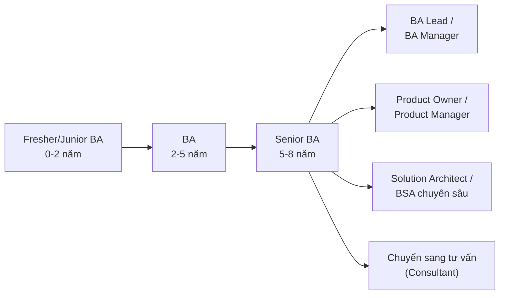

# Chương 4: Định hướng nghề nghiệp BA: lộ trình, chứng chỉ IIBA/CBAP, CCBA, PMI-PBA

## Mục tiêu học

- Hình dung được lộ trình phát triển sự nghiệp BA từ mới vào nghề đến cấp cao.
- Biết các chứng chỉ phổ biến trong nghề BA, chứng chỉ nào phù hợp ở giai đoạn nào.
- Biết BA có thể rẽ nhánh sang những vai trò nào khi đã có kinh nghiệm.
- Tự đánh giá được mình đang ở đâu trên lộ trình, và bước tiếp theo cần chuẩn bị gì.

## 4.1 Lộ trình sự nghiệp điển hình

Không có một con đường "đúng duy nhất" — BA là nghề có nhiều điểm rẽ nhánh vì kỹ năng cốt lõi
(phân tích, giao tiếp, hiểu nghiệp vụ) chuyển hoá tốt sang nhiều vai trò khác.

### Fresher/Junior BA (0-2 năm)

Công việc chủ yếu: hỗ trợ BA senior thu thập yêu cầu, viết user story dưới sự hướng dẫn, tham gia
họp ghi chép (meeting minutes), làm quen công cụ (Jira, Confluence). Trọng tâm học: nắm vững các
kỹ thuật elicitation (Chương 12), cách viết tài liệu chuẩn (Chương 19-24), và **học lắng nghe** —
kỹ năng bị đánh giá thấp nhưng quan trọng nhất ở giai đoạn này.

### BA (2-5 năm)

Có thể tự chủ trì thu thập yêu cầu cho một module/tính năng, tự viết BRD/SRS mà không cần review
sát sao. Bắt đầu tham gia sâu vào ước lượng (Chương 30), quản lý thay đổi yêu cầu (Chương 18).
Đây là giai đoạn nên cân nhắc học sâu một domain cụ thể (Banking, E-commerce... — Chương 39) để
tạo lợi thế cạnh tranh.

### Senior BA (5-8 năm)

Chủ trì toàn bộ dự án về mặt yêu cầu, tư vấn ngược lại cho Sponsor về tính khả thi/rủi ro nghiệp
vụ, mentor BA junior. Bắt đầu cần kỹ năng lãnh đạo không chính thức (influence without authority)
vì thường không có quyền quản lý trực tiếp nhưng vẫn cần điều phối nhiều bên.

### Các hướng rẽ sau Senior BA

- **BA Lead/Manager**: quản lý một đội BA, phân bổ người vào các dự án, chuẩn hoá quy trình BA
  trong tổ chức.
- **Product Owner/Product Manager**: dịch chuyển từ "phân tích yêu cầu" sang "quyết định sản phẩm"
  — cần thêm tư duy về chiến lược sản phẩm, thị trường, không chỉ phân tích yêu cầu đơn thuần.
- **Solution Architect/BSA chuyên sâu**: đi sâu hơn vào khía cạnh kỹ thuật, thiết kế giải pháp tích
  hợp hệ thống — phù hợp với BA có nền tảng kỹ thuật tốt.
- **Tư vấn (Consultant)**: làm việc độc lập hoặc tại công ty tư vấn, mang kinh nghiệm domain đi
  làm nhiều dự án khác nhau thay vì gắn với một sản phẩm/công ty.

## 4.2 Các chứng chỉ phổ biến

| Chứng chỉ | Tổ chức cấp | Phù hợp giai đoạn | Đặc điểm |
|---|---|---|---|
| **ECBA** (Entry Certificate in Business Analysis) | IIBA | Mới vào nghề, chưa có/ít kinh nghiệm | Không yêu cầu kinh nghiệm làm việc, kiểm tra kiến thức nền tảng theo BABOK |
| **CCBA** (Certification of Competency in Business Analysis) | IIBA | 2-3 năm kinh nghiệm | Yêu cầu một số giờ kinh nghiệm thực tế theo BABOK, mức trung cấp |
| **CBAP** (Certified Business Analysis Professional) | IIBA | 5+ năm kinh nghiệm | Chứng chỉ được công nhận rộng rãi nhất cho BA senior, yêu cầu nhiều giờ kinh nghiệm và giờ học liên tục (CDU) |
| **PMI-PBA** (Professional in Business Analysis) | PMI | Có kinh nghiệm, thường kết hợp làm việc gần PM | Nhấn mạnh liên kết giữa business analysis và project management |

> **BABOK (Business Analysis Body of Knowledge)** là tài liệu nền tảng của IIBA, tổng hợp các kỹ
> thuật và khái niệm chuẩn cho nghề BA — nhiều khái niệm trong sách này (elicitation, requirements
> classification, traceability...) bắt nguồn từ BABOK, dù được trình bày lại theo cách thực chiến
> hơn, ít hàn lâm hơn.

**Chứng chỉ có cần thiết không?** Không bắt buộc để làm nghề BA — nhiều BA giỏi không có chứng chỉ
nào. Giá trị của chứng chỉ nằm ở: (1) hệ thống hoá kiến thức nếu bạn tự học phân tán, (2) có lợi
khi ứng tuyển ở công ty nước ngoài/tập đoàn lớn coi trọng bằng cấp, (3) là mốc để tự đánh giá quá
trình học. Kinh nghiệm thực chiến và khả năng tạo ra tài liệu/kết quả thật vẫn là yếu tố quyết định
nhất.

## 4.3 Tự đánh giá vị trí hiện tại

Dùng bảng sau để tự chấm điểm (1 = chưa làm được, 5 = thành thạo) sau khi hoàn thành cuốn sách này:

| Kỹ năng | Chương liên quan | Tự đánh giá (1-5) |
|---|---|---|
| Thu thập yêu cầu (elicitation) | 12 | |
| Viết BRD/PRD/SRS | 19-21 | |
| Viết User Story/Use Case | 22-24 | |
| Quản lý backlog, ước lượng | 26, 30 | |
| Giao tiếp với stakeholder cấp cao | 32 | |
| Điều phối workshop | 33 | |
| Hiểu ít nhất 1 domain nghiệp vụ | 39 | |

Quay lại bảng này sau khi đọc xong sách (Chương 40) để thấy sự tiến bộ, và biết chương nào cần đọc
lại/thực hành thêm.

## Bài tập

1. Tự chấm điểm bảng ở mục 4.3 **ngay bây giờ, trước khi đọc các chương sau** — dùng làm mốc so
   sánh sau này.
2. Tìm hiểu xem công ty (hoặc công ty bạn muốn ứng tuyển) có yêu cầu/khuyến khích chứng chỉ BA nào
   không. Nếu có, ghi chú lại yêu cầu kinh nghiệm tối thiểu để thi chứng chỉ đó.

## Sai lầm thường gặp

- **Chờ có chứng chỉ mới dám nhận việc BA**: kinh nghiệm thực tế (kể cả từ dự án cá nhân, dự án
  tình nguyện) giá trị hơn nhiều so với chỉ có chứng chỉ mà chưa thực hành.
- **Không đầu tư vào domain knowledge**: BA giỏi kỹ thuật phân tích nhưng không hiểu ngành (banking,
  bán lẻ...) thường bị giới hạn ở các dự án đơn giản — xem thêm Chương 39.
- **Nghĩ BA là nghề "an toàn, không cần học thêm"**: công cụ, phương pháp luận (Agile, AI hỗ trợ
  phân tích...) thay đổi liên tục — BA cần cập nhật liên tục như mọi nghề khác trong ngành IT.

## Tóm tắt & tiếp theo

Nghề BA có lộ trình rõ ràng từ Junior đến Senior, với nhiều hướng rẽ (Lead, PO, Architect, Tư vấn)
và một số chứng chỉ hỗ trợ (ECBA/CCBA/CBAP từ IIBA, PMI-PBA từ PMI) — không bắt buộc nhưng hữu ích.
Chương 5 sẽ đi vào chi tiết bộ kỹ năng và công cụ cụ thể mà một BA cần trang bị để làm việc hiệu quả
từ ngày đầu tiên.
