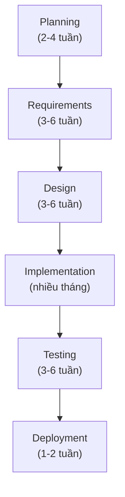

# Chương 6: Waterfall: đặc điểm, các giai đoạn tuần tự, ưu/nhược điểm

## Mục tiêu học

- Mô tả được đặc điểm cốt lõi của mô hình Waterfall.
- Vẽ và giải thích được sơ đồ các giai đoạn Waterfall áp dụng cho một dự án cụ thể.
- Liệt kê ưu và nhược điểm của Waterfall, và biết trong tình huống nào Waterfall vẫn là lựa chọn
  hợp lý — không phải mô hình "lỗi thời" như nhiều tài liệu Agile vẫn ngầm ám chỉ.

## 6.1 Waterfall là gì?

**Waterfall** (mô hình thác nước) áp dụng đúng 6 giai đoạn SDLC (Chương 2) theo thứ tự **tuần
tự, hoàn thành hẳn giai đoạn trước mới sang giai đoạn sau**, giống nước chảy từ bậc thang cao
xuống thấp — không chảy ngược lại.

Đặc điểm cốt lõi: **tài liệu yêu cầu (SRS — Chương 20) được "chốt" (sign-off) trước khi bắt đầu
Design**, và Design được chốt trước khi bắt đầu code. Mọi thay đổi sau khi chốt phải đi qua quy
trình Change Request chính thức (Chương 18) — thường tốn thời gian và cần phê duyệt lại từ Sponsor.

## 6.2 Ví dụ Waterfall áp dụng cho FoodNow

Nếu FoodNow chọn làm theo Waterfall:

1. **Planning**: Ban giám đốc phê duyệt ngân sách và mục tiêu tổng thể (giảm phụ thuộc app bên thứ
   ba, xây dữ liệu khách hàng riêng).
2. **Requirements**: BA phỏng vấn toàn bộ stakeholder (ban giám đốc, quản lý chi nhánh, nhân viên
   giao hàng), viết BRD và SRS đầy đủ cho **toàn bộ phạm vi app** (đặt hàng, thanh toán, theo dõi
   đơn, chương trình khách hàng thân thiết) — tài liệu này được review và **ký duyệt** trước khi
   sang bước tiếp theo.
3. **Design**: kiến trúc sư thiết kế toàn bộ hệ thống, Designer thiết kế toàn bộ giao diện dựa trên
   SRS đã chốt.
4. **Implementation**: Dev code toàn bộ tính năng trong nhiều tháng, không có tính năng nào ra mắt
   cho người dùng thật cho đến khi xong hết.
5. **Testing**: QA kiểm thử toàn bộ hệ thống một lượt.
6. **Deployment**: ra mắt app hoàn chỉnh một lần duy nhất.

Điểm quan trọng: nếu ở tháng thứ 4 (đang Implementation), ban giám đốc **đổi ý** muốn thêm tính
năng đặt bàn tại quán (một nhu cầu không có trong SRS ban đầu) — yêu cầu này phải qua Change
Request, có thể làm trễ toàn bộ tiến độ vì nhiều phần thiết kế/code đã dựa trên phạm vi cũ.

## 6.3 Ưu điểm

- **Rõ ràng, dễ lập kế hoạch và ước tính ngân sách** trước khi bắt đầu — phù hợp khi cần cam kết
  ngân sách/thời gian cố định với khách hàng (hợp đồng fixed-price).
- **Tài liệu hoá đầy đủ**: hữu ích cho các ngành yêu cầu tuân thủ quy định nghiêm ngặt (Banking,
  Y tế, Hàng không) — cần hồ sơ đầy đủ cho kiểm toán/audit.
- **Phù hợp khi yêu cầu đã ổn định, ít khả năng thay đổi**: ví dụ dự án thay thế một hệ thống cũ
  bằng công nghệ mới nhưng nghiệp vụ giữ nguyên y hệt.
- **Dễ quản lý với đội phân tán nhiều nhà thầu phụ**: mỗi giai đoạn có bàn giao (deliverable) rõ
  ràng, dễ phân định trách nhiệm giữa các bên.

## 6.4 Nhược điểm

- **Phát hiện sai sót quá muộn**: như sơ đồ chi phí ở Chương 2, nếu SRS hiểu sai một yêu cầu quan
  trọng, phải đến giai đoạn Testing (sau nhiều tháng) mới phát hiện ra.
- **Không linh hoạt với thay đổi**: thị trường/nghiệp vụ thay đổi trong lúc dự án đang chạy (điều
  rất phổ biến với sản phẩm mới) sẽ khiến SRS "lỗi thời" trước khi kịp ra mắt.
- **Không có giá trị nghiệp vụ nào được tạo ra cho đến khi xong toàn bộ**: FoodNow phải chờ hết cả
  dự án (có thể 6-9 tháng) mới có bất kỳ tính năng nào dùng được, thay vì có thể ra mắt sớm tính
  năng đặt hàng cơ bản trước.
- **Áp lực lớn lên giai đoạn Requirements**: vì mọi thứ dựa trên SRS đã chốt, BA chịu áp lực phải
  "đúng ngay từ đầu" — điều gần như không tưởng với sản phẩm hoàn toàn mới, thị trường chưa rõ.

## 6.5 Khi nào Waterfall vẫn là lựa chọn hợp lý?

Trái với quan niệm phổ biến "Waterfall đã lỗi thời, Agile luôn tốt hơn", Waterfall vẫn phù hợp khi:

- Yêu cầu **đã rõ ràng và ổn định** (ví dụ: hệ thống thay thế phần mềm kế toán cũ bằng công nghệ
  mới, nghiệp vụ kế toán không đổi).
- Hợp đồng dạng **fixed-price, fixed-scope** với bên thứ ba — cần cam kết phạm vi/chi phí rõ ràng
  ngay từ đầu.
- Ngành có **yêu cầu tuân thủ pháp lý nghiêm ngặt** đòi hỏi tài liệu hoá đầy đủ trước khi triển
  khai (một số hệ thống trong ngành tài chính, dược phẩm, hàng không).
- Dự án **quy mô nhỏ, rủi ro thấp**, không cần lặp lại nhiều vòng phản hồi.

Chương 10 sẽ có bảng so sánh đầy đủ hơn giữa Waterfall và các mô hình Agile để giúp bạn (hoặc đội
dự án) chọn mô hình phù hợp cho từng tình huống cụ thể.

## Bài tập

1. Với dự án FoodNow, giả sử ban giám đốc yêu cầu cam kết ngân sách và thời gian cố định trước khi
   ký hợp đồng với đội phát triển thuê ngoài. Waterfall có phù hợp trong tình huống này không? Giải
   thích bằng 2 lý do dựa trên mục 6.5.
2. Liệt kê 2 rủi ro cụ thể nếu FoodNow chọn Waterfall nhưng thị trường giao đồ ăn thay đổi nhanh
   (đối thủ ra tính năng mới) trong lúc dự án đang ở giai đoạn Implementation.

## Sai lầm thường gặp

- **Coi Waterfall là "làm không có kế hoạch gì thêm sau khi ký SRS"**: Waterfall vẫn cần quy trình
  Change Request để xử lý thay đổi phát sinh — không phải "đóng băng hoàn toàn" mà là "thay đổi có
  kiểm soát, có phê duyệt" (Chương 18).
- **Áp dụng Waterfall cho sản phẩm hoàn toàn mới, thị trường chưa rõ**: rủi ro rất cao vì không có
  cơ chế học hỏi và điều chỉnh sớm — nên cân nhắc Agile (Chương 7) trong tình huống này.
- **Nghĩ BA hết việc sau khi SRS được ký**: BA vẫn cần theo sát Design/Implementation/Testing để xử
  lý các câu hỏi làm rõ phát sinh, dù phạm vi đã chốt.

## Tóm tắt & tiếp theo

Waterfall làm tuần tự, hoàn thành hẳn từng giai đoạn SDLC trước khi sang giai đoạn tiếp theo — rõ
ràng, dễ lập kế hoạch, nhưng phát hiện sai sót muộn và kém linh hoạt. Phù hợp khi yêu cầu ổn định
hoặc cần cam kết phạm vi/chi phí cố định. Chương 7 sẽ giới thiệu triết lý hoàn toàn khác: Agile —
ra đời chính là để giải quyết những nhược điểm của Waterfall.
