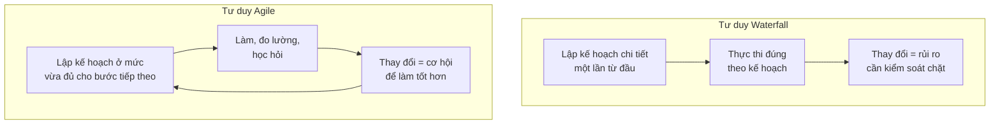

# Chương 7: Agile: Agile Manifesto, 12 nguyên tắc, tư duy Agile khác Waterfall ở đâu

## Mục tiêu học

- Trình bày được 4 giá trị cốt lõi của Agile Manifesto và ý nghĩa thực tế của từng giá trị.
- Giải thích được Agile **không phải là một quy trình cụ thể** mà là một tư duy/triết lý —
  Scrum, Kanban, XP (Chương 8-10) là các **framework cụ thể hoá** tư duy đó.
- So sánh được sự khác biệt gốc rễ giữa tư duy Agile và tư duy Waterfall.

## 7.1 Bối cảnh ra đời

Năm 2001, 17 chuyên gia phần mềm (đại diện nhiều phương pháp nhẹ khác nhau như Scrum, XP,
Crystal...) họp lại và ký bản **Agile Manifesto** — không phải để tạo ra một quy trình mới, mà để
phát biểu chung một **hệ giá trị** mà họ nhận thấy tạo ra phần mềm tốt hơn cách làm Waterfall
truyền thống, vốn đang gây nhiều thất bại dự án vào thời điểm đó.

## 7.2 Bốn giá trị cốt lõi

> Chúng tôi đánh giá cao:
> - **Cá nhân và sự tương tác** hơn là quy trình và công cụ
> - **Phần mềm chạy được** hơn là tài liệu đầy đủ
> - **Hợp tác với khách hàng** hơn là đàm phán hợp đồng
> - **Phản hồi với thay đổi** hơn là bám sát kế hoạch
>
> Mặc dù các giá trị bên phải vẫn có ý nghĩa, chúng tôi đánh giá cao hơn các giá trị bên trái.

Điểm quan trọng thường bị hiểu sai: **"hơn là" không có nghĩa là "bỏ hẳn"**. Agile vẫn cần tài
liệu, vẫn cần quy trình, vẫn cần hợp đồng — chỉ là khi phải đánh đổi, ưu tiên vế bên trái. Đây là
lý do BA làm Agile **vẫn viết tài liệu** (Chương 19-24) — chỉ là tài liệu gọn hơn, tập trung vào
việc đủ dùng để đội hiểu và làm đúng, thay vì tài liệu hoá cho mục đích hồ sơ/kiểm toán.

| Giá trị | Ý nghĩa với công việc BA |
|---|---|
| Cá nhân & tương tác hơn quy trình & công cụ | BA nên ưu tiên trao đổi trực tiếp với Dev/stakeholder hơn là chỉ gửi tài liệu rồi chờ phản hồi qua email |
| Phần mềm chạy được hơn tài liệu đầy đủ | BA viết User Story đủ để Dev làm đúng (Chương 23), không cần SRS 100 trang cho mọi tính năng nhỏ |
| Hợp tác với khách hàng hơn đàm phán hợp đồng | BA khuyến khích Sponsor/người dùng tham gia liên tục (demo mỗi sprint), không chỉ ký duyệt một lần rồi biến mất |
| Phản hồi với thay đổi hơn bám sát kế hoạch | BA xem yêu cầu thay đổi giữa dự án là **bình thường, thậm chí tốt** (nghĩa là đang học được điều mới), không phải sự cố cần né tránh |

## 7.3 12 nguyên tắc (tóm tắt theo nhóm)

Agile Manifesto đi kèm 12 nguyên tắc chi tiết hơn — nhóm lại theo chủ đề để dễ nhớ:

**Nhóm giao hàng liên tục & sớm:**
1. Ưu tiên cao nhất là làm hài lòng khách hàng qua việc giao phần mềm có giá trị **sớm và liên tục**.
2. Giao phần mềm chạy được thường xuyên, chu kỳ càng ngắn càng tốt (vài tuần thay vì vài tháng).

**Nhóm chào đón thay đổi:**
3. Chào đón thay đổi yêu cầu, kể cả ở giai đoạn muộn — Agile khai thác thay đổi để tạo lợi thế
   cạnh tranh cho khách hàng, thay vì coi đó là điều cần tránh.

**Nhóm con người & hợp tác:**
4. Người làm nghiệp vụ và Dev phải làm việc cùng nhau hằng ngày suốt dự án.
5. Xây dựng dự án quanh những cá nhân có động lực, tin tưởng họ hoàn thành công việc.
6. Cách truyền đạt thông tin hiệu quả nhất là trò chuyện trực tiếp (face-to-face).

**Nhóm đo lường & bền vững:**
7. Phần mềm chạy được là thước đo tiến độ chính.
8. Agile khuyến khích nhịp độ phát triển bền vững, duy trì được mãi mãi — không chạy nước rút kiệt sức.

**Nhóm kỹ thuật & đơn giản hoá:**
9. Liên tục chú ý đến kỹ thuật xuất sắc và thiết kế tốt (xem thêm XP — Chương 9).
10. Đơn giản — nghệ thuật tối đa hoá lượng công việc **không cần làm** — là căn bản.

**Nhóm tự tổ chức & cải tiến:**
11. Kiến trúc, yêu cầu, thiết kế tốt nhất đến từ đội **tự tổ chức**.
12. Đội thường xuyên suy ngẫm cách làm việc hiệu quả hơn, rồi điều chỉnh hành vi cho phù hợp
    (đây là gốc rễ của buổi Retrospective trong Scrum — Chương 8).

## 7.4 Agile khác Waterfall ở đâu, về bản chất?

Khác biệt gốc rễ nằm ở **niềm tin về việc có thể biết trước mọi thứ hay không**:

- Waterfall giả định: nếu phân tích đủ kỹ ở đầu dự án, có thể **biết trước gần như toàn bộ** yêu
  cầu — nên đầu tư mạnh vào lập kế hoạch/phân tích chi tiết trước khi làm.
- Agile giả định: với sản phẩm phần mềm phức tạp, đặc biệt sản phẩm mới, **không thể biết trước
  hết mọi thứ** dù phân tích kỹ đến đâu — nên thay vì cố đoán đúng ngay từ đầu, hãy làm từng phần
  nhỏ, học từ phản hồi thực tế, rồi điều chỉnh liên tục.

Điều này thay đổi căn bản vai trò của BA: trong Agile, BA **không cố viết một tài liệu hoàn hảo
ngay từ đầu**, mà làm việc liên tục theo từng chu kỳ ngắn, liên tục làm rõ và tinh chỉnh yêu cầu
dựa trên phản hồi thực tế từ mỗi lần giao hàng.

## Bài tập

1. Với dự án FoodNow, nếu ban giám đốc chưa chắc chắn khách hàng có sẵn sàng trả thêm phí giao
   hàng nhanh hay không, mô hình nào (Waterfall hay Agile) giúp FoodNow **kiểm chứng giả thuyết
   này với chi phí thấp hơn**? Giải thích dựa trên nguyên tắc 1-3 ở mục 7.3.
2. Chọn 3 trong 12 nguyên tắc Agile mà bạn thấy khó áp dụng nhất trong môi trường công ty truyền
   thống (nếu bạn từng làm việc ở môi trường như vậy), giải thích vì sao khó.

## Sai lầm thường gặp

- **Nghĩ Agile nghĩa là "không cần tài liệu, không cần kế hoạch"**: sai — Agile vẫn cần cả hai,
  chỉ ưu tiên vế bên trái của 4 giá trị khi phải đánh đổi, không phải bỏ hẳn vế bên phải.
- **Nghĩ Agile luôn nhanh hơn Waterfall**: Agile không nhất thiết nhanh hơn về tổng thời gian —
  giá trị chính là **giảm rủi ro và có phản hồi sớm**, không phải "làm nhanh hơn" theo nghĩa đơn giản.
- **Áp dụng nửa vời**: gọi là "Agile" nhưng vẫn giữ nguyên tư duy "lập kế hoạch chi tiết một lần,
  không chấp nhận thay đổi" — đây là một dạng "Waterfall trá hình" khá phổ biến trong thực tế.

## Tóm tắt & tiếp theo

Agile là một tư duy/triết lý (4 giá trị, 12 nguyên tắc), không phải một quy trình cụ thể — khác
biệt gốc rễ với Waterfall nằm ở niềm tin "có thể biết trước mọi thứ hay không". Chương 8 sẽ đi vào
**Scrum** — framework Agile phổ biến nhất, cụ thể hoá tư duy này thành vai trò, sự kiện, và
artifact rõ ràng mà BA cần nắm vững.
