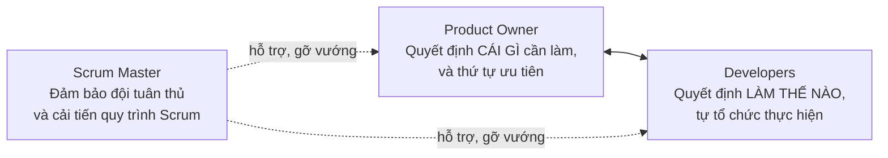
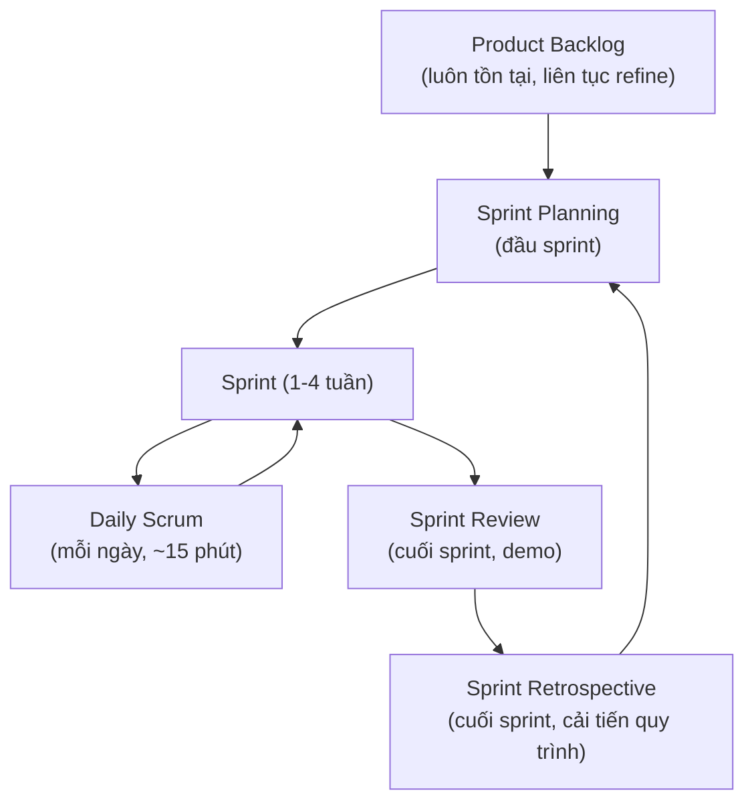

# Chương 8: Scrum chi tiết: vai trò, sự kiện, artifact

## Mục tiêu học

- Gọi tên và giải thích được 3 vai trò, 5 sự kiện, 3 artifact của Scrum.
- Mô tả được một sprint điển hình diễn ra như thế nào từ đầu đến cuối.
- Xác định rõ BA tham gia vào sự kiện nào, đóng góp gì — kể cả khi BA không phải một vai trò
  "chính thức" được định nghĩa trong Scrum Guide.

## 8.1 Scrum là gì?

**Scrum** là framework Agile phổ biến nhất, tổ chức công việc thành các chu kỳ lặp cố định gọi là
**Sprint** (thường 1-4 tuần, phổ biến nhất là 2 tuần). Mỗi sprint là một vòng lặp đầy đủ các giai
đoạn SDLC thu nhỏ (Requirements → Design → Implementation → Testing) cho một phần nhỏ sản phẩm.

> Lưu ý quan trọng: **Scrum không định nghĩa vai trò "Business Analyst"** trong bộ tài liệu chính
> thức (Scrum Guide) — chỉ có Product Owner, Scrum Master, Developers. Trong thực tế, công việc
> BA vẫn tồn tại và cần thiết, thường được một người đảm nhận dưới danh nghĩa: chính PO kiêm luôn,
> một BA riêng hỗ trợ PO, hoặc một Developer kiêm phân tích. Sách này gọi chung người làm công
> việc đó là "BA" dù chức danh chính thức trong đội có thể khác.

## 8.2 Ba vai trò

- **Product Owner (PO)**: chịu trách nhiệm tối đa hoá giá trị sản phẩm, quản lý Product Backlog,
  quyết định thứ tự ưu tiên. BA thường làm việc **rất sát** với PO — cung cấp phân tích để PO ra
  quyết định đúng (Chương 27).
- **Scrum Master (SM)**: không phải "quản lý dự án" theo nghĩa truyền thống — vai trò của SM là
  đảm bảo đội hiểu và áp dụng đúng Scrum, loại bỏ trở ngại (impediment) cho đội.
- **Developers**: bao gồm mọi người trực tiếp tạo ra sản phẩm (coder, tester, designer trong một
  số đội) — tự tổ chức, tự quyết định cách hoàn thành công việc trong sprint.

## 8.3 Năm sự kiện (Events)

| Sự kiện | Mục đích | BA tham gia thế nào |
|---|---|---|
| **Sprint** | "Chiếc hộp" chứa mọi sự kiện khác, có độ dài cố định | BA làm việc liên tục trong suốt sprint, không chỉ ở đầu/cuối |
| **Sprint Planning** | Đội chọn các hạng mục từ Product Backlog đưa vào Sprint Backlog, thống nhất mục tiêu sprint | BA giải thích chi tiết yêu cầu, trả lời câu hỏi để đội ước lượng chính xác (Chương 27, 30) |
| **Daily Scrum** | Đội đồng bộ tiến độ hằng ngày trong 15 phút | BA tham dự để nắm vấn đề phát sinh sớm, sẵn sàng làm rõ yêu cầu ngay khi Dev cần |
| **Sprint Review** | Demo sản phẩm đã hoàn thành cho stakeholder, thu thập phản hồi | BA chuẩn bị nội dung demo cùng đội, ghi nhận phản hồi để đưa vào backlog tiếp theo |
| **Sprint Retrospective** | Đội tự nhìn lại cách làm việc, đề xuất cải tiến | BA đóng góp góc nhìn về quy trình làm rõ yêu cầu có hiệu quả không |

## 8.4 Ba Artifact (sản phẩm/tài liệu)

| Artifact | Là gì | Liên quan đến BA |
|---|---|---|
| **Product Backlog** | Danh sách toàn bộ công việc cần làm cho sản phẩm, sắp theo ưu tiên, luôn thay đổi | BA/PO liên tục "refine" (làm rõ, chia nhỏ) các hạng mục trong backlog (Chương 24, 27) |
| **Sprint Backlog** | Tập con của Product Backlog được chọn cho sprint hiện tại, cộng với kế hoạch để hoàn thành | BA đảm bảo các hạng mục trong Sprint Backlog đã đủ rõ ràng để Dev bắt tay làm ngay |
| **Increment** | Tổng các phần đã hoàn thành, đạt "Definition of Done", có thể release được | BA xác nhận Increment có đúng đáp ứng ý định nghiệp vụ ban đầu không (liên hệ Chương 34 - UAT) |

## 8.5 Một sprint điển hình với FoodNow

Giả sử đội FoodNow làm Scrum, sprint 2 tuần, đang phát triển tính năng "theo dõi đơn hàng real-time":

1. **Sprint Planning (ngày 1)**: PO đưa User Story "Là khách hàng, tôi muốn xem trạng thái đơn hàng
   theo thời gian thực để biết khi nào đồ ăn tới" vào sprint. BA giải thích rõ 4 trạng thái đơn hàng
   cần hiển thị, Dev ước lượng story point.
2. **Trong sprint**: Dev code, gặp câu hỏi "nếu nhà hàng huỷ đơn giữa chừng thì hiển thị trạng thái
   gì?" — hỏi trực tiếp BA thay vì tự đoán, BA trả lời trong Daily Scrum hoặc trao đổi riêng.
3. **Sprint Review (cuối sprint)**: Demo tính năng cho đại diện quản lý chi nhánh (stakeholder),
   ghi nhận phản hồi: "cần thêm âm thanh thông báo khi đơn được giao xong" — đưa vào backlog cho
   sprint sau.
4. **Sprint Retrospective**: Đội nhận ra việc làm rõ yêu cầu về trạng thái đơn hàng lẽ ra nên làm
   kỹ hơn **trước** Sprint Planning (ở bước refinement) để tránh phát sinh câu hỏi giữa sprint.

## Bài tập

1. Vẽ lại timeline một sprint 2 tuần cho FoodNow theo mẫu ở mục 8.5, nhưng với một tính năng khác:
   "khách hàng đặt lại đơn hàng cũ chỉ với 1 chạm". Ghi rõ BA làm gì ở mỗi sự kiện.
2. Giải thích vì sao Daily Scrum giới hạn 15 phút lại quan trọng — điều gì xảy ra nếu buổi họp này
   kéo dài thành 1 tiếng thảo luận sâu mỗi ngày?

## Sai lầm thường gặp

- **BA vắng mặt trong Daily Scrum/Sprint Planning vì nghĩ "không phải việc của mình"**: dẫn đến Dev
  phải tự đoán yêu cầu khi BA không có mặt để hỏi ngay.
- **Nhồi nhét quá nhiều làm rõ yêu cầu vào Sprint Planning**: nên làm ở bước refinement/backlog
  grooming **trước** Sprint Planning (Chương 27), để Sprint Planning chỉ còn việc thống nhất phạm
  vi và ước lượng, không phải ngồi phân tích yêu cầu từ đầu.
- **Coi Sprint Review là buổi "nghiệm thu chính thức"**: Sprint Review là để lấy phản hồi sớm, tinh
  chỉnh hướng đi — không thay thế cho UAT chính thức trước khi release rộng rãi (Chương 34).

## Tóm tắt & tiếp theo

Scrum tổ chức công việc qua Sprint với 3 vai trò (PO, SM, Developers), 5 sự kiện (Sprint, Planning,
Daily Scrum, Review, Retrospective) và 3 artifact (Product Backlog, Sprint Backlog, Increment) — dù
không có vai trò BA chính thức, công việc phân tích vẫn cần thiết xuyên suốt. Chương 9 sẽ giới
thiệu Extreme Programming (XP) — framework Agile tập trung vào **thực hành kỹ thuật**, thường được
kết hợp cùng Scrum.
