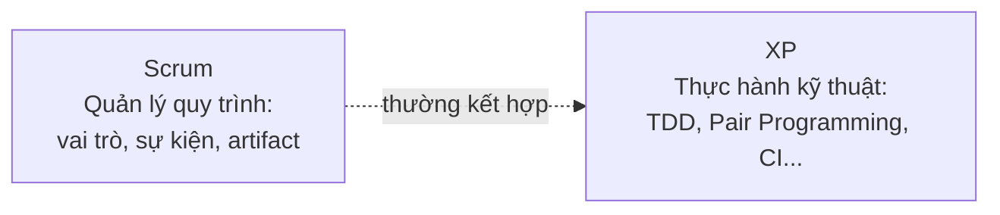

# Chương 9: Extreme Programming (XP): thực hành kỹ thuật và vai trò BA

## Mục tiêu học

- Giải thích được XP là gì, khác Scrum ở điểm nào (Scrum tập trung quản lý quy trình, XP tập
  trung thực hành kỹ thuật).
- Liệt kê và giải thích được các thực hành kỹ thuật cốt lõi của XP: TDD, Pair Programming,
  Continuous Integration, Refactoring, Simple Design, Collective Code Ownership.
- Hiểu vai trò của BA khi làm việc cùng một đội áp dụng XP — khác gì so với đội chỉ làm Scrum
  thuần tuý.

## 9.1 XP là gì, vì sao ra đời?

**Extreme Programming (XP)** ra đời cùng thời điểm với Scrum (giữa/cuối thập niên 1990), cũng là
một trong những framework góp phần hình thành Agile Manifesto. Nếu Scrum trả lời câu hỏi **"tổ
chức công việc và con người thế nào"**, thì XP trả lời câu hỏi **"làm sao viết code chất lượng cao,
thích ứng nhanh với thay đổi"**. Hai framework này **không loại trừ nhau** — nhiều đội áp dụng
Scrum để quản lý quy trình, đồng thời áp dụng các thực hành kỹ thuật của XP bên trong mỗi sprint.

## 9.2 Các thực hành kỹ thuật cốt lõi

| Thực hành | Mô tả ngắn | Ảnh hưởng đến BA |
|---|---|---|
| **Test-Driven Development (TDD)** | Viết test trước khi viết code hiện thực tính năng | Acceptance Criteria (Chương 23) của BA cần đủ rõ ràng, cụ thể để Dev chuyển thành test case ngay được |
| **Pair Programming** | Hai lập trình viên cùng làm việc trên một máy, một người code, một người review trực tiếp | Không ảnh hưởng trực tiếp đến BA, nhưng giúp giảm lỗi hiểu sai yêu cầu vì có 2 người cùng đọc hiểu tài liệu |
| **Continuous Integration (CI)** | Tích hợp code vào nhánh chính nhiều lần mỗi ngày, tự động build & test | Cho phép giao hàng nhỏ, thường xuyên hơn — phù hợp để BA tổ chức demo/lấy phản hồi liên tục |
| **Refactoring liên tục** | Cải thiện cấu trúc code mà không đổi hành vi bên ngoài | BA cần hiểu: thời gian "refactor" không tạo ra tính năng mới ngay, nhưng cần thiết để duy trì tốc độ phát triển dài hạn — cần giải thích điều này với Sponsor khi họ hỏi "sao sprint này không ra tính năng gì mới" |
| **Simple Design** | Làm giải pháp đơn giản nhất đáp ứng đúng yêu cầu hiện tại, không thiết kế thừa cho tương lai chưa chắc xảy ra | Khuyến khích BA viết yêu cầu tập trung vào **giá trị cần ngay**, tránh yêu cầu "phòng khi sau này cần" (gold plating) |
| **Collective Code Ownership** | Bất kỳ ai trong đội cũng có thể sửa bất kỳ phần code nào | Không ảnh hưởng trực tiếp BA, nhưng nghĩa là BA có thể trao đổi yêu cầu với **bất kỳ Dev nào** trong đội, không chỉ người "phụ trách module đó" |
| **On-site Customer** | Có đại diện khách hàng/nghiệp vụ làm việc cùng đội hằng ngày, trả lời câu hỏi ngay lập tức | Đây chính là vai trò gần nhất với **BA** trong XP nguyên bản — XP kỳ vọng có người đóng vai "khách hàng tại chỗ" để làm rõ yêu cầu ngay khi Dev cần, không phải chờ qua nhiều lớp trung gian |

## 9.3 "On-site Customer" — vai trò gần nhất với BA trong XP

Đây là khái niệm quan trọng nhất của XP đối với công việc BA: XP giả định có một người **luôn có
mặt, luôn sẵn sàng trả lời câu hỏi về yêu cầu ngay lập tức** khi Dev cần, thay vì Dev phải đợi
email/họp theo lịch mới được giải đáp. Trong thực tế hiện đại, vai trò "on-site customer" này
thường do chính BA đảm nhận (vì đại diện khách hàng thật hiếm khi có thể ngồi cùng đội hằng ngày).

Điều này đặt ra yêu cầu cụ thể cho BA làm việc trong đội theo XP:

- Cần **sẵn sàng phản hồi nhanh** trong giờ làm việc — không chỉ có mặt trong các buổi họp chính thức.
- Cần viết **Acceptance Criteria đủ cụ thể** để Dev có thể tự chuyển thành test case (liên hệ TDD)
  mà không cần hỏi lại quá nhiều — nhưng vẫn chấp nhận sẽ có câu hỏi phát sinh và cần trả lời ngay.
- Cần hiểu đủ về mặt kỹ thuật để tham gia thảo luận về đánh đổi (trade-off) khi Dev đề xuất đơn
  giản hoá một yêu cầu vì lý do kỹ thuật (liên hệ Simple Design).

## 9.4 Ví dụ: BA làm việc với đội FoodNow áp dụng XP

Đội FoodNow áp dụng Scrum + các thực hành XP. Khi BA viết Acceptance Criteria cho tính năng "áp
dụng mã giảm giá khi thanh toán":

- Vì đội áp dụng TDD, BA viết Acceptance Criteria theo cú pháp Given-When-Then (Chương 23) đủ cụ
  thể để Dev viết test tự động trực tiếp từ đó — ví dụ: "Given giỏ hàng có tổng 200.000đ, When
  nhập mã giảm giá 'FOODNOW10' hợp lệ, Then tổng tiền giảm còn 180.000đ".
- Trong lúc code, Dev phát hiện trường hợp chưa rõ: "nếu khách nhập 2 mã giảm giá cùng lúc thì
  sao?" — vì BA đóng vai trò gần với "on-site customer", Dev nhắn hỏi trực tiếp và nhận câu trả
  lời ngay trong ngày, thay vì phải chờ đến buổi họp tuần sau.
- Vì đội áp dụng Simple Design, Dev đề xuất: thay vì xây dựng hệ thống áp dụng nhiều mã giảm giá
  cùng lúc (phức tạp, chưa chắc cần), chỉ cho phép áp dụng 1 mã/đơn hàng ở phiên bản đầu — BA đồng
  ý vì đúng tinh thần "chưa cần thiết ngay", ghi nhận làm cải tiến tương lai nếu có nhu cầu thật.

## Bài tập

1. Viết một Acceptance Criteria theo Given-When-Then cho tính năng "khách hàng huỷ đơn trong vòng
   2 phút sau khi đặt" của FoodNow — đủ cụ thể để Dev có thể viết test tự động trực tiếp từ đó.
2. Giải thích bằng lời của bạn: vì sao "on-site customer" lại là khái niệm quan trọng với BA hơn
   là với PM hay Designer.

## Sai lầm thường gặp

- **BA chỉ giao tài liệu rồi biến mất, không sẵn sàng trả lời câu hỏi nhanh**: đi ngược tinh thần
  "on-site customer" của XP, khiến Dev phải tự đoán và dễ làm sai ý.
- **Viết Acceptance Criteria quá mơ hồ, không đủ cụ thể để chuyển thành test case**: làm giảm hiệu
  quả của TDD, Dev phải đoán ý hoặc quay lại hỏi nhiều lần.
- **Từ chối mọi đề xuất đơn giản hoá từ Dev vì "không đúng như tài liệu"**: nên cân nhắc tinh thần
  Simple Design — nếu đơn giản hoá không ảnh hưởng giá trị nghiệp vụ cốt lõi, nên linh hoạt.

## Tóm tắt & tiếp theo

XP bổ sung các thực hành kỹ thuật (TDD, Pair Programming, CI, Refactoring, Simple Design) cho
Agile, và khái niệm "on-site customer" đặt ra kỳ vọng cụ thể về việc BA cần sẵn sàng, phản hồi
nhanh, viết yêu cầu đủ cụ thể để chuyển hoá thành test. Chương 10 sẽ giới thiệu Kanban — một
framework Agile khác, đơn giản hơn Scrum về mặt cấu trúc sự kiện, và tổng hợp bảng so sánh toàn bộ
các mô hình đã học (Waterfall, Scrum, XP, Kanban).
