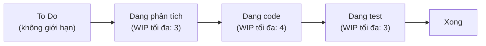

# Chương 10: Kanban & so sánh các mô hình: Waterfall vs Scrum vs Kanban vs XP

## Mục tiêu học

- Giải thích được nguyên lý cốt lõi của Kanban: luồng liên tục (continuous flow) và giới hạn công
  việc đang làm (WIP limit).
- Phân biệt được Kanban với Scrum — điểm khác biệt quan trọng nhất là gì.
- Dùng được bảng tiêu chí để chọn mô hình phù hợp cho một dự án cụ thể, thay vì chọn theo trào lưu.

## 10.1 Kanban là gì?

**Kanban** (tiếng Nhật nghĩa là "bảng hiệu"/"thẻ trực quan") là phương pháp quản lý công việc dựa
trên **luồng liên tục**, khác với Scrum tổ chức công việc theo các chu kỳ cố định (sprint). Công
việc di chuyển qua các cột trạng thái (ví dụ: To Do → Đang phân tích → Đang làm → Đang test →
Xong) trên một **bảng Kanban**, mỗi cột có thể giới hạn số lượng công việc tối đa được phép nằm
trong đó cùng lúc — gọi là **WIP limit (Work In Progress limit)**.

**Vì sao cần giới hạn WIP?** Nguyên lý cốt lõi: làm nhiều việc cùng lúc (đa nhiệm) khiến mỗi việc
đều chậm lại do chi phí chuyển đổi ngữ cảnh (context switching). Giới hạn WIP buộc đội **hoàn
thành việc đang làm trước khi nhận việc mới** — thường tạo ra thời gian hoàn thành (lead time)
ngắn hơn cho toàn hệ thống, dù có vẻ nghịch lý.

## 10.2 Kanban khác Scrum ở đâu?

| Tiêu chí | Scrum | Kanban |
|---|---|---|
| Nhịp độ | Cố định (sprint 1-4 tuần) | Liên tục, không chia chu kỳ cố định |
| Vai trò | Định nghĩa rõ (PO, SM, Developers) | Không định nghĩa vai trò bắt buộc |
| Cách giới hạn công việc | Giới hạn theo Sprint Backlog (số lượng công việc chọn cho sprint) | Giới hạn WIP theo từng cột trên bảng |
| Thay đổi giữa chu kỳ | Hạn chế thay đổi Sprint Backlog giữa sprint đang chạy | Có thể thêm việc mới bất cứ lúc nào miễn còn chỗ trống theo WIP limit |
| Đo lường | Velocity (số story point hoàn thành mỗi sprint) | Lead time, Cycle time (thời gian một hạng mục đi từ đầu đến cuối bảng) |
| Phù hợp nhất khi | Công việc có thể nhóm thành các đợt giao hàng rõ ràng | Công việc đến liên tục, không đều, khó nhóm thành đợt cố định (ví dụ: đội support, đội vận hành) |

**Ví dụ thực tế**: đội phát triển tính năng mới cho FoodNow (công việc có kế hoạch, có thể nhóm
theo tính năng) thường hợp với Scrum hơn. Đội vận hành/bảo trì hệ thống FoodNow sau go-live (nhận
yêu cầu sửa lỗi/hỗ trợ liên tục, không đều, khó đoán trước) thường hợp với Kanban hơn.

## 10.3 Vai trò BA trong Kanban

Vì Kanban không định nghĩa chu kỳ cố định, công việc của BA cũng liên tục hơn: thay vì có một giai
đoạn "refinement trước sprint" rõ rệt như Scrum, BA cần đảm bảo luôn có sẵn một lượng hạng mục **đã
được làm rõ đầy đủ** ("ready") trong cột To Do, để đội không bao giờ bị đói việc rõ ràng để làm.
Kỹ thuật MoSCoW/ưu tiên hoá (Chương 26) vẫn áp dụng được, chỉ khác ở chỗ ưu tiên được xem xét liên
tục thay vì "chốt" một lần đầu mỗi sprint.

## 10.4 Bảng so sánh tổng hợp 4 mô hình

| Tiêu chí | Waterfall | Scrum | Kanban | XP |
|---|---|---|---|---|
| Loại | Tuần tự | Lặp (iterative), theo chu kỳ | Luồng liên tục | Tập thực hành kỹ thuật (thường kết hợp Scrum/Kanban) |
| Tài liệu yêu cầu | Đầy đủ, chốt trước khi code (SRS) | Gọn, tinh chỉnh liên tục (User Story) | Gọn, tinh chỉnh liên tục | Acceptance Criteria đủ cụ thể để viết test |
| Chấp nhận thay đổi | Thấp — cần Change Request chính thức | Trung bình — hạn chế đổi trong sprint đang chạy | Cao — có thể đổi bất cứ lúc nào (trong giới hạn WIP) | Cao, đi kèm Simple Design để dễ thích ứng |
| Giao hàng | Một lần, ở cuối dự án | Từng sprint (1-4 tuần) | Liên tục, ngay khi hạng mục hoàn thành | Thường xuyên nhờ CI |
| Phù hợp khi | Yêu cầu ổn định, cần cam kết phạm vi/chi phí cố định | Sản phẩm mới, cần phản hồi định kỳ theo đợt | Công việc đến liên tục, không đều (support/vận hành) | Cần chất lượng kỹ thuật cao, thay đổi thường xuyên |
| Vai trò BA | Rõ ràng theo giai đoạn, áp lực cao ở Requirements | Làm việc sát PO, refine backlog liên tục | Đảm bảo luôn có backlog "ready", làm việc liên tục | Gần vai trò "on-site customer", phản hồi tức thời |

## 10.5 Cách chọn mô hình cho một dự án cụ thể

Không có mô hình nào "tốt nhất tuyệt đối" — câu hỏi cần đặt ra:

1. **Yêu cầu đã ổn định chưa, hay còn nhiều điều chưa biết?** → Chưa ổn định: nghiêng về Agile
   (Scrum/Kanban/XP). Đã ổn định + cần cam kết chi phí cố định: cân nhắc Waterfall.
2. **Công việc có thể nhóm thành đợt rõ ràng không, hay đến liên tục ngẫu nhiên?** → Nhóm được
   thành đợt: Scrum. Đến liên tục, không đều: Kanban.
3. **Có cần chất lượng kỹ thuật/tốc độ thích ứng rất cao không (sản phẩm cạnh tranh gắt)?** → Cân
   nhắc bổ sung thực hành XP bên trong Scrum/Kanban.
4. **Ràng buộc pháp lý/hợp đồng có đòi hỏi tài liệu hoá đầy đủ trước khi code không?** → Nghiêng
   Waterfall hoặc mô hình lai (Chương 11 sẽ nói thêm về mô hình Hybrid).

Với FoodNow: giai đoạn phát triển tính năng mới (chưa chắc chắn khách hàng phản ứng ra sao) hợp
Scrum; giai đoạn vận hành sau go-live (xử lý bug, yêu cầu nhỏ liên tục) hợp Kanban.

## Bài tập

1. Với đội vận hành hệ thống FoodNow sau go-live (nhận báo lỗi và yêu cầu nhỏ liên tục từ các chi
   nhánh), vẽ một bảng Kanban đơn giản (tối thiểu 4 cột) và đặt WIP limit hợp lý cho từng cột.
2. Dùng 4 câu hỏi ở mục 10.5 để tự chọn mô hình phù hợp cho một dự án bạn biết hoặc đang làm.

## Sai lầm thường gặp

- **Nghĩ Kanban là "Scrum không có sprint" — đơn giản hơn nên dễ làm hơn**: Kanban đòi hỏi kỷ luật
  cao về giới hạn WIP, không có sự "ép buộc" bởi ranh giới sprint như Scrum — nhiều đội áp dụng sai
  vì không tuân thủ WIP limit, biến bảng Kanban thành danh sách việc không giới hạn.
- **Chọn mô hình theo trào lưu ("ai cũng làm Scrum nên mình cũng làm")**: nên chọn dựa trên đặc
  điểm công việc thực tế, theo 4 câu hỏi ở mục 10.5.
- **Trộn lẫn Scrum và Kanban mà không hiểu rõ đang đánh đổi gì**: một số đội dùng "Scrumban" (lai
  giữa hai mô hình) hợp lý, nhưng cần hiểu rõ lý do, không phải trộn ngẫu nhiên vì không quyết được.

## Tóm tắt & tiếp theo

Kanban dựa trên luồng liên tục và giới hạn WIP, khác Scrum ở việc không có chu kỳ cố định. Không
mô hình nào (Waterfall/Scrum/Kanban/XP) tốt tuyệt đối — việc chọn mô hình cần dựa trên đặc điểm
công việc thực tế. Chương 11 sẽ tổng kết Phần 1 bằng cách đi sâu vào **vai trò và trách nhiệm cụ
thể của BA** trong từng mô hình, giúp bạn biết chính xác cần làm gì khi vào một đội đã chọn sẵn
một mô hình cụ thể.
