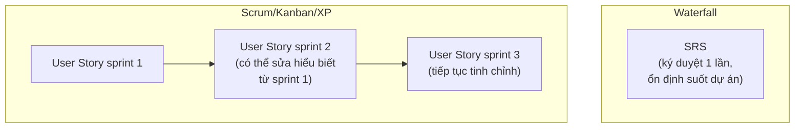

# Chương 11: Vai trò và trách nhiệm cụ thể của BA trong từng mô hình

## Mục tiêu học

- Tổng hợp lại, so sánh trực tiếp deliverable và nhịp độ làm việc của BA trong Waterfall, Scrum,
  Kanban, XP.
- Biết cách thích ứng nhanh khi chuyển từ một đội theo mô hình này sang đội theo mô hình khác.
- Hiểu khái niệm mô hình Hybrid (lai) — thực tế phổ biến hơn "Agile thuần" hay "Waterfall thuần".

## 11.1 Bảng tổng hợp deliverable của BA theo từng mô hình

| Mô hình | Tài liệu chính BA tạo ra | Nhịp độ | Khi nào tài liệu được xem là "xong" |
|---|---|---|---|
| **Waterfall** | BRD, SRS đầy đủ (Chương 19-20) | Một lần, đầu dự án | Khi được Sponsor **ký duyệt chính thức** (sign-off), gần như không đổi sau đó trừ Change Request |
| **Scrum** | User Story, Acceptance Criteria, backlog được refine liên tục (Chương 23-24, 27) | Liên tục theo sprint | Khi đạt "Definition of Ready" trước khi vào sprint, và "Definition of Done" sau khi hoàn thành |
| **Kanban** | Tương tự Scrum nhưng không gắn với ranh giới sprint | Liên tục, không theo chu kỳ cố định | Khi hạng mục đạt tiêu chí "ready" để vào cột tiếp theo trên bảng |
| **XP** | Acceptance Criteria rất cụ thể (đủ để viết test tự động), phản hồi tức thời | Liên tục, tức thời (on-site customer) | Khi test tự động dựa trên Acceptance Criteria pass |

## 11.2 Sự khác biệt về "độ chắc chắn" của tài liệu

Khác biệt quan trọng nhất giữa Waterfall và các mô hình Agile không phải là "có tài liệu hay
không" — mà là **tài liệu có được xem là "cố định" hay "sống, liên tục thay đổi"**:

BA chuyển từ Waterfall sang Agile thường gặp khó khăn tâm lý ban đầu: cảm giác "chưa chắc chắn,
chưa hoàn chỉnh" khi viết User Story ngắn gọn cho sprint hiện tại mà chưa biết chi tiết toàn bộ
sản phẩm sẽ ra sao — đây là điều **bình thường và có chủ đích** trong Agile, không phải làm việc
cẩu thả.

## 11.3 Thích ứng khi chuyển mô hình

**Từ Waterfall sang Scrum/Kanban** — điều BA cần thay đổi tư duy:
- Ngừng cố viết tài liệu "hoàn chỉnh một lần" — chấp nhận viết vừa đủ cho bước tiếp theo, tinh
  chỉnh dần dựa trên phản hồi.
- Tăng tần suất giao tiếp với Dev — không còn chuyển giao tài liệu một lần rồi biến mất, mà đồng
  hành liên tục.
- Học cách chia nhỏ yêu cầu lớn (Epic) thành các User Story độc lập, có thể giao hàng riêng lẻ
  (Chương 24) — kỹ năng gần như không cần thiết trong Waterfall thuần.

**Từ Scrum sang Kanban** — điều BA cần thay đổi tư duy:
- Bỏ nhịp "refine theo sprint" cố định, chuyển sang duy trì liên tục một hàng đợi backlog "ready".
- Theo dõi cycle time/lead time thay vì velocity để đánh giá hiệu quả làm rõ yêu cầu.

**Vào một đội áp dụng XP** — điều BA cần chuẩn bị:
- Sẵn sàng tinh thần "on-site customer": phản hồi nhanh, viết Acceptance Criteria rất cụ thể.
- Hiểu đủ kỹ thuật để tham gia thảo luận đánh đổi khi Dev đề xuất Simple Design.

## 11.4 Mô hình Hybrid (lai) — thực tế phổ biến hơn "thuần"

Trong thực tế, rất ít công ty áp dụng một mô hình "thuần" 100% theo đúng sách vở. Phổ biến hơn là
các mô hình lai, ví dụ:

- **Water-Scrum-Fall**: giai đoạn đầu dự án (thu thập yêu cầu tổng thể, ký hợp đồng, ngân sách)
  làm theo kiểu Waterfall vì cần cam kết với Sponsor/khách hàng; giai đoạn triển khai thực tế làm
  theo Scrum để linh hoạt; giai đoạn cuối (release, đào tạo người dùng, nghiệm thu chính thức) lại
  quay về phong cách Waterfall vì cần tài liệu hoá đầy đủ cho bàn giao.
- **Scrumban**: kết hợp nhịp sprint của Scrum với bảng trực quan và giới hạn WIP của Kanban.
- **SAFe, LeSS** (Scaled Agile): các framework mở rộng Agile cho tổ chức lớn nhiều đội cùng phối
  hợp — nằm ngoài phạm vi sách này, nhưng người đọc nên biết tên để tự tìm hiểu thêm khi làm việc
  ở tổ chức quy mô lớn.

BA giỏi không phải người "thuộc lòng lý thuyết một mô hình", mà là người **nhận diện được mô hình
thực tế** đội mình đang áp dụng (dù có tên chính thức hay không) và điều chỉnh cách làm tài liệu,
nhịp độ giao tiếp cho phù hợp.

## 11.5 Checklist nhanh: "Tôi vừa vào một đội mới, cần làm gì trước tiên?"

1. Hỏi rõ: đội đang theo mô hình nào (tên gọi chính thức, nhưng quan trọng hơn là **cách làm thực
   tế** — có sprint không, có ký duyệt SRS chính thức không, có bảng Kanban không).
2. Tìm hiểu deliverable BA trước đó của đội trông như thế nào (xem lại tài liệu cũ trong Confluence/
   Jira nếu có) để theo đúng chuẩn/định dạng đội đang quen dùng.
3. Xác định nhịp độ giao tiếp kỳ vọng: có Daily Scrum không, có kỳ vọng phản hồi tức thời như XP
   không, hay có thể làm việc theo lịch họp cố định như Waterfall.
4. Xác định ai có quyền "chốt"/ký duyệt yêu cầu — Sponsor (Waterfall) hay PO (Scrum/Kanban).

## Bài tập

1. Giả sử bạn được chuyển từ một dự án FoodNow làm theo Waterfall (đã có SRS đầy đủ) sang một dự
   án mới làm theo Scrum. Liệt kê 3 thói quen làm việc bạn cần thay đổi ngay, dựa trên mục 11.3.
2. Dùng checklist ở mục 11.5 để lên danh sách câu hỏi bạn sẽ hỏi trong ngày đầu tiên nếu gia nhập
   một đội dự án hoàn toàn mới.

## Sai lầm thường gặp

- **Áp dụng cứng nhắc lý thuyết sách vở mà không quan sát thực tế đội đang làm gì**: mô hình lai
  (Hybrid) rất phổ biến — cần linh hoạt thay vì đòi hỏi đội phải làm "đúng chuẩn" theo lý thuyết.
- **Giữ nguyên thói quen cũ khi chuyển mô hình** (ví dụ vẫn cố viết SRS 50 trang khi đội đã chuyển
  sang Scrum) — gây lãng phí thời gian và không phù hợp nhịp độ đội đang cần.
- **Không hỏi rõ ai có quyền quyết định cuối cùng khi vào đội mới**: dẫn đến trình bày tài liệu sai
  người, sai quy trình phê duyệt.

## Tóm tắt & tiếp theo

BA cần điều chỉnh deliverable và nhịp độ làm việc theo mô hình đội đang áp dụng — từ tài liệu "cố
định, ký duyệt một lần" của Waterfall đến tài liệu "sống, liên tục tinh chỉnh" của Scrum/Kanban/XP,
và cần nhận diện linh hoạt các mô hình lai (Hybrid) phổ biến trong thực tế. Đây cũng là điểm kết
thúc Phần 1. Từ Chương 12, sách bước vào Phần 2 — đi sâu vào kỹ năng cốt lõi nhất của nghề BA:
thu thập và phân tích yêu cầu, bắt đầu với các kỹ thuật Elicitation.
