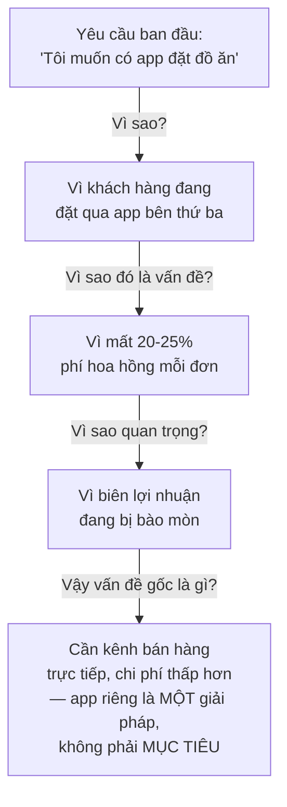

# Chương 12: Kỹ thuật Elicitation: interview, workshop, survey, observation

## Mục tiêu học

- Liệt kê được các kỹ thuật elicitation phổ biến và biết khi nào nên dùng kỹ thuật nào.
- Chuẩn bị và thực hiện được một buổi phỏng vấn thu thập yêu cầu hiệu quả.
- Phân biệt câu hỏi mở (open question) và câu hỏi đóng (closed question), biết dùng đúng lúc.
- Tránh được các lỗi phổ biến khiến elicitation thu về thông tin sai hoặc thiếu.

## 12.1 Elicitation là gì?

**Elicitation** (thu thập/khơi gợi yêu cầu) là quá trình **chủ động lấy thông tin** từ stakeholder
về nhu cầu, vấn đề, kỳ vọng của họ — khác với việc chỉ "chờ" họ tự nói ra. Từ "khơi gợi" quan
trọng: nhiều stakeholder không tự biết diễn đạt rõ nhu cầu của mình (như ví dụ ban giám đốc FoodNow
ở Chương 1: "tôi muốn có app để khách đặt đồ ăn online" — một câu quá mơ hồ để bắt tay làm ngay).
Việc của BA là dùng đúng kỹ thuật để **giúp họ diễn đạt rõ ràng hơn** điều họ thực sự cần.

## 12.2 Các kỹ thuật elicitation phổ biến

| Kỹ thuật | Mô tả | Khi nào dùng | Ưu điểm | Hạn chế |
|---|---|---|---|---|
| **Interview (Phỏng vấn 1-1)** | Trò chuyện trực tiếp với một stakeholder | Cần đào sâu ý kiến cá nhân, chủ đề nhạy cảm | Đào sâu được chi tiết, xây dựng quan hệ tin cậy | Tốn thời gian, chỉ có 1 góc nhìn mỗi lần |
| **Workshop (Hội thảo nhóm)** | Tập hợp nhiều stakeholder cùng thảo luận | Cần thống nhất ý kiến giữa nhiều bên có góc nhìn khác nhau | Phát hiện mâu thuẫn giữa các bên ngay tại chỗ, tiết kiệm thời gian so với phỏng vấn từng người | Cần điều phối tốt (Chương 33), dễ bị người nói nhiều lấn át người ít nói |
| **Survey/Questionnaire (Khảo sát)** | Bảng câu hỏi gửi cho số đông | Cần thu thập ý kiến từ số lượng lớn người (ví dụ hàng trăm khách hàng) | Thu thập được số lượng lớn, dễ định lượng | Không đào sâu được, câu hỏi thiết kế sai sẽ thu về dữ liệu vô nghĩa |
| **Observation (Quan sát)** | Quan sát người dùng thực hiện công việc hiện tại | Người dùng khó diễn đạt bằng lời việc họ làm hằng ngày (thao tác đã thành thói quen) | Phát hiện được vấn đề thật mà chính người dùng cũng không nhận ra là "vấn đề" | Tốn thời gian, người bị quan sát có thể thay đổi hành vi vì biết đang bị quan sát |
| **Document Analysis (Phân tích tài liệu có sẵn)** | Đọc quy trình, biểu mẫu, báo cáo hiện có | Có hệ thống/quy trình cũ cần tìm hiểu trước khi thay thế | Không tốn thời gian của stakeholder, có sẵn dữ liệu khách quan | Tài liệu có thể đã lỗi thời, không phản ánh cách làm thực tế hiện tại |
| **Brainstorming** | Cả nhóm cùng đưa ý tưởng tự do, chưa đánh giá đúng/sai ngay | Giai đoạn đầu, cần nhiều ý tưởng đa dạng trước khi thu hẹp | Khuyến khích sáng tạo, không giới hạn tư duy sớm | Dễ lan man nếu không điều phối tốt, cần bước lọc ý tưởng sau đó |
| **Focus Group** | Nhóm nhỏ người dùng đại diện thảo luận có định hướng | Cần hiểu cảm nhận/thái độ của một nhóm người dùng cụ thể | Thu được góc nhìn đa dạng hơn phỏng vấn 1-1, sâu hơn survey | Cần người điều phối có kỹ năng, kết quả có thể bị ảnh hưởng bởi tâm lý đám đông |

## 12.3 Ví dụ áp dụng cho FoodNow

Với dự án FoodNow, BA có thể kết hợp nhiều kỹ thuật cho từng nhóm stakeholder:

- **Interview** với Ban giám đốc: làm rõ mục tiêu chiến lược (giảm phụ thuộc app bên thứ ba, tăng
  biên lợi nhuận) — chủ đề mang tính chiến lược, cần trao đổi riêng, sâu.
- **Workshop** với quản lý các chi nhánh: thống nhất quy trình xử lý đơn hàng chung, vì mỗi chi
  nhánh hiện có thể đang làm hơi khác nhau — cần cả nhóm ngồi lại thống nhất một lần.
- **Survey** gửi cho khách hàng thân thiết hiện tại: hỏi họ có sẵn sàng dùng app riêng của FoodNow
  thay vì app bên thứ ba không, lý do gì khiến họ vẫn dùng app khác.
- **Observation** tại một chi nhánh: quan sát trực tiếp nhân viên nhận và xử lý đơn hàng qua điện
  thoại hiện tại — có thể phát hiện ra vấn đề mà nhân viên không tự nhận ra (ví dụ: mất trung bình
  2 phút để ghi chép thủ công một đơn hàng phức tạp, một điểm nghẽn rõ ràng chưa ai từng nêu ra).
- **Document Analysis**: xem lại mẫu hoá đơn giấy hiện tại, báo cáo doanh thu theo chi nhánh — để
  hiểu cấu trúc dữ liệu cần có trong hệ thống mới.

## 12.4 Kỹ thuật đặt câu hỏi trong phỏng vấn

**Câu hỏi mở (open question)**: khuyến khích người trả lời diễn giải, cung cấp thông tin mới bạn
chưa nghĩ tới. Dùng ở đầu buổi phỏng vấn hoặc khi cần khám phá.
> Ví dụ: "Anh/chị mô tả giúp em quy trình xử lý một đơn hàng từ lúc khách gọi điện đến lúc giao
> xong hiện nay?"

**Câu hỏi đóng (closed question)**: giới hạn câu trả lời (có/không, chọn 1 trong các lựa chọn).
Dùng để xác nhận lại thông tin, thu hẹp phạm vi, hoặc khi thời gian có hạn.
> Ví dụ: "Vậy có nghĩa là hiện tại chưa có cách nào để khách theo dõi trạng thái đơn hàng, đúng
> không ạ?"

**Kỹ thuật "5 Whys" (5 lần hỏi vì sao)**: khi nhận một yêu cầu ở mức bề mặt, tiếp tục hỏi "vì sao"
để tìm ra vấn đề gốc rễ:

Kỹ thuật này giúp BA tránh sai lầm nghiêm trọng: nhận yêu cầu "xây app" như một mục tiêu tự thân,
trong khi mục tiêu thật là "giảm chi phí hoa hồng" — biết điều này giúp BA đề xuất và đánh giá các
giải pháp thay thế (ví dụ: đàm phán lại phí với app bên thứ ba) một cách khách quan hơn, thay vì
mặc định "xây app riêng" là câu trả lời duy nhất.

## Bài tập

1. Chọn 3 kỹ thuật elicitation phù hợp nhất để tìm hiểu nhu cầu của **nhân viên giao hàng** của
   FoodNow (một nhóm stakeholder chưa được đề cập ở ví dụ 12.3) — giải thích vì sao chọn từng kỹ thuật.
2. Áp dụng kỹ thuật "5 Whys" cho yêu cầu: "Tôi muốn app có tính năng chat trực tiếp với nhà hàng."
   Viết ra chuỗi câu hỏi "vì sao" và vấn đề gốc rễ bạn tìm ra được (có thể tự giả định câu trả lời
   hợp lý).

## Sai lầm thường gặp

- **Chỉ dùng một kỹ thuật duy nhất cho mọi tình huống** (ví dụ chỉ phỏng vấn, không bao giờ quan
  sát thực tế) — bỏ lỡ loại thông tin mà kỹ thuật đó không thu được.
- **Đặt toàn câu hỏi đóng ngay từ đầu buổi phỏng vấn**: giới hạn thông tin thu được, bỏ lỡ những
  điều bạn còn chưa biết để hỏi.
- **Dừng lại ở yêu cầu bề mặt, không hỏi "vì sao"**: dẫn đến xây đúng cái được yêu cầu nhưng sai
  vấn đề gốc rễ cần giải quyết.
- **Thiết kế survey với câu hỏi dẫn dắt (leading question)**: ví dụ "Anh/chị có đồng ý rằng app
  hiện tại quá chậm không?" — ép người trả lời theo hướng có sẵn, làm sai lệch kết quả.

## Tóm tắt & tiếp theo

Elicitation có nhiều kỹ thuật (interview, workshop, survey, observation, document analysis,
brainstorming, focus group) — mỗi kỹ thuật phù hợp với một tình huống khác nhau, và kỹ thuật "5
Whys" giúp tìm ra vấn đề gốc rễ thay vì dừng ở yêu cầu bề mặt. Chương 13 sẽ học cách xác định **nên
hỏi ai, khi nào** một cách có hệ thống — thông qua Stakeholder Analysis và ma trận RACI.
