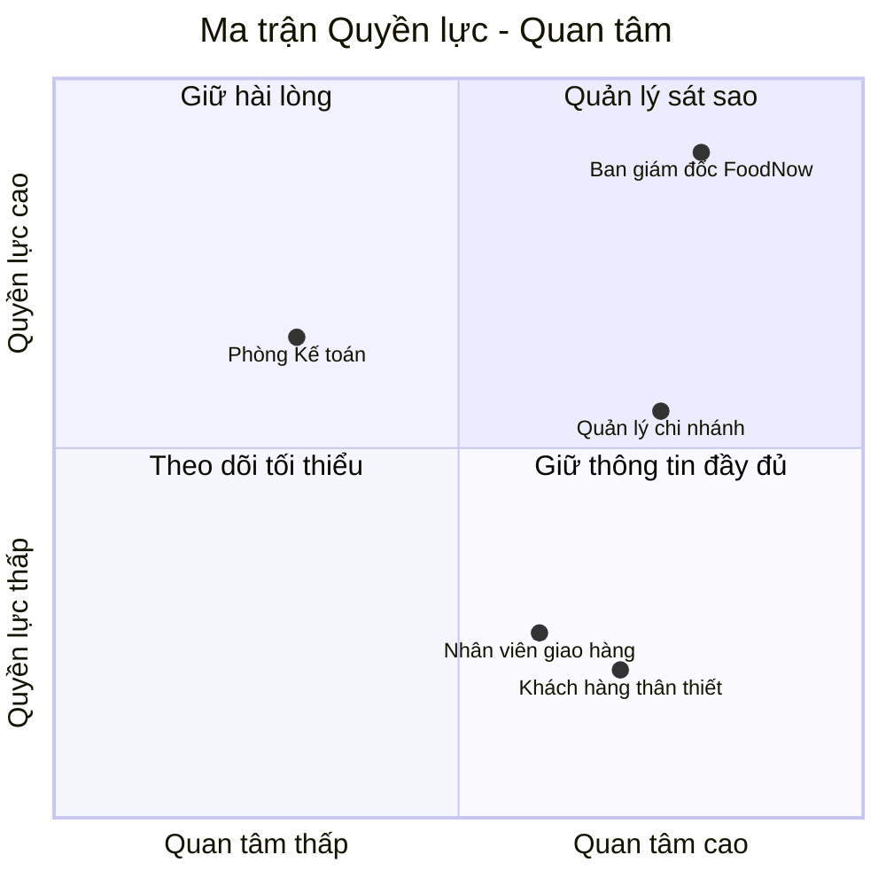

# Chương 13: Stakeholder Analysis & ma trận RACI

## Mục tiêu học

- Xác định và phân loại được stakeholder của một dự án theo mức độ quyền lực và mức độ quan tâm.
- Xây dựng được ma trận RACI cho một hoạt động/tài liệu cụ thể.
- Tránh được sai lầm phổ biến: bỏ sót stakeholder quan trọng hoặc tốn quá nhiều thời gian cho
  stakeholder ít ảnh hưởng.

## 13.1 Vì sao cần phân tích stakeholder trước khi elicitation?

Chương 12 giới thiệu các kỹ thuật thu thập yêu cầu — nhưng trước khi chọn kỹ thuật, cần trả lời:
**hỏi ai, và dành bao nhiêu thời gian/công sức cho mỗi người?** Một dự án có thể có hàng chục
stakeholder, nhưng không phải ai cũng cần được đầu tư thời gian như nhau. **Stakeholder Analysis**
giúp BA phân bổ nguồn lực hợp lý.

## 13.2 Ma trận Quyền lực — Quan tâm (Power-Interest Grid)

Công cụ kinh điển để phân loại stakeholder theo 2 trục: **mức độ quyền lực/ảnh hưởng** đến dự án,
và **mức độ quan tâm** đến kết quả dự án.

| Nhóm | Chiến lược |
|---|---|
| **Quyền lực cao, quan tâm cao** (Ban giám đốc) | **Quản lý sát sao**: cập nhật thường xuyên, thu hút tham gia sâu vào quyết định quan trọng |
| **Quyền lực cao, quan tâm thấp** (ví dụ: một cổ đông không trực tiếp điều hành) | **Giữ hài lòng**: cập nhật định kỳ, không cần chi tiết, nhưng đảm bảo họ không bất ngờ khi có quyết định lớn |
| **Quyền lực thấp, quan tâm cao** (Phòng Kế toán — cần hệ thống mới tương thích báo cáo) | **Giữ thông tin đầy đủ**: lắng nghe ý kiến, cập nhật thường xuyên dù họ không có quyền quyết định cuối cùng |
| **Quyền lực thấp, quan tâm thấp** | **Theo dõi tối thiểu**: cập nhật ở mức tổng quan, không cần đầu tư nhiều thời gian |

> Lưu ý quan trọng: **"quyền lực thấp" không có nghĩa là "không quan trọng để hỏi ý kiến nghiệp
> vụ"**. Nhân viên giao hàng của FoodNow có quyền lực thấp trong việc quyết định dự án, nhưng vẫn
> là nguồn thông tin elicitation quan trọng (Chương 12) vì họ hiểu rõ nhất vấn đề vận hành thực tế.
> Ma trận này dùng để quyết định **chiến lược giao tiếp và quản lý kỳ vọng**, không phải để quyết
> định "ai đáng để lắng nghe yêu cầu".

## 13.3 Ma trận RACI

**RACI** là công cụ làm rõ **ai chịu trách nhiệm gì** cho một hoạt động hoặc tài liệu cụ thể —
tránh tình trạng "tưởng người khác làm" hoặc nhiều người cùng tưởng mình có quyền quyết định.

- **R — Responsible (Người thực hiện)**: người trực tiếp làm công việc.
- **A — Accountable (Người chịu trách nhiệm cuối cùng)**: người có quyền quyết định cuối cùng, chịu
  trách nhiệm giải trình về kết quả. **Chỉ nên có một người A cho mỗi hoạt động** — nhiều người "A"
  cùng lúc dẫn đến không ai thực sự chịu trách nhiệm.
- **C — Consulted (Người được tham vấn)**: người cần được hỏi ý kiến trước khi quyết định, có
  thông tin đầu vào quan trọng nhưng không quyết định.
- **I — Informed (Người được thông báo)**: người cần biết kết quả sau khi quyết định/hoàn thành,
  nhưng không cần tham gia trước đó.

### Ví dụ: RACI cho việc viết và duyệt tài liệu SRS của FoodNow

| Hoạt động | Ban giám đốc | BA | Trưởng nhóm Dev | Quản lý chi nhánh | QA Lead |
|---|---|---|---|---|---|
| Thu thập yêu cầu ban đầu | C | **R** | I | C | I |
| Viết bản nháp SRS | I | **R** | C | I | C |
| Duyệt và ký SRS chính thức | **A** | R | C | I | I |
| Review tính khả thi kỹ thuật | I | C | **R/A** | I | I |
| Xác nhận SRS khớp quy trình vận hành thực tế | I | R | I | **A** | I |

Đọc bảng này: BA là **Responsible** (người thực hiện) cho việc viết SRS, nhưng **Accountable**
(quyền quyết định cuối) về việc **ký duyệt chính thức** thuộc về Ban giám đốc — BA không tự ý
"chốt" tài liệu mà không có sự phê duyệt của người có thẩm quyền.

## 13.4 Cách xây dựng RACI cho dự án của bạn

1. Liệt kê các hoạt động/tài liệu chính cần làm rõ trách nhiệm (thường là các mốc quan trọng:
   elicitation, viết tài liệu, duyệt tài liệu, review thiết kế, UAT, sign-off).
2. Liệt kê tất cả vai trò/cá nhân liên quan.
3. Với mỗi ô giao giữa hoạt động và vai trò, gán đúng một chữ cái R/A/C/I (một hoạt động có thể có
   nhiều R, nhiều C, nhiều I — nhưng **chỉ nên có đúng 1 A**).
4. Rà soát lại: có hoạt động nào thiếu "A" không (không ai chịu trách nhiệm cuối)? Có hoạt động
   nào có nhiều hơn 1 "A" không (dễ gây tranh cãi quyền quyết định)?

## Bài tập

1. Vẽ ma trận Quyền lực — Quan tâm cho dự án FoodNow, thêm ít nhất 2 stakeholder chưa xuất hiện ở
   ví dụ mục 13.2 (ví dụ: đối tác giao hàng thuê ngoài, bộ phận Marketing).
2. Xây dựng bảng RACI cho hoạt động "Nghiệm thu UAT trước khi go-live" (Chương 34-35 sẽ nói chi
   tiết về UAT/Sign-off) — với các vai trò: Ban giám đốc, BA, QA Lead, Quản lý chi nhánh, Trưởng
   nhóm Dev.

## Sai lầm thường gặp

- **Gán nhiều người cùng làm "A" cho một hoạt động**: dẫn đến khi có vấn đề, không ai thực sự chịu
  trách nhiệm giải trình — mỗi người đều nghĩ "người kia sẽ quyết".
- **Bỏ sót stakeholder "quyền lực thấp, quan tâm cao"**: nhóm này thường có thông tin quý giá và dễ
  trở thành người phản đối gay gắt nếu cảm thấy bị bỏ rơi trong quá trình.
- **Nhầm lẫn RACI với sơ đồ tổ chức (org chart)**: RACI mô tả trách nhiệm theo **từng hoạt động cụ
  thể**, một người có thể là "A" ở hoạt động này nhưng chỉ là "C" ở hoạt động khác — không phải một
  bảng phân cấp chức vụ cố định.

## Tóm tắt & tiếp theo

Stakeholder Analysis (qua ma trận Quyền lực — Quan tâm) giúp BA phân bổ thời gian giao tiếp hợp
lý, còn ma trận RACI làm rõ ai thực hiện, ai chịu trách nhiệm cuối, ai được tham vấn, ai được thông
báo cho từng hoạt động cụ thể. Chương 14 sẽ đi vào phân loại các **loại yêu cầu** khác nhau mà BA
thu thập được — vì không phải mọi yêu cầu đều cùng một "loại", và việc phân loại đúng ảnh hưởng
đến cách tài liệu hoá chúng.
