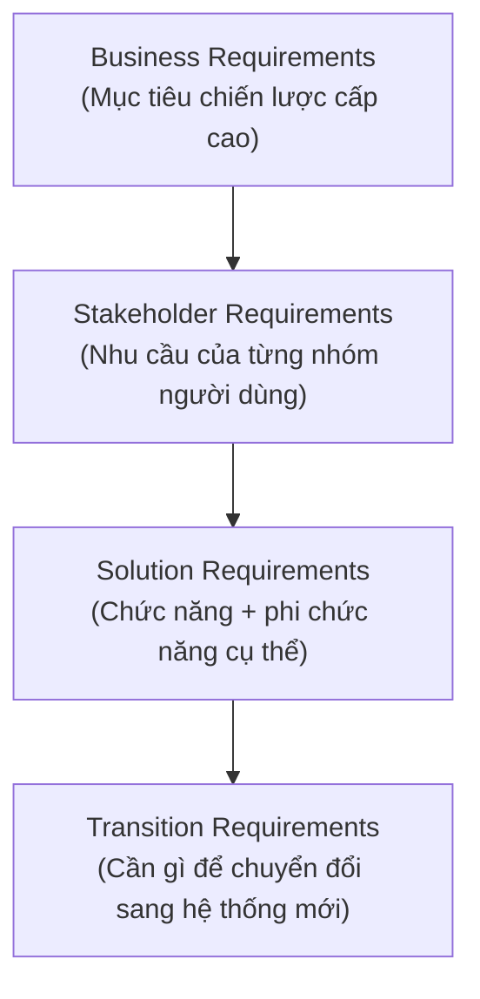

# Chương 14: Phân loại yêu cầu: Business, Stakeholder, Solution, Transition

## Mục tiêu học

- Phân biệt được 4 loại yêu cầu theo phân loại chuẩn của BABOK: Business, Stakeholder, Solution
  (Functional/Non-functional), Transition Requirements.
- Biết mỗi loại yêu cầu nên xuất hiện trong tài liệu nào (liên hệ Chương 19-21).
- Tránh lỗi phổ biến: trộn lẫn các loại yêu cầu trong cùng một danh sách phẳng, gây khó theo dõi.

## 14.1 Vì sao cần phân loại yêu cầu?

Một danh sách yêu cầu không phân loại thường trộn lẫn nhiều tầng khác nhau — từ mục tiêu chiến
lược cấp cao đến chi tiết kỹ thuật cụ thể — khiến người đọc khó biết yêu cầu nào quan trọng hơn,
yêu cầu nào phục vụ yêu cầu nào. Phân loại giúp tổ chức tài liệu rõ ràng và giúp BA kiểm tra được
**tính đầy đủ**: có yêu cầu Solution nào không bắt nguồn từ một yêu cầu Business/Stakeholder nào
không (nếu có, cần đặt câu hỏi "yêu cầu này để làm gì, phục vụ mục tiêu nào?").

## 14.2 Bốn loại yêu cầu

### Business Requirements (Yêu cầu nghiệp vụ)

Mục tiêu chiến lược cấp cao nhất, thường xuất phát từ Sponsor/ban lãnh đạo — trả lời câu hỏi **"vì
sao dự án này tồn tại"**.

> Ví dụ FoodNow: "Giảm phụ thuộc vào các app giao đồ ăn bên thứ ba, tăng biên lợi nhuận trên mỗi
> đơn hàng thêm tối thiểu 15% trong vòng 12 tháng sau khi ra mắt app riêng."

Đặc điểm: đo lường được bằng chỉ số kinh doanh (doanh thu, chi phí, thời gian), không mô tả chi
tiết tính năng cụ thể. Ghi trong **BRD** (Chương 19).

### Stakeholder Requirements (Yêu cầu của các bên liên quan)

Nhu cầu cụ thể của **từng nhóm người dùng/stakeholder**, là cầu nối giữa mục tiêu chiến lược và
chi tiết kỹ thuật — trả lời câu hỏi **"nhóm người này cần gì để công việc/trải nghiệm của họ tốt hơn"**.

> Ví dụ FoodNow:
> - Khách hàng: "Tôi muốn đặt món và thanh toán trong vòng dưới 2 phút."
> - Nhân viên chi nhánh: "Tôi muốn nhận đơn hàng mới ngay lập tức mà không cần liên tục kiểm tra
>   điện thoại/màn hình."

Ghi trong **BRD** hoặc phần đầu của **PRD** (Chương 19).

### Solution Requirements (Yêu cầu giải pháp)

Chi tiết cụ thể mà hệ thống/sản phẩm phải có để đáp ứng Stakeholder Requirements — chia làm 2 nhánh:

- **Functional Requirements (Yêu cầu chức năng)**: hệ thống phải **làm được gì**.
  > Ví dụ: "Hệ thống phải cho phép khách hàng thêm/xoá/sửa số lượng món trong giỏ hàng trước khi
  > thanh toán."
- **Non-functional Requirements (Yêu cầu phi chức năng)**: hệ thống phải **làm tốt đến mức nào**
  (chất lượng, hiệu năng, bảo mật...) — chi tiết ở Chương 21.
  > Ví dụ: "Trang xác nhận đơn hàng phải tải xong trong vòng dưới 2 giây với kết nối 4G."

Ghi chi tiết trong **SRS** (Chương 20) và **FRD** (Chương 21).

### Transition Requirements (Yêu cầu chuyển đổi)

Những gì cần thiết **chỉ trong giai đoạn chuyển đổi** từ trạng thái cũ sang hệ thống mới, không
còn cần thiết sau khi chuyển đổi hoàn tất — trả lời câu hỏi **"làm sao đi từ đây đến đó an toàn"**.

> Ví dụ FoodNow: "Cần import toàn bộ dữ liệu khách hàng thân thiết hiện có (đang lưu trên Excel ở
> từng chi nhánh) vào hệ thống mới trước ngày go-live." hoặc "Cần đào tạo nhân viên 12 chi nhánh
> sử dụng hệ thống xử lý đơn hàng mới trong vòng 2 tuần trước khi ngừng hệ thống cũ."

Đặc điểm dễ nhận biết: có "ngày hết hạn" tự nhiên — sau khi chuyển đổi xong, yêu cầu này không còn
ý nghĩa nữa (khác với Solution Requirements vẫn tồn tại mãi trong sản phẩm).

## 14.3 Bảng tổng hợp: từ mục tiêu đến chi tiết

| Loại yêu cầu | Câu hỏi trả lời | Ví dụ FoodNow | Ghi ở tài liệu nào |
|---|---|---|---|
| Business | Vì sao làm dự án này? | Tăng biên lợi nhuận 15%, giảm phụ thuộc app bên thứ ba | BRD |
| Stakeholder | Từng nhóm người cần gì? | Khách cần đặt hàng nhanh; nhân viên cần nhận đơn tức thời | BRD/PRD |
| Solution — Functional | Hệ thống phải làm được gì? | Cho phép sửa giỏ hàng trước khi thanh toán | SRS/FRD |
| Solution — Non-functional | Hệ thống phải tốt đến mức nào? | Trang xác nhận tải dưới 2 giây | SRS/FRD |
| Transition | Cần gì để chuyển đổi an toàn? | Import dữ liệu khách hàng cũ, đào tạo nhân viên | Kế hoạch triển khai riêng |

## 14.4 Kiểm tra tính đầy đủ bằng cách "truy ngược"

Một kỹ thuật hữu ích: với mỗi Solution Requirement, thử **truy ngược lên** xem nó phục vụ
Stakeholder Requirement nào, và Stakeholder Requirement đó phục vụ Business Requirement nào. Nếu
không truy ngược lên được — đây có thể là dấu hiệu của **"gold plating"** (thêm tính năng không ai
thực sự cần, thường do Dev hoặc chính BA tự thêm vào vì nghĩ "sẽ hay") hoặc yêu cầu bị lạc mất bối
cảnh nghiệp vụ ban đầu.

> Ví dụ: nếu trong SRS của FoodNow có yêu cầu "hệ thống hỗ trợ 15 ngôn ngữ khác nhau" nhưng không
> Stakeholder Requirement/Business Requirement nào nhắc đến việc mở rộng ra thị trường quốc tế —
> đây là dấu hiệu cần đặt câu hỏi lại: yêu cầu này từ đâu ra, phục vụ mục tiêu gì?

Kỹ thuật truy ngược này chính là nền tảng của **Requirements Traceability Matrix** — công cụ sẽ
học chi tiết ở Chương 16.

## Bài tập

1. Với dự án FoodNow, viết 1 ví dụ cho mỗi loại trong 4 loại yêu cầu (Business, Stakeholder,
   Solution-Functional, Solution-Non-functional, Transition) — khác với các ví dụ đã có trong
   chương này.
2. Cho yêu cầu sau: "Hệ thống phải cho phép khách hàng đăng nhập bằng vân tay." Thử truy ngược:
   yêu cầu này có thể phục vụ Stakeholder Requirement nào? Stakeholder Requirement đó phục vụ
   Business Requirement nào? Nếu không truy ngược được hợp lý, đề xuất câu hỏi bạn sẽ hỏi lại
   stakeholder.

## Sai lầm thường gặp

- **Viết Business Requirement quá chi tiết kỹ thuật** (ví dụ: "hệ thống dùng database PostgreSQL")
  — đây là chi tiết Solution, không phải mục tiêu nghiệp vụ, và ràng buộc kỹ thuật không cần thiết
  quá sớm.
- **Viết Solution Requirement không truy ngược được lên Stakeholder/Business Requirement nào** —
  dấu hiệu của gold plating hoặc yêu cầu bị hiểu sai/thêm ngẫu hứng.
- **Nhét Transition Requirements chung với Solution Requirements trong SRS**: gây nhầm lẫn vì
  Transition Requirements có "ngày hết hạn", không nên nằm trong tài liệu mô tả sản phẩm lâu dài.

## Tóm tắt & tiếp theo

Bốn loại yêu cầu (Business, Stakeholder, Solution, Transition) tạo thành một chuỗi phân cấp từ mục
tiêu chiến lược đến chi tiết kỹ thuật cụ thể, và mỗi Solution Requirement nên truy ngược được lên
yêu cầu cấp cao hơn mà nó phục vụ. Chương 15 sẽ học cách **mô hình hoá trực quan** các yêu cầu này
bằng sơ đồ: Use Case Diagram, Activity Diagram, Sequence Diagram, và BPMN cơ bản.
