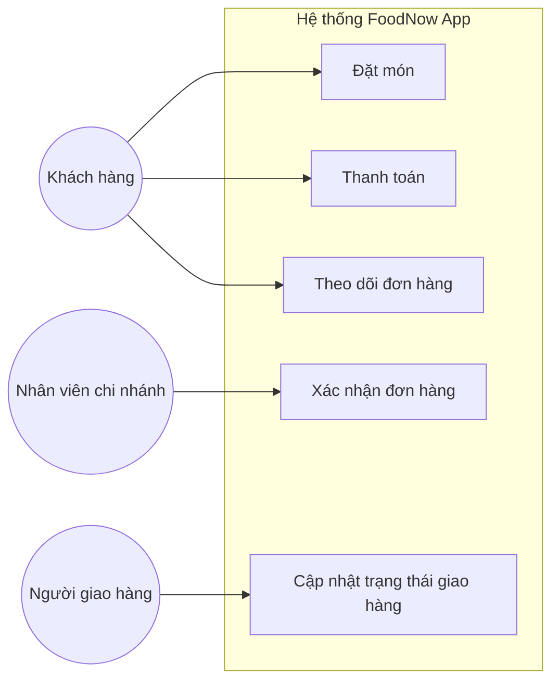
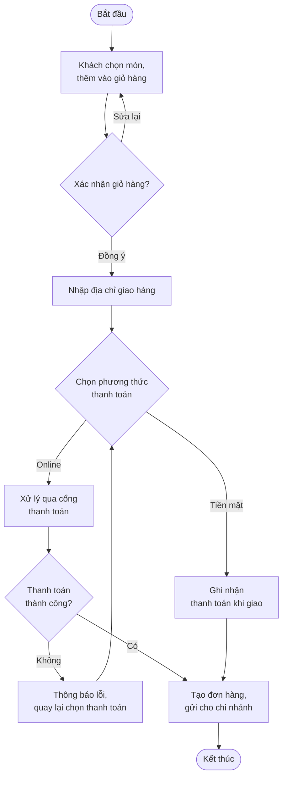
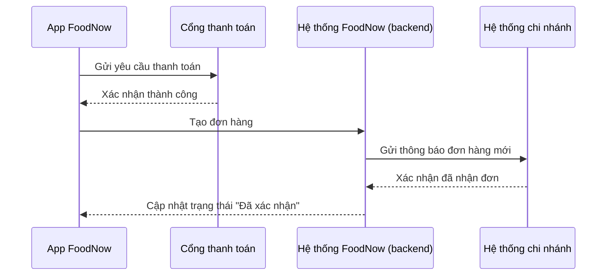
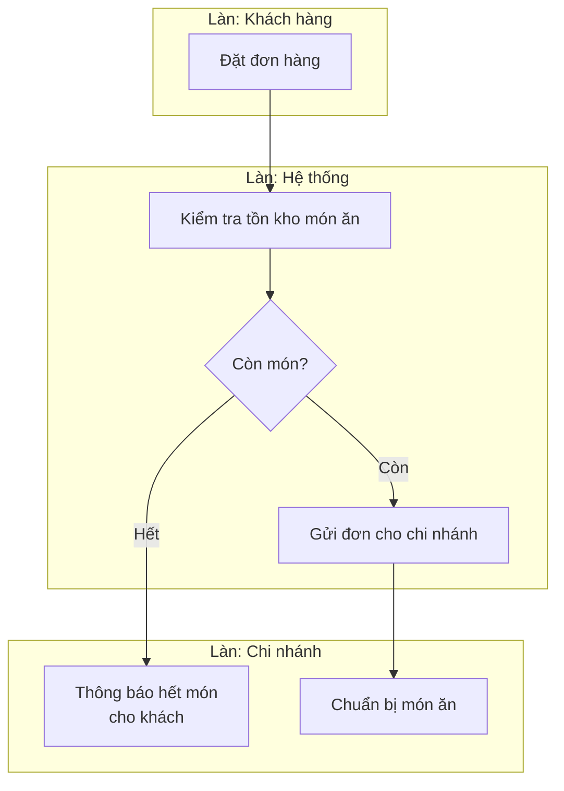

# Chương 15: Mô hình hoá yêu cầu: Use Case, Activity, Sequence Diagram, BPMN cơ bản

## Mục tiêu học

- Vẽ được Use Case Diagram để mô tả tổng quan chức năng hệ thống và actor tương tác.
- Vẽ được Activity Diagram để mô tả luồng nghiệp vụ có rẽ nhánh, song song.
- Đọc hiểu được Sequence Diagram mô tả tương tác giữa các thành phần theo thời gian.
- Vẽ được sơ đồ BPMN cơ bản để mô tả quy trình nghiệp vụ liên phòng ban.
- Biết chọn đúng loại sơ đồ cho đúng mục đích — lỗi phổ biến nhất của người mới là dùng sai loại
  sơ đồ cho tình huống không phù hợp.

## 15.1 Vì sao cần mô hình hoá bằng sơ đồ?

Văn bản thuần (như tài liệu Chương 14) tốt để mô tả **chi tiết**, nhưng kém hiệu quả để thể hiện
**cấu trúc tổng thể, luồng đi, hoặc tương tác giữa nhiều bên**. Não người xử lý thông tin trực quan
nhanh hơn nhiều so với đọc văn bản dài — một sơ đồ tốt giúp stakeholder (kể cả người không rành kỹ
thuật) nhìn thấy ngay lỗ hổng logic mà đọc văn bản khó phát hiện ra.

## 15.2 Use Case Diagram — tổng quan chức năng và actor

Dùng để trả lời: **"hệ thống có những chức năng gì, ai (actor) tương tác với chức năng nào"** —
phù hợp cho tài liệu ở mức tổng quan (BRD, phần đầu SRS), trước khi đi vào chi tiết từng use case
(Chương 22).

> Lưu ý: sơ đồ trên dùng ký hiệu đơn giản hoá (flowchart) thay vì ký hiệu UML Use Case chuẩn (hình
> que biểu diễn actor, hình elip biểu diễn use case) vì công cụ Mermaid dùng trong sách chưa hỗ trợ
> đầy đủ ký hiệu UML Use Case. Khi làm việc thực tế, bạn có thể dùng draw.io/Lucidchart/Visio để vẽ
> đúng ký hiệu UML chuẩn nếu công ty yêu cầu — nhưng **giá trị nằm ở nội dung (actor nào, chức năng
> nào), không nằm ở việc tuân thủ ký hiệu 100% đúng chuẩn UML**.

**Actor** là bất kỳ ai/hệ thống nào tương tác với hệ thống từ bên ngoài — có thể là người
(Khách hàng, Nhân viên) hoặc hệ thống khác (ví dụ: cổng thanh toán VNPay, hệ thống SMS gửi mã OTP).

## 15.3 Activity Diagram — luồng nghiệp vụ có rẽ nhánh

Dùng để mô tả **các bước tuần tự, có điều kiện rẽ nhánh, có thể có nhánh song song** — phù hợp mô
tả một quy trình nghiệp vụ cụ thể, chi tiết hơn Use Case Diagram.

Activity Diagram đặc biệt hữu ích để **phát hiện các trường hợp ngoại lệ (exception) chưa được
tính đến** — ví dụ, khi vẽ sơ đồ trên, BA buộc phải trả lời câu hỏi "nếu thanh toán online thất
bại thì sao?" — một câu hỏi dễ bị bỏ sót nếu chỉ mô tả bằng văn bản liệt kê các bước "thành công".

## 15.4 Sequence Diagram — tương tác giữa các thành phần theo thời gian

Dùng để mô tả **thứ tự trao đổi thông điệp (message) giữa các đối tượng/hệ thống theo trục thời
gian** — hữu ích khi cần làm rõ tương tác giữa nhiều hệ thống (ví dụ: app FoodNow, cổng thanh toán,
hệ thống quản lý chi nhánh).

Sequence Diagram thường được BA dùng khi làm việc gần với đội kỹ thuật hơn (ví dụ khi viết SRS chi
tiết — Chương 20), vì nó thể hiện rõ **ai gọi ai, theo thứ tự nào** — thông tin quan trọng để Dev
thiết kế API/tích hợp hệ thống.

## 15.5 BPMN cơ bản — quy trình nghiệp vụ liên phòng ban

**BPMN (Business Process Model and Notation)** là chuẩn ký hiệu chuyên dùng để mô tả quy trình
nghiệp vụ, đặc biệt khi quy trình đi **qua nhiều phòng ban/vai trò khác nhau** — dùng "làn bơi"
(swimlane) để phân tách trách nhiệm của từng bên.

Khác biệt với Activity Diagram thông thường: BPMN **nhấn mạnh ai làm gì** qua các làn bơi, phù hợp
khi cần trình bày cho nhiều phòng ban thấy rõ ranh giới trách nhiệm của mình trong một quy trình
chung — rất hữu ích trong workshop có nhiều phòng ban tham gia (Chương 33).

## 15.6 Chọn đúng loại sơ đồ cho đúng mục đích

| Câu hỏi cần trả lời | Dùng sơ đồ nào |
|---|---|
| Hệ thống có những chức năng gì, ai dùng? | Use Case Diagram |
| Luồng thao tác chi tiết, có rẽ nhánh điều kiện? | Activity Diagram |
| Thứ tự trao đổi thông tin giữa các hệ thống/thành phần? | Sequence Diagram |
| Quy trình đi qua nhiều phòng ban, cần rõ ai chịu trách nhiệm đoạn nào? | BPMN (swimlane) |

## Bài tập

1. Vẽ Use Case Diagram cho tính năng "Quản lý chương trình khách hàng thân thiết" của FoodNow, với
   ít nhất 2 actor và 3 use case.
2. Vẽ Activity Diagram mô tả luồng "khách hàng huỷ đơn hàng" — bao gồm ít nhất một điều kiện rẽ
   nhánh (ví dụ: huỷ được hay không tuỳ trạng thái đơn hàng hiện tại).

## Sai lầm thường gặp

- **Dùng Activity Diagram khi cần thể hiện trách nhiệm liên phòng ban**: nên dùng BPMN với
  swimlane để rõ ràng hơn về ai làm gì.
- **Vẽ sơ đồ quá chi tiết, nhồi nhét mọi trường hợp ngoại lệ vào một sơ đồ duy nhất**: làm sơ đồ
  rối, khó đọc — nên tách thành nhiều sơ đồ nhỏ theo từng luồng chính/luồng phụ.
- **Coi việc vẽ đúng ký hiệu UML/BPMN chuẩn quan trọng hơn nội dung**: với hầu hết đội dự án thực
  tế, sơ đồ đơn giản hoá dễ hiểu quan trọng hơn tuân thủ 100% ký hiệu chuẩn — trừ khi công ty có
  yêu cầu nghiêm ngặt về chuẩn tài liệu.

## Tóm tắt & tiếp theo

Bốn loại sơ đồ (Use Case, Activity, Sequence, BPMN) phục vụ các mục đích khác nhau — chọn đúng
loại sơ đồ giúp giao tiếp hiệu quả hơn văn bản thuần, và giúp BA tự phát hiện lỗ hổng logic khi vẽ.
Chương 16 sẽ học cách dùng **Requirements Traceability Matrix (RTM)** để theo dõi mọi yêu cầu đã
thu thập và mô hình hoá được, đảm bảo không yêu cầu nào "biến mất" trong quá trình dự án.
