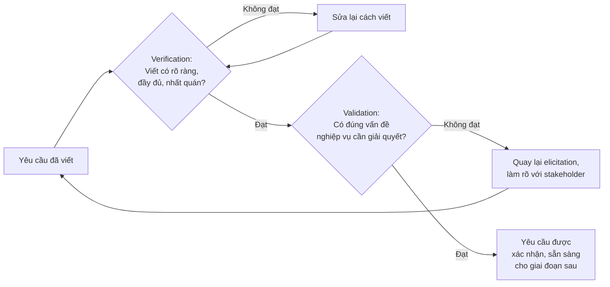

# Chương 17: Requirements Validation & Verification

## Mục tiêu học

- Phân biệt rõ ràng Validation ("có đúng vấn đề cần giải quyết không") và Verification ("tài liệu
  có viết đúng chuẩn, đủ rõ ràng không") — hai khái niệm rất dễ nhầm vì tên gọi gần giống nhau.
- Áp dụng được bộ tiêu chí kiểm tra chất lượng một yêu cầu tốt.
- Biết cách tổ chức một buổi review yêu cầu hiệu quả.

## 17.1 Validation vs Verification — khác nhau ở đâu?

Đây là cặp khái niệm gây nhầm lẫn nhiều nhất trong BABOK vì tên tiếng Anh gần giống nhau. Cách nhớ
đơn giản nhất, dùng hai câu hỏi:

- **Verification — "Are we building it right?"** (Chúng ta có đang xây **đúng cách** không?):
  kiểm tra yêu cầu có được viết rõ ràng, đầy đủ, nhất quán, không mâu thuẫn — kiểm tra **chất
  lượng của bản thân tài liệu**, không quan tâm nó có giải quyết đúng vấn đề nghiệp vụ hay không.
- **Validation — "Are we building the right thing?"** (Chúng ta có đang xây **đúng thứ** không?):
  kiểm tra yêu cầu (dù viết rõ ràng hay không) có thực sự giải quyết đúng vấn đề nghiệp vụ, đúng
  mong đợi của stakeholder hay không.

**Ví dụ minh hoạ khác biệt**: yêu cầu "Hệ thống phải cho phép khách hàng huỷ đơn hàng bất cứ lúc
nào, kể cả khi đã giao xong" — yêu cầu này có thể **verify đạt** (viết rõ ràng, không mơ hồ, dùng
đúng thuật ngữ) nhưng **validate không đạt** (về mặt nghiệp vụ, cho phép huỷ đơn sau khi đã giao
xong là vô lý, gây thiệt hại cho nhà hàng — rõ ràng đây là lỗi hiểu sai ý định thật của
stakeholder, cần quay lại elicitation làm rõ).

## 17.2 Bộ tiêu chí Verification — thế nào là một yêu cầu viết tốt?

| Tiêu chí | Giải thích | Ví dụ VI PHẠM | Sửa lại |
|---|---|---|---|
| **Rõ ràng (Unambiguous)** | Chỉ hiểu theo một nghĩa duy nhất | "Hệ thống phải nhanh" | "Trang chủ tải xong trong dưới 2 giây với kết nối 4G" |
| **Đầy đủ (Complete)** | Không thiếu thông tin cần thiết để hiện thực | "Gửi email xác nhận đơn hàng" (gửi khi nào? nội dung gì?) | "Ngay sau khi thanh toán thành công, gửi email xác nhận gồm: mã đơn hàng, danh sách món, tổng tiền, thời gian giao dự kiến" |
| **Nhất quán (Consistent)** | Không mâu thuẫn với yêu cầu khác trong cùng tài liệu | Yêu cầu A nói "tối đa 5 món/đơn", yêu cầu B (cùng tài liệu) nói "không giới hạn số món" | Rà soát và thống nhất lại với stakeholder trước khi chốt |
| **Khả thi (Feasible)** | Có thể hiện thực được trong ràng buộc thời gian/ngân sách/công nghệ | "Giao hàng trong vòng 5 phút mọi lúc, mọi nơi" | "Giao hàng trong vòng 30 phút trong bán kính 5km, với các đơn đặt trong giờ hoạt động" |
| **Đo lường được (Measurable/Testable)** | Có thể viết được test case để xác nhận đạt/không đạt | "Giao diện phải đẹp" | "Giao diện tuân thủ bộ nhận diện thương hiệu FoodNow (màu, font đính kèm ở Phụ lục), đã được Designer duyệt" |
| **Có thể truy vết (Traceable)** | Có thể liên kết lên nguồn gốc và xuống đến thiết kế/test (liên hệ Chương 16) | Yêu cầu xuất hiện đột ngột, không rõ ai yêu cầu, để làm gì | Ghi rõ nguồn: "Theo yêu cầu của Phòng Marketing trong workshop ngày X" |

## 17.3 Kỹ thuật kiểm tra Validation

Verification có thể tự BA làm một mình (đọc lại, đối chiếu tiêu chí). Validation **bắt buộc cần có
sự tham gia của stakeholder** — không thể tự BA "tự xác nhận" yêu cầu là đúng vấn đề nghiệp vụ:

- **Review trực tiếp với stakeholder**: trình bày lại yêu cầu bằng ngôn ngữ của họ (không phải
  ngôn ngữ kỹ thuật), hỏi "đây có đúng ý anh/chị không?"
- **Prototype/Wireframe** (Chương 25): cho stakeholder xem hình ảnh cụ thể thay vì chỉ đọc văn bản
  — nhiều người validate chính xác hơn khi nhìn thấy giao diện thay vì đọc mô tả trừu tượng.
- **Walkthrough kịch bản cụ thể**: đi qua từng bước một tình huống thực tế ("giả sử khách đặt 3 món,
  1 món hết hàng giữa chừng, thì...") để kiểm tra yêu cầu có xử lý đúng các trường hợp thật.

## 17.4 Tổ chức một buổi review yêu cầu hiệu quả

1. **Gửi tài liệu trước ít nhất 1-2 ngày**: để người tham dự có thời gian đọc trước, buổi họp dùng
   để thảo luận sâu chứ không phải đọc lần đầu tại chỗ.
2. **Xác định rõ mục tiêu buổi review**: verification (rà soát cách viết) hay validation (xác nhận
   đúng vấn đề nghiệp vụ) — hai mục tiêu này cần cách tổ chức khác nhau, verification có thể làm
   qua checklist nhanh, validation cần thảo luận sâu với đúng stakeholder có thẩm quyền.
3. **Dùng checklist tiêu chí (mục 17.2)** làm khung thảo luận, tránh review lan man không có cấu trúc.
4. **Ghi nhận mọi phản hồi, kể cả chưa thống nhất được ngay**: đưa vào danh sách vấn đề mở
   (open items), phân công người theo dõi, hạn chốt.
5. **Không rời phòng họp mà không có quyết định rõ ràng**: mỗi yêu cầu được review nên có 1 trong
   3 trạng thái cuối: Chấp nhận, Cần sửa (có ghi rõ sửa gì), hoặc Cần làm rõ thêm (có ghi rõ ai sẽ
   làm rõ, khi nào).

## Bài tập

1. Cho yêu cầu: "Hệ thống phải bảo mật tốt." Áp dụng bộ tiêu chí Verification ở mục 17.2, chỉ ra
   yêu cầu này vi phạm tiêu chí nào, và viết lại thành một yêu cầu đạt chuẩn.
2. Với yêu cầu (đã viết rõ ràng): "Khách hàng có thể đặt tối đa 20 đơn hàng cùng lúc trong một
   ngày." — yêu cầu này **verify đạt** nhưng có khả năng **validate không đạt**. Giải thích vì sao,
   và đề xuất câu hỏi bạn sẽ hỏi lại stakeholder để làm rõ ý định thật.

## Sai lầm thường gặp

- **Chỉ làm Verification, bỏ qua Validation**: tài liệu viết rất chuyên nghiệp, rõ ràng, đầy đủ —
  nhưng giải quyết sai vấn đề, vì không ai xác nhận lại với đúng stakeholder có thẩm quyền.
- **Tự mình "validate" mà không có stakeholder tham gia**: BA tự cho là đúng theo hiểu biết cá nhân
  — đây thực chất vẫn chỉ là verification (kiểm tra logic nội tại), không phải validation thật sự.
- **Review yêu cầu quá muộn, sau khi Design/Implementation đã bắt đầu**: mất đi lợi ích lớn nhất
  của validation — phát hiện sai sót càng sớm, chi phí sửa càng thấp (nhắc lại nguyên lý Chương 2).

## Tóm tắt & tiếp theo

Verification kiểm tra "viết có đúng cách không" (rõ ràng, đầy đủ, nhất quán, khả thi, đo lường
được, truy vết được), Validation kiểm tra "có đúng vấn đề nghiệp vụ không" — cần phân biệt rõ và
làm cả hai, không thể thay thế cho nhau. Chương 18 sẽ học cách quản lý khi yêu cầu **thay đổi**
giữa dự án — điều gần như chắc chắn sẽ xảy ra, dù dự án làm theo mô hình nào.
