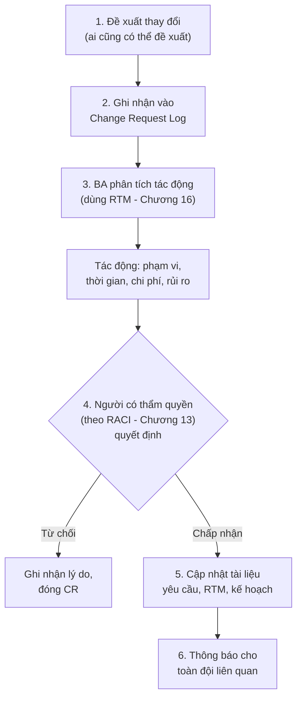

# Chương 18: Quản lý thay đổi yêu cầu: scope creep, Change Request

## Mục tiêu học

- Định nghĩa được "scope creep" và phân biệt với thay đổi yêu cầu hợp lý, có kiểm soát.
- Thực hiện được quy trình Change Request đầy đủ: đề xuất, đánh giá tác động, phê duyệt.
- Biết cách xử lý thay đổi yêu cầu khác nhau giữa dự án Waterfall và Agile.

## 18.1 Scope creep là gì?

**Scope creep** ("phạm vi phình to không kiểm soát") là hiện tượng phạm vi dự án tăng dần theo
thời gian mà **không qua đánh giá tác động và phê duyệt chính thức** — thường bắt đầu từ những yêu
cầu nhỏ, có vẻ "tiện thể làm luôn" nhưng cộng dồn lại gây trễ tiến độ, vượt ngân sách nghiêm trọng.

> Ví dụ FoodNow: trong lúc demo tính năng đặt món, một quản lý chi nhánh buột miệng "tiện thể làm
> luôn tính năng đặt bàn trước cho khách muốn ăn tại quán nhé, chắc không mất nhiều thời gian đâu."
> Nếu BA/Dev đồng ý làm ngay mà không đánh giá tác động, không cập nhật kế hoạch/ngân sách, không
> có ai phê duyệt chính thức — đây chính là scope creep, dù bản thân yêu cầu đó có thể hợp lý.

Điểm mấu chốt: **vấn đề không nằm ở việc thay đổi yêu cầu** (thay đổi là bình thường, đặc biệt
trong Agile — Chương 7) — vấn đề nằm ở việc thay đổi **không qua kiểm soát, không ai đánh giá tác
động, không ai chính thức phê duyệt đánh đổi**.

## 18.2 Quy trình Change Request (CR)

### Bước 1-2: Đề xuất và ghi nhận

Bất kỳ ai (Sponsor, Dev, người dùng cuối) đều có thể đề xuất thay đổi — nhưng **mọi đề xuất đều
phải được ghi nhận chính thức** vào một "Change Request Log" (có thể đơn giản là một bảng Excel
hoặc một loại issue riêng trong Jira), không xử lý miệng, không quyết định ngẫu hứng tại chỗ.

### Bước 3: Phân tích tác động (Impact Analysis)

Đây là bước quan trọng nhất và là nơi RTM (Chương 16) phát huy giá trị lớn nhất. BA cần trả lời:

- **Phạm vi**: thay đổi này ảnh hưởng đến những use case/module nào khác?
- **Thời gian**: cần thêm bao lâu để hiện thực thay đổi này?
- **Chi phí**: có cần thêm nguồn lực không?
- **Rủi ro**: thay đổi này có xung đột với yêu cầu nào đã có không? Có ảnh hưởng đến các cam kết
  đã đưa ra với stakeholder khác không?

### Bước 4: Phê duyệt

Ai có quyền phê duyệt phụ thuộc vào RACI đã xác định (Chương 13) — thường là Sponsor cho thay đổi
lớn ảnh hưởng ngân sách/tiến độ đáng kể, hoặc PO cho thay đổi trong phạm vi backlog ở dự án Agile.

### Bước 5-6: Cập nhật và thông báo

Sau khi được phê duyệt, cần cập nhật **toàn bộ tài liệu liên quan** (BRD/SRS, RTM, kế hoạch dự án)
và thông báo rõ ràng cho tất cả các bên bị ảnh hưởng — tránh tình trạng một phần đội vẫn làm theo
yêu cầu cũ vì không biết đã có thay đổi.

## 18.3 Change Request Log — mẫu đơn giản

| CR ID | Ngày đề xuất | Người đề xuất | Mô tả thay đổi | Tác động (tóm tắt) | Người phê duyệt | Trạng thái |
|---|---|---|---|---|---|---|
| CR-01 | 2024-03-10 | Quản lý chi nhánh Q1 | Thêm tính năng đặt bàn trước | +2 tuần, +1 Dev, không ảnh hưởng module hiện có | Ban giám đốc | Đã phê duyệt |
| CR-02 | 2024-03-15 | Phòng Marketing | Đổi giao diện trang chủ theo bộ nhận diện mới | +3 ngày, cần Designer làm lại | PO | Đang đánh giá |

## 18.4 Xử lý thay đổi khác nhau giữa Waterfall và Agile

| | Waterfall | Agile (Scrum/Kanban) |
|---|---|---|
| Tần suất thay đổi được chấp nhận | Thấp, cần lý do chính đáng vì ảnh hưởng SRS đã ký | Cao hơn — coi thay đổi là bình thường (Chương 7) |
| Ai phê duyệt | Thường cần Sponsor/Ban chỉ đạo dự án chính thức | Thường PO đủ thẩm quyền cho thay đổi trong phạm vi sản phẩm |
| Khi nào áp dụng thay đổi | Ngay khi phê duyệt, có thể ảnh hưởng công việc đang làm dở | Đưa vào backlog, ưu tiên và lên kế hoạch cho **sprint tiếp theo** — hạn chế đổi Sprint Backlog đang chạy |
| Tài liệu cần cập nhật | SRS, RTM, kế hoạch dự án đầy đủ | User Story mới/cập nhật trong backlog, ít khi cần "ký duyệt" hình thức |

Trong Agile, quy trình CR thường **nhẹ hơn nhiều** — nhiều đội không gọi đó là "Change Request"
mà chỉ đơn giản là "thêm một User Story mới vào backlog, PO sắp xếp độ ưu tiên." Tuy nhiên, bản
chất vẫn cần đi qua các bước tương tự (ghi nhận, đánh giá tác động, quyết định có thẩm quyền) — chỉ
là hình thức nhẹ nhàng, nhanh hơn.

## Bài tập

1. Xử lý tình huống ở mục 18.1 (yêu cầu đặt bàn trước) theo đúng quy trình 6 bước ở mục 18.2 —
   viết ra nội dung cụ thể cho từng bước (giả định hợp lý các con số về thời gian/chi phí).
2. Giải thích bằng lời của bạn: vì sao "thay đổi yêu cầu" trong Agile không bị coi là scope creep,
   trong khi thay đổi tương tự trong Waterfall (nếu không qua CR chính thức) lại là scope creep?

## Sai lầm thường gặp

- **Từ chối mọi thay đổi một cách cứng nhắc**: đi ngược tinh thần thích ứng cần thiết, đặc biệt
  trong Agile — không phải mọi thay đổi đều xấu, chỉ thay đổi **không kiểm soát** mới là vấn đề.
- **Chấp nhận thay đổi ngay tại chỗ mà không phân tích tác động**: nguyên nhân phổ biến nhất của
  scope creep — như ví dụ "tiện thể làm luôn" ở mục 18.1.
- **Không cập nhật tài liệu sau khi CR được phê duyệt**: dẫn đến tài liệu (SRS, RTM) không còn phản
  ánh đúng thực tế, gây nhầm lẫn về sau.

## Tóm tắt & tiếp theo

Scope creep xảy ra khi thay đổi yêu cầu không qua đánh giá tác động và phê duyệt chính thức — quy
trình Change Request (đề xuất, ghi nhận, phân tích tác động dùng RTM, phê duyệt, cập nhật, thông
báo) giúp kiểm soát điều này, dù mức độ hình thức khác nhau giữa Waterfall và Agile. Đây là chương
cuối của Phần 2. Từ Chương 19, sách bước vào Phần 3 — đi sâu vào **cách viết từng loại tài liệu BA
cốt lõi**, kèm mẫu tài liệu thật cho dự án FoodNow, bắt đầu với BRD và PRD.
