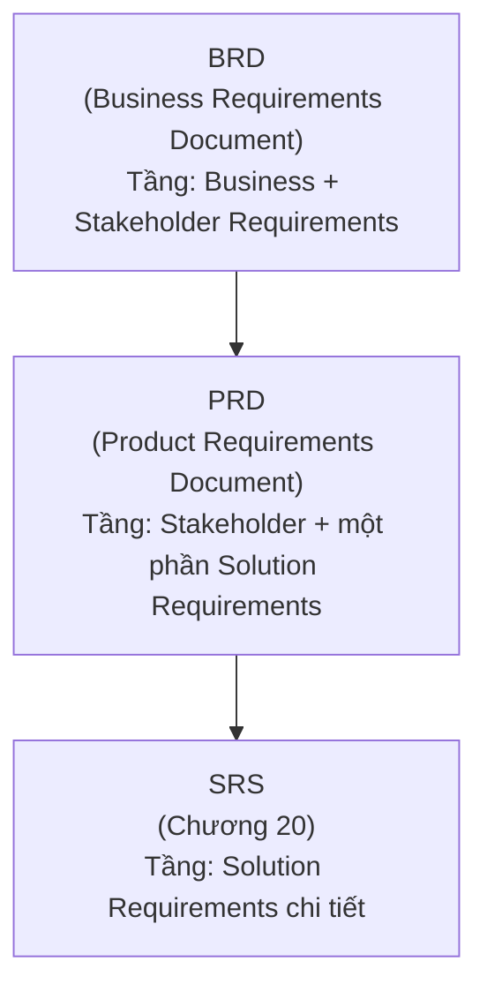

# Chương 19: BRD & PRD: khác nhau ở đâu, cấu trúc, mẫu đầy đủ

## Mục tiêu học

- Phân biệt rõ BRD (Business Requirements Document) và PRD (Product Requirements Document) —
  hai tài liệu hay bị dùng lẫn lộn hoặc coi là một.
- Nắm được cấu trúc chuẩn của từng loại tài liệu.
- Biết khi nào cần viết cả hai, khi nào chỉ cần một.
- Có sẵn mẫu tài liệu đầy đủ trong `templates/brd-prd/` để tham khảo và tái sử dụng.

## 19.1 BRD và PRD khác nhau ở đâu?

Đây là cặp tài liệu gây nhầm lẫn phổ biến — nhiều công ty dùng tên gọi khác nhau cho tài liệu có
nội dung tương tự, hoặc gộp chung thành một tài liệu. Về bản chất, hai tài liệu này nằm ở hai tầng
khác nhau trong chuỗi phân loại yêu cầu đã học ở Chương 14:

| | BRD | PRD |
|---|---|---|
| Trả lời câu hỏi | Vì sao dự án này tồn tại? Mục tiêu kinh doanh là gì? | Sản phẩm cần có những gì để đạt mục tiêu đó? |
| Đối tượng đọc chính | Sponsor, Ban lãnh đạo, các phòng ban liên quan | Product Owner, Designer, Dev lead |
| Mức độ chi tiết kỹ thuật | Rất thấp — tập trung giá trị kinh doanh | Trung bình — mô tả tính năng ở mức khái niệm, chưa đi sâu chi tiết kỹ thuật (đó là việc của SRS) |
| Ai thường viết | BA (đôi khi cùng PM) | BA hoặc Product Manager/Product Owner |
| Độ ổn định | Ít thay đổi (mục tiêu kinh doanh thường ổn định) | Có thể điều chỉnh khi hiểu thêm về sản phẩm/thị trường |

**Cách nhớ đơn giản**: BRD trả lời "TẠI SAO", PRD trả lời "CÁI GÌ" (ở mức tính năng/khái niệm),
SRS (Chương 20) trả lời "NHƯ THẾ NÀO" (ở mức chi tiết đủ để code).

> Trong thực tế, nhiều công ty nhỏ/vừa gộp BRD và PRD thành một tài liệu duy nhất (thường gọi
> chung là BRD hoặc PRD tuỳ thói quen công ty) — điều này hoàn toàn hợp lý cho dự án nhỏ. Sách này
> trình bày tách biệt để bạn hiểu rõ bản chất từng phần, và biết cách gộp/tách linh hoạt tuỳ tình
> huống thực tế.

## 19.2 Cấu trúc chuẩn của BRD

1. **Thông tin chung**: tên dự án, người soạn thảo, ngày, phiên bản, danh sách phê duyệt.
2. **Bối cảnh & vấn đề nghiệp vụ (Business Problem)**: vấn đề gì đang tồn tại, vì sao cần giải quyết.
3. **Mục tiêu kinh doanh (Business Objectives)**: đo lường được, gắn với chỉ số cụ thể (liên hệ
   Business Requirements — Chương 14).
4. **Phạm vi (Scope)**: trong phạm vi (in scope) và ngoài phạm vi (out of scope) — phần "ngoài
   phạm vi" quan trọng không kém, tránh hiểu lầm và scope creep (Chương 18).
5. **Đối tượng sử dụng (Stakeholders)**: các nhóm liên quan và nhu cầu tổng quan của từng nhóm
   (liên hệ Stakeholder Analysis — Chương 13).
6. **Yêu cầu nghiệp vụ chi tiết**: danh sách Business + Stakeholder Requirements, có ID để truy
   vết (liên hệ RTM — Chương 16).
7. **Giả định & ràng buộc (Assumptions & Constraints)**: những điều được giả định là đúng, và giới
   hạn (ngân sách, thời gian, công nghệ bắt buộc).
8. **Rủi ro sơ bộ**: các rủi ro nghiệp vụ đã nhận diện được (chi tiết hơn ở RAID Log — Chương 31).
9. **Tiêu chí thành công (Success Criteria)**: làm sao biết dự án đã thành công (liên hệ KPI/OKR —
   Chương 36).
10. **Phê duyệt (Sign-off)**: chữ ký/xác nhận của người có thẩm quyền (Chương 35).

## 19.3 Cấu trúc chuẩn của PRD

1. **Thông tin chung**: tương tự BRD.
2. **Tóm tắt sản phẩm (Product Overview)**: sản phẩm là gì, cho ai, giải quyết vấn đề gì (liên kết
   ngược lại BRD).
3. **Đối tượng người dùng & Persona**: mô tả cụ thể hơn BRD, có thể có persona chi tiết cho từng
   nhóm người dùng chính.
4. **Danh sách tính năng (Feature List)**: liệt kê các tính năng ở mức khái niệm, thường nhóm theo
   Epic (liên hệ Chương 24).
5. **Yêu cầu phi chức năng ở mức tổng quan**: hiệu năng, bảo mật, khả năng mở rộng — mức khái quát,
   chi tiết đầy đủ nằm ở SRS (Chương 20-21).
6. **Ưu tiên hoá tính năng**: MoSCoW hoặc tương tự (Chương 26) — tính năng nào bắt buộc có ở phiên
   bản đầu, tính năng nào có thể làm sau.
7. **Lộ trình phát hành sơ bộ (Release Roadmap)**: liên hệ Incremental Delivery (Chương 28-29).
8. **Các chỉ số đo lường thành công của sản phẩm**: tương tự Success Criteria của BRD nhưng cụ thể
   hơn ở mức sản phẩm (ví dụ: tỷ lệ chuyển đổi, tỷ lệ giữ chân người dùng).

## 19.4 Mẫu tài liệu đầy đủ cho FoodNow

Một bộ BRD + PRD đầy đủ, điền sẵn nội dung cho dự án FoodNow, được lưu tại:

> **`templates/brd-prd/FoodNow-BRD.md`** và **`templates/brd-prd/FoodNow-PRD.md`**

Hai file này dùng được ngay làm mẫu tham khảo — sao chép và điều chỉnh nội dung theo dự án thật
của bạn. Phụ lục A (cuối sách) cũng in lại đầy đủ nội dung này để tiện tra cứu khi đọc trọn bộ.

## Bài tập

1. Mở file `templates/brd-prd/FoodNow-BRD.md`, đọc kỹ mục "Phạm vi" — thử bổ sung thêm 2 mục vào
   danh sách "ngoài phạm vi" mà bạn nghĩ là hợp lý cho phiên bản đầu tiên của app FoodNow.
2. Dựa theo cấu trúc PRD ở mục 19.3, viết phần "Danh sách tính năng" cho một sản phẩm bạn tự chọn
   (có thể là một app/website bạn quen thuộc), nhóm tính năng theo 2-3 Epic.

## Sai lầm thường gặp

- **Nhét chi tiết kỹ thuật (API, database) vào BRD**: BRD nên giữ ở mức nghiệp vụ thuần tuý, tránh
  ràng buộc giải pháp kỹ thuật quá sớm — điều này thuộc về SRS (Chương 20).
- **Bỏ qua mục "Ngoài phạm vi" (Out of scope)**: đây là nguồn gốc phổ biến của tranh cãi và scope
  creep sau này — nêu rõ những gì KHÔNG làm cũng quan trọng như nêu những gì SẼ làm.
- **Viết PRD trước khi có BRD**: dễ dẫn đến sản phẩm không truy ngược được lên mục tiêu kinh doanh
  rõ ràng — nên xác định "vì sao" (BRD) trước khi xác định "cái gì" (PRD), dù trong thực tế hai
  tài liệu này có thể phát triển song song và tinh chỉnh lẫn nhau.

## Tóm tắt & tiếp theo

BRD trả lời "vì sao", PRD trả lời "cái gì" — BRD hướng đến Sponsor/lãnh đạo, PRD hướng đến đội sản
phẩm/thiết kế; nhiều công ty nhỏ gộp chung thành một tài liệu. Chương 20 sẽ đi vào tài liệu chi
tiết nhất trong bộ ba này: SRS theo chuẩn IEEE 830 — nơi yêu cầu được đặc tả đủ chi tiết để Dev
hiện thực chính xác.
