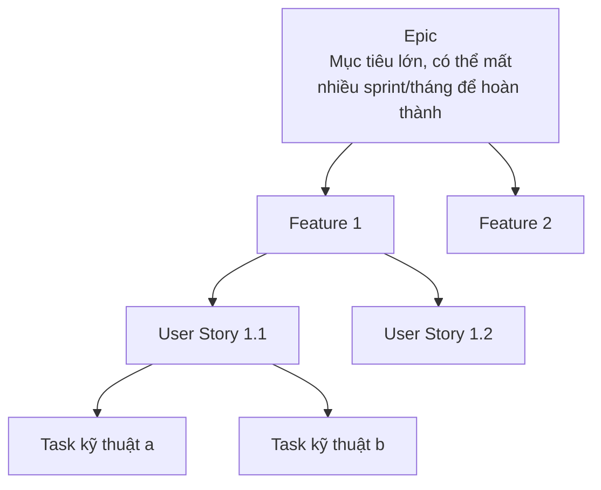

# Chương 24: Epic, Feature, User Story: phân rã backlog, mẫu backlog

## Mục tiêu học

- Phân biệt được Epic, Feature, User Story, Task — 4 cấp độ phân rã công việc phổ biến trong Agile.
- Thực hành kỹ thuật phân rã (decomposition) một Epic lớn thành các User Story nhỏ đạt tiêu chí
  INVEST (Chương 23).
- Xây dựng được một backlog có cấu trúc, sẵn sàng đưa vào công cụ như Jira (Chương 37).

## 24.1 Bốn cấp độ phân rã

| Cấp độ | Quy mô | Ví dụ FoodNow |
|---|---|---|
| **Epic** | Lớn, nhiều sprint/tháng | "Chương trình khách hàng thân thiết" |
| **Feature** | Vừa, có thể là 1-2 sprint | "Tích điểm theo giá trị đơn hàng" |
| **User Story** | Nhỏ, hoàn thành trong vài ngày (Chương 23) | "Là khách hàng, tôi muốn xem số điểm hiện có, để biết mình còn bao nhiêu điểm" |
| **Task** | Chi tiết kỹ thuật, do Dev tự chia nhỏ | "Tạo API GET /loyalty-points/{userId}" |

> Lưu ý: **Task kỹ thuật thường do Dev tự chia nhỏ và quản lý**, không phải công việc chính của
> BA — BA tập trung ở 3 cấp độ Epic/Feature/User Story, nơi ngôn ngữ vẫn là ngôn ngữ nghiệp vụ chứ
> chưa đi vào chi tiết kỹ thuật thuần tuý.

## 24.2 Kỹ thuật phân rã Epic thành User Story

Có nhiều cách phân rã một Epic — không có cách "đúng duy nhất", nhưng các trục phân rã phổ biến:

1. **Theo luồng nghiệp vụ (workflow steps)**: chia theo các bước tuần tự trong một quy trình.
2. **Theo quy tắc nghiệp vụ (business rules)**: tách riêng từng biến thể/quy tắc phức tạp.
3. **Theo loại dữ liệu/đối tượng (data variations)**: ví dụ tách theo loại người dùng khác nhau.
4. **Theo mức độ ưu tiên (happy path trước, edge case sau)**: làm trước phần lõi tạo giá trị chính,
   xử lý edge case ở story riêng, làm sau nếu cần.

### Ví dụ: phân rã Epic "Chương trình khách hàng thân thiết" (FoodNow)

**Epic**: Chương trình khách hàng thân thiết — khách hàng tích điểm theo giá trị đơn hàng, có thể
đổi điểm lấy ưu đãi.

Phân rã theo luồng nghiệp vụ (tích điểm → xem điểm → đổi điểm):

| ID | User Story | Ưu tiên (MoSCoW — Chương 26) |
|---|---|---|
| US-401 | Là khách hàng, tôi muốn được tự động tích điểm sau mỗi đơn hàng thành công, để tôi tích luỹ dần mà không cần thao tác thêm | Must have |
| US-402 | Là khách hàng, tôi muốn xem số điểm hiện có trên màn hình tài khoản, để tôi biết mình còn bao nhiêu điểm | Must have |
| US-403 | Là khách hàng, tôi muốn xem lịch sử tích/đổi điểm, để tôi kiểm tra lại các giao dịch điểm của mình | Should have |
| US-404 | Là khách hàng, tôi muốn đổi điểm lấy mã giảm giá, để tôi tiết kiệm chi phí cho đơn hàng tiếp theo | Must have |
| US-405 | Là khách hàng, tôi muốn nhận thông báo khi điểm sắp hết hạn, để tôi không bỏ lỡ cơ hội sử dụng | Could have |
| US-406 | Là Ban giám đốc, tôi muốn xem báo cáo tổng số điểm đã phát hành/đã đổi theo tháng, để đánh giá hiệu quả chương trình | Should have |

Mỗi User Story ở trên đều đạt tiêu chí **Independent** (có thể làm US-402 mà chưa cần US-404 xong)
và **Small** (mỗi story có thể ước lượng và hoàn thành trong vài ngày).

## 24.3 Định nghĩa "Ready" và "Done" cho một User Story

Để backlog vận hành trơn tru, đội cần thống nhất trước 2 định nghĩa quan trọng:

- **Definition of Ready (DoR)**: điều kiện để một User Story đủ điều kiện đưa vào Sprint Planning
  (Chương 8, 27) — thường gồm: đã có Acceptance Criteria rõ ràng, đã được ước lượng, không còn phụ
  thuộc chưa giải quyết.
- **Definition of Done (DoD)**: điều kiện để một User Story được coi là hoàn thành thực sự — không
  chỉ "code xong" mà thường gồm: code đã review, đã pass test tự động, đã qua QA, đã demo được.

BA có vai trò quan trọng trong việc đảm bảo DoR được đáp ứng **trước khi** đưa story vào sprint —
tránh tình trạng Dev nhận story mơ hồ, phải dừng lại giữa chừng để hỏi lại BA.

## 24.4 Mẫu backlog đầy đủ

Một backlog đầy đủ hơn cho toàn bộ các Epic của FoodNow (không chỉ chương trình khách hàng thân
thiết) được lưu tại:

> **`templates/user-story-epic/FoodNow-UserStories.md`**

Xem bản đầy đủ tại Phụ lục C (cuối sách).

## Bài tập

1. Phân rã Epic "Theo dõi đơn hàng real-time" của FoodNow thành tối thiểu 4 User Story, theo một
   trong các trục phân rã ở mục 24.2 — ghi rõ bạn chọn trục nào.
2. Với 4 User Story vừa viết, tự đề xuất mức ưu tiên MoSCoW cho từng story (sẽ học chi tiết kỹ
   thuật MoSCoW ở Chương 26, nhưng có thể tự ước lượng theo trực giác trước).

## Sai lầm thường gặp

- **Epic không bao giờ được phân rã, cứ để nguyên trong backlog**: khiến đội không thể ước lượng
  hay lên kế hoạch sprint cụ thể — Epic cần được phân rã trước khi đưa vào sprint bất kỳ.
- **Phân rã theo tầng kỹ thuật thay vì theo giá trị nghiệp vụ** (ví dụ: 1 story "làm frontend", 1
  story "làm backend" cho cùng một tính năng) — vi phạm tiêu chí "Valuable" vì không story riêng lẻ
  nào tạo ra giá trị hoàn chỉnh cho người dùng.
- **Không thống nhất Definition of Ready/Done trước khi bắt đầu**: dẫn đến tranh cãi liên tục về
  "story này đã xong chưa" giữa các thành viên đội.

## Tóm tắt & tiếp theo

Epic → Feature → User Story → Task là 4 cấp độ phân rã phổ biến, BA chủ yếu làm việc ở 3 cấp độ
đầu; kỹ thuật phân rã theo luồng nghiệp vụ, quy tắc, loại dữ liệu, hoặc mức ưu tiên giúp chia Epic
lớn thành User Story đạt tiêu chí INVEST. Chương 25 sẽ khép lại Phần 3 với chủ đề wireframe/prototype
cơ bản — công cụ trực quan hỗ trợ BA mô tả ý tưởng rõ ràng hơn văn bản thuần.
