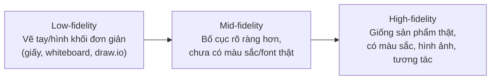

# Chương 25: Wireframe & Prototype cơ bản cho BA

## Mục tiêu học

- Hiểu vì sao BA cần biết vẽ wireframe ở mức cơ bản, dù không phải Designer.
- Phân biệt 3 mức độ "trung thực" (fidelity) của wireframe: low-fidelity, mid-fidelity, high-fidelity.
- Vẽ được một wireframe low-fidelity đơn giản để minh hoạ ý tưởng trong buổi họp/workshop.
- Biết ranh giới: việc gì BA nên tự làm, việc gì nên để Designer đảm nhận.

## 25.1 Vì sao BA cần biết wireframe, dù không phải Designer?

Chương 17 đã nói: **prototype/wireframe là một kỹ thuật Validation hiệu quả** — nhiều stakeholder
validate chính xác hơn khi nhìn thấy hình ảnh cụ thể so với đọc mô tả bằng văn bản. Trong thực tế,
BA thường cần vẽ nhanh một wireframe đơn giản ngay trong buổi họp/workshop để:

- Minh hoạ ý tưởng ngay lập tức, tránh hiểu lầm khi mô tả bằng lời quá trừu tượng.
- Làm cơ sở thảo luận cụ thể hơn khi elicitation (Chương 12) — nhiều stakeholder khó hình dung
  bằng lời, nhưng dễ dàng góp ý khi nhìn thấy hình vẽ, dù chỉ là hình vẽ tay đơn giản.
- Chuẩn bị tài liệu đầu vào rõ ràng hơn trước khi bàn giao cho Designer chính thức.

**BA không cần biết dùng Figma thành thạo hay có gu thẩm mỹ như Designer** — mục tiêu chỉ là truyền
đạt được **cấu trúc và luồng thông tin**, không phải tạo ra giao diện đẹp.

## 25.2 Ba mức độ "trung thực" (fidelity)



| Mức độ | Công cụ thường dùng | Ai thường làm | Khi nào dùng |
|---|---|---|---|
| **Low-fidelity** | Giấy, bút, whiteboard, draw.io | BA, PO, cả đội trong workshop | Giai đoạn ý tưởng ban đầu, thảo luận nhanh, không cần chuẩn xác |
| **Mid-fidelity** | Balsamiq, draw.io với template UI | BA (cơ bản) hoặc Designer | Làm rõ luồng và bố cục trước khi Designer đầu tư thời gian thiết kế chi tiết |
| **High-fidelity** | Figma, Adobe XD | Designer chuyên nghiệp | Thiết kế cuối cùng, gần với sản phẩm thật, dùng để Dev code theo |

BA chủ yếu hoạt động ở mức **low-fidelity** và đôi khi **mid-fidelity** — high-fidelity là công
việc chuyên môn của Designer.

## 25.3 Ví dụ: Wireframe low-fidelity cho màn hình giỏ hàng FoodNow

Dưới đây là một wireframe low-fidelity dạng khối đơn giản (mô tả bằng ký hiệu văn bản, tương đương
những gì bạn có thể vẽ tay trên giấy hoặc bằng hình khối trong draw.io):

```
┌─────────────────────────────────┐
│  ← Quay lại        Giỏ hàng     │
├─────────────────────────────────┤
│  [Ảnh]  Cơm gà xối mỡ            │
│         35.000đ   [- 2 +]  [Xoá]│
├─────────────────────────────────┤
│  [Ảnh]  Trà đào cam sả           │
│         25.000đ   [- 1 +]  [Xoá]│
├─────────────────────────────────┤
│  Nhập mã giảm giá: [________][Áp dụng]│
├─────────────────────────────────┤
│  Tạm tính:              95.000đ │
│  Giảm giá:              -9.500đ │
│  Tổng cộng:              85.500đ│
├─────────────────────────────────┤
│      [   Tiếp tục thanh toán   ]│
└─────────────────────────────────┘
```

Wireframe này đủ để trả lời các câu hỏi quan trọng khi thảo luận với stakeholder: Có hiển thị ảnh
món không? Có cho sửa số lượng trực tiếp tại giỏ hàng không? Nhập mã giảm giá ở đâu trong luồng?
— tất cả **không cần biết vẽ đẹp**, chỉ cần đủ rõ để thảo luận đúng trọng tâm.

## 25.4 Ranh giới: việc của BA và việc của Designer

| Việc BA nên làm | Việc nên để Designer làm |
|---|---|
| Vẽ nhanh low-fidelity để minh hoạ ý tưởng trong họp | Thiết kế high-fidelity cuối cùng |
| Xác định cấu trúc thông tin, luồng màn hình (Activity Diagram — Chương 15) | Chọn màu sắc, font, khoảng cách, hiệu ứng chuyển động |
| Góp ý về nội dung/luồng nghiệp vụ khi xem thiết kế Designer làm | Đảm bảo tuân thủ bộ nhận diện thương hiệu, nguyên tắc UX chuyên sâu |
| Đảm bảo wireframe phản ánh đúng yêu cầu nghiệp vụ (validate — Chương 17) | Kiểm tra khả năng tiếp cận (accessibility), responsive trên nhiều thiết bị |

Nguyên tắc chung: BA tập trung vào **"thông tin gì cần có, theo thứ tự nào, luồng ra sao"** —
Designer tập trung vào **"trình bày thông tin đó đẹp, dễ dùng, nhất quán thương hiệu như thế nào"**.
Khi hai bên tôn trọng ranh giới này, tránh được tình trạng BA "chỉ đạo" Designer về mặt thẩm mỹ
(vượt quá chuyên môn) hoặc Designer tự ý thay đổi luồng nghiệp vụ mà không hỏi lại BA.

## Bài tập

1. Vẽ (bằng ký hiệu văn bản như ví dụ mục 25.3, hoặc vẽ tay/dùng draw.io) một wireframe low-fidelity
   cho màn hình "Theo dõi đơn hàng" của FoodNow — hiển thị được các trạng thái đơn hàng (liên hệ
   User Story US-201, Chương 24).
2. Với wireframe bạn vừa vẽ, liệt kê 3 câu hỏi bạn sẽ đặt ra cho stakeholder khi trình bày wireframe
   này để validate (liên hệ kỹ thuật Validation — Chương 17).

## Sai lầm thường gặp

- **Đầu tư quá nhiều thời gian làm wireframe đẹp ở giai đoạn ý tưởng ban đầu**: lãng phí thời gian
  — ở giai đoạn cần thảo luận nhanh, low-fidelity là đủ, không cần mid/high-fidelity.
- **BA tự ý quyết định các chi tiết thẩm mỹ (màu sắc, font) trong wireframe rồi áp đặt cho Designer**:
  vượt quá ranh giới chuyên môn — nên để trống các quyết định này, tập trung vào cấu trúc/luồng.
- **Chỉ mô tả yêu cầu bằng văn bản, không bao giờ vẽ minh hoạ dù ý tưởng phức tạp**: bỏ lỡ công cụ
  validation hiệu quả, dễ gây hiểu lầm hơn nhiều so với có kèm hình minh hoạ dù đơn giản.

## Tóm tắt & tiếp theo

BA nên biết vẽ wireframe low-fidelity (và đôi khi mid-fidelity) để minh hoạ ý tưởng nhanh, hỗ trợ
validation hiệu quả hơn văn bản thuần — nhưng cần tôn trọng ranh giới, để lại phần thiết kế
high-fidelity chuyên sâu cho Designer. Đây là chương khép lại Phần 3 (Tài liệu BA cốt lõi). Từ
Chương 26, sách bước vào Phần 4 — Quản lý dự án & giao hàng, bắt đầu với kỹ thuật ưu tiên hoá
backlog: MoSCoW, WSJF, và mô hình Kano.
