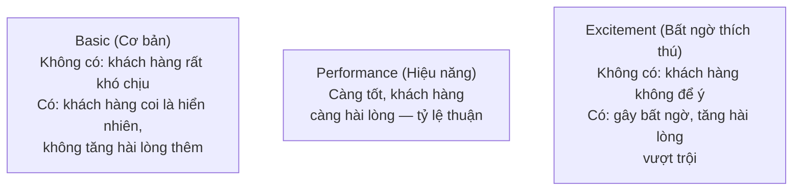

# Chương 26: Ưu tiên hoá Backlog: MoSCoW, WSJF, mô hình Kano

## Mục tiêu học

- Áp dụng được kỹ thuật MoSCoW để phân loại độ ưu tiên của yêu cầu.
- Hiểu và tính toán được điểm WSJF ở mức cơ bản để so sánh độ ưu tiên giữa các hạng mục.
- Phân loại được tính năng theo mô hình Kano (Basic, Performance, Excitement) để hiểu tác động đến
  sự hài lòng của khách hàng.
- Biết chọn kỹ thuật phù hợp cho từng tình huống.

## 26.1 Vì sao cần ưu tiên hoá?

Backlog của bất kỳ dự án nào cũng gần như luôn có **nhiều việc hơn thời gian/nguồn lực có thể làm
ngay**. Ưu tiên hoá giúp trả lời câu hỏi quan trọng nhất trong quản lý sản phẩm: **"làm gì trước,
làm gì sau, làm gì có thể không làm"** — dựa trên tiêu chí khách quan thay vì "ai la to nhất được
làm trước".

## 26.2 MoSCoW

Kỹ thuật đơn giản và phổ biến nhất, phân loại mỗi hạng mục vào 1 trong 4 nhóm:

| Nhóm | Ý nghĩa | Ví dụ FoodNow |
|---|---|---|
| **M — Must have** | Bắt buộc phải có, thiếu thì sản phẩm không dùng được/không đạt mục tiêu tối thiểu | Đặt món, thanh toán (US-101 đến US-104) |
| **S — Should have** | Quan trọng nhưng có thể tạm hoãn nếu thời gian gấp | Xem lịch sử đơn hàng (US-203) |
| **C — Could have** | Có thì tốt, không có cũng không ảnh hưởng lớn | Thông báo điểm sắp hết hạn (US-405) |
| **W — Won't have (this time)** | Đã cân nhắc nhưng quyết định KHÔNG làm ở phiên bản này | Đặt bàn trước tại quán (xem BRD, mục "Ngoài phạm vi" — Chương 19) |

**Nguyên tắc quan trọng**: nhóm "Must have" nên chiếm **tối đa 60% tổng khối lượng công việc** —
nếu mọi thứ đều được gắn nhãn "Must have", nhãn đó mất hết ý nghĩa (không còn phân biệt được gì
với gì). Đây là lỗi rất phổ biến khi PO/Sponsor không quen làm việc với MoSCoW.

## 26.3 WSJF (Weighted Shortest Job First)

MoSCoW tốt để phân loại nhanh nhưng không giúp so sánh **định lượng** giữa các hạng mục cùng nhóm
"Must have". **WSJF** giải quyết vấn đề này bằng công thức:

> **WSJF = Cost of Delay (Chi phí trì hoãn) ÷ Job Size (Độ lớn công việc)**

**Cost of Delay** thường được ước lượng bằng tổng của 3 yếu tố (mỗi yếu tố chấm điểm tương đối,
ví dụ theo thang Fibonacci 1-2-3-5-8-13):

- **Giá trị kinh doanh** (Business Value): mang lại lợi ích trực tiếp đến mức nào.
- **Mức độ khẩn cấp theo thời gian** (Time Criticality): trì hoãn càng lâu, giá trị mất đi càng
  nhanh hay không (ví dụ: tính năng phục vụ mùa Tết mất giá trị hoàn toàn nếu làm xong sau Tết).
- **Giảm rủi ro/tạo cơ hội** (Risk Reduction/Opportunity Enablement): làm sớm giúp giảm rủi ro
  hoặc mở ra cơ hội gì cho các hạng mục khác.

### Ví dụ tính WSJF cho 2 hạng mục của FoodNow

| Hạng mục | Giá trị kinh doanh | Khẩn cấp thời gian | Giảm rủi ro | Tổng Cost of Delay | Job Size | WSJF |
|---|---|---|---|---|---|---|
| Tích hợp cổng thanh toán VNPay | 8 | 5 | 8 (rủi ro kỹ thuật cao, nên làm sớm) | 21 | 8 | **2.6** |
| Thông báo điểm sắp hết hạn (US-405) | 2 | 1 | 1 | 4 | 3 | **1.3** |

WSJF càng cao, càng nên ưu tiên làm trước — ở đây, tích hợp cổng thanh toán (2.6) nên làm trước
thông báo điểm sắp hết hạn (1.3), phù hợp với trực giác nhưng giờ có con số cụ thể để giải thích
quyết định với stakeholder, thay vì chỉ dựa vào cảm tính.

> WSJF phổ biến trong các tổ chức áp dụng SAFe (Scaled Agile Framework — nhắc ở Chương 11), phù hợp
> khi cần so sánh định lượng giữa nhiều hạng mục lớn, đến từ nhiều đội khác nhau.

## 26.4 Mô hình Kano

MoSCoW và WSJF tập trung vào ưu tiên **thời điểm làm**, mô hình Kano tập trung vào **tác động đến
sự hài lòng của khách hàng** — phân loại tính năng thành 3 nhóm:

| Nhóm Kano | Ví dụ FoodNow | Hàm ý cho ưu tiên hoá |
|---|---|---|
| **Basic** | App phải đặt được hàng, thanh toán được — nếu lỗi, khách bỏ đi ngay | Bắt buộc làm tốt, nhưng làm tốt hơn cũng không "gây ấn tượng" thêm — đầu tư vừa đủ, không quá tay |
| **Performance** | Tốc độ tải trang, độ chính xác thời gian giao hàng dự kiến | Càng đầu tư tối ưu, khách hàng càng hài lòng hơn theo tỷ lệ — đáng đầu tư liên tục |
| **Excitement** | Gợi ý món ăn dựa trên lịch sử đặt hàng, quà bất ngờ vào sinh nhật khách hàng | Không bắt buộc nhưng tạo khác biệt cạnh tranh — cân nhắc làm sau khi đã vững phần Basic |

**Ứng dụng thực tế**: nhiều đội mới làm sản phẩm mắc lỗi đầu tư quá nhiều vào tính năng
"Excitement" (nghe hấp dẫn, dễ gây hứng thú khi brainstorm) trong khi tính năng "Basic" còn chưa ổn
định — ví dụ FoodNow đầu tư tính năng gợi ý món ăn bằng AI trong khi app vẫn còn lỗi khi thanh
toán — đây là sai lầm về thứ tự ưu tiên nghiêm trọng.

## 26.5 Kết hợp cả ba kỹ thuật trong thực tế

Quy trình thực chiến phổ biến:

1. Dùng **Kano** để hiểu tác động của từng nhóm tính năng đến trải nghiệm khách hàng (làm 1 lần,
   mang tính định hướng chiến lược).
2. Dùng **MoSCoW** để phân loại nhanh cho mỗi phiên bản/release cụ thể.
3. Dùng **WSJF** khi cần so sánh định lượng giữa nhiều hạng mục cùng nằm trong nhóm "Must have"
   của MoSCoW, để quyết định thứ tự làm cụ thể.

## Bài tập

1. Phân loại 6 User Story của Epic C (Chương trình khách hàng thân thiết, xem
   `templates/user-story-epic/FoodNow-UserStories.md`) theo MoSCoW — so sánh với mức ưu tiên đã gợi
   ý sẵn trong bảng, giải thích nếu bạn có ý kiến khác.
2. Chọn 2 tính năng của FoodNow, tự chấm điểm Cost of Delay (3 yếu tố) và Job Size, tính WSJF theo
   công thức mục 26.3.

## Sai lầm thường gặp

- **Gắn nhãn "Must have" cho gần như mọi thứ trong backlog**: làm mất ý nghĩa phân loại — nên giới
  hạn nhóm Must have ở mức hợp lý (tối đa ~60%).
- **Chỉ dùng một kỹ thuật duy nhất cho mọi quyết định**: mỗi kỹ thuật trả lời một câu hỏi khác nhau
  (thời điểm làm vs tác động hài lòng khách hàng) — nên kết hợp như gợi ý ở mục 26.5.
- **Đầu tư quá sớm vào tính năng Excitement khi tính năng Basic chưa ổn định**: gây lãng phí nguồn
  lực và rủi ro mất khách hàng vì trải nghiệm cơ bản chưa tốt.

## Tóm tắt & tiếp theo

MoSCoW phân loại nhanh 4 nhóm ưu tiên, WSJF định lượng so sánh dựa trên chi phí trì hoãn và độ lớn
công việc, mô hình Kano phân loại tác động đến sự hài lòng khách hàng (Basic/Performance/
Excitement) — nên kết hợp cả ba tuỳ mục đích. Chương 27 sẽ đi sâu vào vai trò cụ thể của BA trong
Sprint Planning và hoạt động "backlog refinement" diễn ra trước đó.
