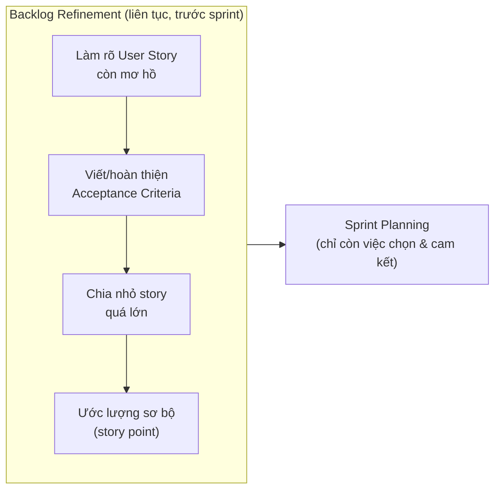
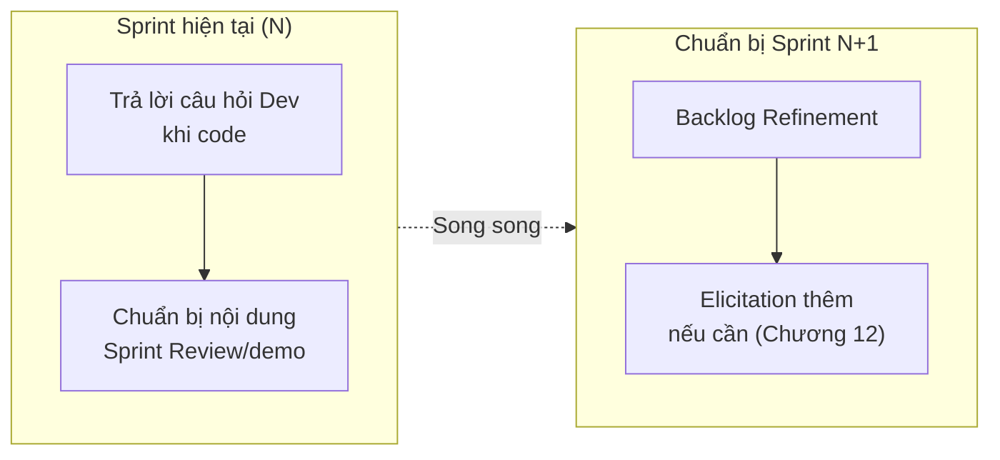

# Chương 27: Sprint Planning & vai trò của BA trong sprint

## Mục tiêu học

- Hiểu vai trò của hoạt động "Backlog Refinement" (còn gọi là Backlog Grooming) — diễn ra trước
  Sprint Planning, không phải trong sự kiện Sprint Planning chính thức.
- Biết BA cần chuẩn bị gì trước Sprint Planning để buổi họp diễn ra hiệu quả.
- Phân biệt công việc BA làm trong sprint đang chạy so với công việc chuẩn bị cho sprint tiếp theo.

## 27.1 Backlog Refinement — nơi phần lớn công việc BA diễn ra

Chương 8 đã giới thiệu 5 sự kiện chính thức của Scrum — nhưng **Backlog Refinement không phải một
sự kiện chính thức** trong Scrum Guide, mà là một **hoạt động liên tục**, thường diễn ra định kỳ
(ví dụ: 1-2 buổi/tuần, mỗi buổi 1 tiếng) để chuẩn bị backlog cho các sprint sắp tới.

Đây là nơi phần lớn thời gian và công sức của BA thực sự dành cho — **không phải trong buổi Sprint
Planning**. Nếu backlog được refine tốt trước đó, Sprint Planning chỉ còn là việc PO trình bày độ
ưu tiên, đội xác nhận hiểu đúng, và cam kết khối lượng công việc cho sprint — không cần dừng lại
để phân tích yêu cầu từ đầu.

## 27.2 Checklist chuẩn bị của BA trước Sprint Planning

Với mỗi User Story dự kiến đưa vào sprint tiếp theo, BA cần đảm bảo đạt **Definition of Ready**
(đã giới thiệu ở Chương 24):

- [ ] User Story viết đúng cấu trúc, có đủ "vai trò - nhu cầu - lợi ích" (Chương 23).
- [ ] Đạt tiêu chí INVEST, đặc biệt là **Small** (đủ nhỏ để hoàn thành trong 1 sprint) và
      **Estimable** (đội đủ hiểu để ước lượng).
- [ ] Có Acceptance Criteria viết theo Gherkin, bao phủ cả trường hợp thành công và thất bại.
- [ ] Không còn phụ thuộc (dependency) chưa giải quyết vào story/hệ thống khác.
- [ ] Đã trao đổi trước với Dev/QA nếu có điểm phức tạp về mặt kỹ thuật cần làm rõ sớm.

Nếu một story chưa đạt các tiêu chí trên, **không nên đưa vào Sprint Planning** — sẽ chỉ gây lãng
phí thời gian buổi họp để phân tích thay vì lên kế hoạch.

## 27.3 Vai trò của BA trong chính buổi Sprint Planning

Dù phần lớn công việc đã làm ở Refinement, BA vẫn có vai trò cụ thể trong buổi Sprint Planning:

- **Trả lời câu hỏi làm rõ phát sinh tại chỗ**: dù đã refine kỹ, Dev có thể vẫn có câu hỏi mới khi
  thảo luận chi tiết cách hiện thực.
- **Xác nhận độ ưu tiên cùng PO**: đảm bảo thứ tự chọn story vào sprint phản ánh đúng giá trị
  nghiệp vụ (liên hệ MoSCoW/WSJF — Chương 26), không chỉ chọn theo độ dễ làm.
- **Ghi nhận rủi ro/giả định mới phát sinh**: nếu trong lúc thảo luận, đội phát hiện một giả định
  quan trọng (ví dụ: "giả sử cổng thanh toán hỗ trợ hoàn tiền tự động") — BA cần ghi lại để xác
  minh sau, tránh giả định sai lặng lẽ trôi vào sprint mà không ai kiểm chứng (liên hệ RAID Log —
  Chương 31).

## 27.4 Công việc của BA trong sprint đang chạy — nhìn hai hướng cùng lúc

BA giỏi trong Scrum thường **làm việc song song hai luồng**:

Đây là điểm khác biệt lớn so với Waterfall (Chương 6), nơi BA thường làm xong hẳn giai đoạn
Requirements rồi mới chuyển hẳn sang hỗ trợ Design/Implementation. Trong Scrum, BA luôn "sống"
đồng thời ở hai thời điểm: **hỗ trợ sprint hiện tại**, và **chuẩn bị cho sprint tiếp theo** — nếu
chỉ tập trung một trong hai, đội sẽ hoặc thiếu hỗ trợ tức thời, hoặc thiếu backlog sẵn sàng khi
sprint tiếp theo bắt đầu.

## 27.5 Ví dụ thực tế với FoodNow

Trong tuần đang chạy Sprint 3 (đội đang code Epic B — Theo dõi đơn hàng), lịch làm việc điển hình
của BA có thể như sau:

- **Thứ 2-3**: Trả lời câu hỏi Dev về US-202 (thông báo đẩy) đang code trong sprint hiện tại; đồng
  thời tổ chức buổi Refinement 1 tiếng cho các story của Epic C (Chương trình khách hàng thân
  thiết) dự kiến vào Sprint 4.
- **Thứ 4**: Phỏng vấn nhanh (elicitation) với Phòng Marketing để làm rõ chi tiết US-405 (thông báo
  điểm sắp hết hạn) còn thiếu Acceptance Criteria.
- **Thứ 5**: Chuẩn bị kịch bản demo cho Sprint Review cuối tuần, xác nhận với QA rằng US-201, US-202
  đã pass test.
- **Thứ 6**: Tham gia Sprint Review, ghi nhận phản hồi từ stakeholder; tham gia Retrospective.

## Bài tập

1. Với 3 User Story chưa đạt Definition of Ready (tự chọn từ `templates/user-story-epic/FoodNow-
   UserStories.md`, giả định chúng còn thiếu Acceptance Criteria), viết ra kế hoạch cụ thể bạn sẽ
   làm trong buổi Backlog Refinement để đưa chúng đạt DoR.
2. Giải thích bằng lời của bạn: vì sao việc BA "làm việc song song hai luồng" (sprint hiện tại +
   chuẩn bị sprint tiếp theo) lại là một thách thức lớn hơn so với làm việc trong mô hình Waterfall.

## Sai lầm thường gặp

- **Không tổ chức Backlog Refinement riêng, dồn hết việc phân tích vào Sprint Planning**: làm buổi
  Sprint Planning kéo dài quá lâu, đội mệt mỏi, giảm chất lượng ước lượng.
- **Chỉ tập trung sprint hiện tại, quên chuẩn bị cho sprint tiếp theo**: dẫn đến backlog "cạn kiệt"
  vào đầu sprint sau, đội phải chờ BA phân tích gấp, ảnh hưởng chất lượng.
- **Đưa story chưa đạt Definition of Ready vào Sprint Planning "cho đủ số lượng"**: gây lãng phí
  thời gian buổi họp và rủi ro cam kết sai khối lượng công việc thực tế đội có thể làm.

## Tóm tắt & tiếp theo

Phần lớn công việc BA trong Scrum diễn ra ở hoạt động Backlog Refinement (không phải sự kiện chính
thức nhưng cực kỳ quan trọng) trước Sprint Planning, và BA cần làm việc song song hai luồng: hỗ trợ
sprint hiện tại và chuẩn bị cho sprint tiếp theo. Chương 28 sẽ đi vào khái niệm cốt lõi của việc
giao hàng theo Agile: **Incremental & Iterative Delivery**.
