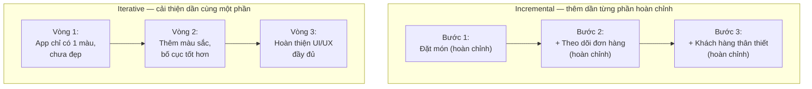
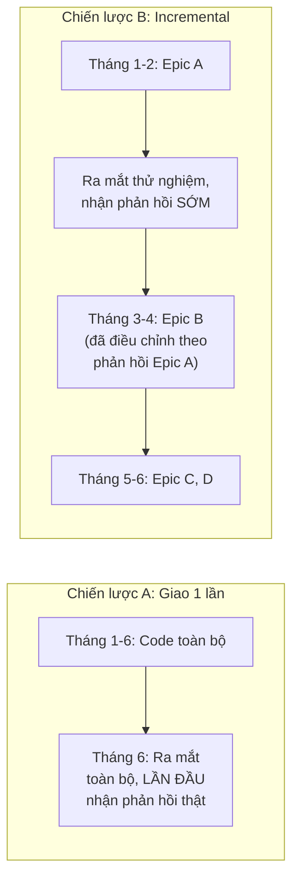

# Chương 28: Incremental & Iterative Delivery: khái niệm, phân biệt

## Mục tiêu học

- Phân biệt rõ ràng "Incremental" (tăng dần) và "Iterative" (lặp lại) — hai khái niệm hay bị dùng
  lẫn lộn dù ý nghĩa khác nhau.
- Giải thích được vì sao giao hàng từng phần giảm rủi ro so với giao hàng một lần (Waterfall).
- Xác định được chiến lược Incremental phù hợp cho một dự án cụ thể.

## 28.1 Incremental vs Iterative — khác nhau ở đâu?

Đây là cặp thuật ngữ dễ nhầm vì thường đi cùng nhau trong Agile, nhưng bản chất khác nhau:

- **Incremental (Tăng dần)**: xây dựng sản phẩm bằng cách **thêm dần các phần mới, hoàn chỉnh**
  vào những gì đã có — mỗi phần thêm vào là một chức năng đầy đủ, dùng được, không cần sửa lại
  những gì đã làm trước đó.
- **Iterative (Lặp lại)**: xây dựng sản phẩm bằng cách **làm đi làm lại, cải thiện dần** cùng một
  phần — mỗi vòng lặp làm cho phần đó tốt hơn, hoàn chỉnh hơn, không nhất thiết đã "dùng được" đầy
  đủ ngay từ vòng lặp đầu.

Trong thực tế, **Scrum kết hợp cả hai**: mỗi sprint vừa có thể thêm tính năng mới (incremental) vừa
có thể cải thiện tính năng đã có dựa trên phản hồi (iterative) — đây là lý do 2 khái niệm hay bị
gộp chung, dù về mặt lý thuyết là hai trục khác nhau.

## 28.2 Vì sao giao hàng từng phần giảm rủi ro?

So sánh hai chiến lược cho dự án FoodNow:

**Chiến lược A — Giao hàng một lần (Waterfall thuần, Chương 6)**: phát triển toàn bộ Epic A, B, C,
D trong 6 tháng, chỉ ra mắt khi hoàn thành 100%.

**Chiến lược B — Incremental Delivery**: ra mắt Epic A (Đặt món & Thanh toán) sau 2 tháng cho 2 chi
nhánh thử nghiệm, thu thập phản hồi thật, rồi tiếp tục Epic B, C, D.

Với Chiến lược A, nếu phát hiện vấn đề nghiêm trọng ở Epic A (ví dụ: khách hàng thấy luồng thanh
toán khó hiểu) — vấn đề này chỉ được phát hiện ở tháng thứ 6, **sau khi đã lỡ xây cả Epic B, C, D**
theo cùng một giả định sai. Với Chiến lược B, vấn đề được phát hiện ở tháng thứ 2, kịp thời điều
chỉnh trước khi tiếp tục — đây chính là giá trị cốt lõi của Incremental Delivery: **biến những giả
định chưa kiểm chứng thành bài học sớm, với chi phí thấp**, thay vì đặt cược toàn bộ dự án vào một
lần ra mắt duy nhất.

## 28.3 Các chiến lược chia Incremental phổ biến

| Chiến lược | Mô tả | Ví dụ FoodNow |
|---|---|---|
| **Theo tính năng (Feature-based)** | Chia theo Epic/Feature độc lập | Epic A trước, Epic B/C/D sau (như ví dụ 28.2) |
| **Theo phân khúc người dùng (User segment)** | Ra mắt cho một nhóm nhỏ trước, mở rộng dần | Thử nghiệm ở 2 chi nhánh trước, mở rộng 12 chi nhánh sau |
| **Theo khu vực địa lý (Geographic)** | Ra mắt ở một khu vực trước | Chỉ Quận 1, Quận 3 trước, mở rộng toàn TP.HCM sau |
| **Theo mức độ hoàn chỉnh (Walking Skeleton)** | Xây một luồng end-to-end tối giản trước (dù đơn giản), rồi bổ sung chi tiết dần | Luồng đặt-thanh toán-nhận đơn tối giản (chưa có UI đẹp, chưa có thông báo) chạy được trước, rồi hoàn thiện dần |

**"Walking Skeleton"** đặc biệt hữu ích ở giai đoạn đầu dự án mới: thay vì hoàn thiện 100% một Epic
rồi mới sang Epic khác, xây một luồng **mỏng nhưng xuyên suốt toàn bộ hệ thống** trước — giúp phát
hiện sớm các vấn đề tích hợp giữa các thành phần (app, backend, cổng thanh toán, hệ thống chi
nhánh) mà chỉ khi ráp nối thực tế mới lộ ra.

## 28.4 Thách thức khi áp dụng Incremental Delivery

- **Cần thiết kế kiến trúc đủ linh hoạt**: để thêm Epic mới không phải viết lại phần đã có — đây là
  lý do Simple Design và Refactoring (XP, Chương 9) quan trọng, giúp code luôn sẵn sàng mở rộng.
- **Quản lý kỳ vọng của Sponsor**: cần giải thích rõ ra mắt "một phần" không có nghĩa là "làm dở
  dang" — mỗi phần ra mắt đều hoàn chỉnh, chỉ là phạm vi nhỏ hơn (liên hệ Definition of Done —
  Chương 24).
- **Ảnh hưởng thương hiệu nếu ra mắt sớm nhưng có lỗi**: cần cân nhắc ra mắt giới hạn (như thử
  nghiệm 2 chi nhánh) trước khi mở rộng toàn bộ, để giảm rủi ro ảnh hưởng uy tín trên diện rộng.

## Bài tập

1. Với dự án FoodNow, tự đề xuất một kế hoạch chia Incremental theo 1 trong 4 chiến lược ở mục
   28.3 (khác với ví dụ đã có), giải thích lý do chọn chiến lược đó.
2. Giải thích bằng ví dụ cụ thể của riêng bạn (không dùng lại ví dụ FoodNow) sự khác biệt giữa
   "Incremental" và "Iterative".

## Sai lầm thường gặp

- **Nhầm lẫn hoàn toàn Incremental và Iterative, dùng thay thế cho nhau**: dù thực tế thường đi
  cùng nhau, hiểu đúng bản chất giúp BA giải thích chiến lược giao hàng chính xác hơn với Sponsor.
- **Chia Incremental theo tầng kỹ thuật thay vì theo giá trị nghiệp vụ** (tương tự lỗi ở Chương 24) —
  ví dụ "increment 1: xong backend, increment 2: xong frontend" — không mang lại giá trị dùng được
  ở mỗi increment.
- **Không chuẩn bị tâm lý cho Sponsor về việc ra mắt từng phần**: nếu Sponsor kỳ vọng "ra mắt là
  phải đầy đủ mọi thứ ngay", cần giải thích rõ lợi ích của Incremental Delivery (mục 28.2) trước
  khi bắt đầu, tránh hiểu lầm giữa chừng dự án.

## Tóm tắt & tiếp theo

Incremental (thêm dần từng phần hoàn chỉnh) và Iterative (cải thiện dần cùng một phần) là hai khái
niệm khác nhau nhưng thường kết hợp trong Agile — giao hàng từng phần giúp phát hiện sớm vấn đề với
chi phí thấp hơn nhiều so với đặt cược vào một lần ra mắt duy nhất. Chương 29 sẽ học cách biến
chiến lược Incremental thành một **kế hoạch cụ thể, có tài liệu** — Release Plan và Incremental
Delivery Plan, kèm mẫu đầy đủ.
