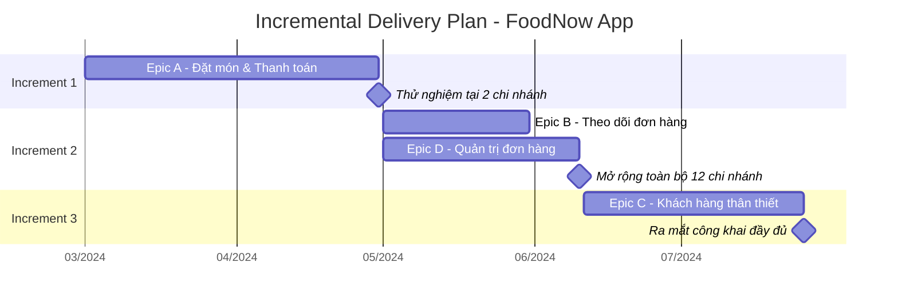

# Chương 29: Release Plan & Delivery Document: mẫu Incremental Delivery Plan

## Mục tiêu học

- Nắm được cấu trúc của một Release Plan/Incremental Delivery Plan.
- Biết cách trình bày kế hoạch giao hàng theo increment cho stakeholder không rành kỹ thuật.
- Có sẵn mẫu Incremental Delivery Plan đầy đủ trong `templates/incremental-delivery/`.

## 29.1 Từ chiến lược đến kế hoạch cụ thể

Chương 28 giới thiệu khái niệm và chiến lược Incremental Delivery — Chương này biến chiến lược đó
thành một **tài liệu cụ thể**, giúp mọi stakeholder (kể cả người không rành kỹ thuật như Ban giám
đốc) hiểu rõ: cái gì sẽ có, khi nào có, và làm sao đo được thành công của mỗi giai đoạn.

## 29.2 Cấu trúc một Incremental Delivery Plan

1. **Tổng quan**: liên kết ngược về mục tiêu kinh doanh (BRD — Chương 19) và chiến lược chia
   increment đã chọn (Chương 28).
2. **Bảng các Increment**: với mỗi increment, nêu rõ:
   - Nội dung/phạm vi (Epic/Feature nào).
   - Đối tượng nhận (toàn bộ người dùng hay nhóm thử nghiệm giới hạn).
   - Thời gian dự kiến.
   - Tiêu chí thành công/tiêu chí để chuyển sang increment tiếp theo.
   - Rủi ro chính của increment đó.
3. **Sơ đồ timeline trực quan**: giúp stakeholder hình dung nhanh (Gantt đơn giản hoặc timeline).
4. **Kế hoạch truyền thông/đào tạo đi kèm mỗi increment** (nếu cần) — liên hệ Transition
   Requirements (Chương 14).
5. **Điều kiện điều chỉnh kế hoạch**: nêu rõ ai có quyền quyết định thay đổi thứ tự/nội dung
   increment nếu có phát sinh (liên hệ Change Request — Chương 18).

## 29.3 Ví dụ timeline trực quan cho FoodNow

## 29.4 Mẫu tài liệu đầy đủ

Bản Incremental Delivery Plan đầy đủ (bao gồm bảng chi tiết từng increment, tiêu chí thành công,
rủi ro, kế hoạch đào tạo) cho dự án FoodNow được lưu tại:

> **`templates/incremental-delivery/FoodNow-IncrementalDeliveryPlan.md`**

Xem bản đầy đủ tại Phụ lục D (cuối sách).

## 29.5 Trình bày kế hoạch cho Sponsor không rành kỹ thuật

Khi trình bày Incremental Delivery Plan cho Ban giám đốc, tránh dùng thuật ngữ kỹ thuật ("sprint",
"backlog", "story point") — nên diễn đạt theo hướng **giá trị kinh doanh của từng giai đoạn**:

> Thay vì nói: "Increment 1 hoàn thành Epic A trong 2 sprint 30 ngày."
>
> Nên nói: "Trong 2 tháng đầu, khách hàng tại 2 chi nhánh thí điểm đã có thể đặt món và thanh toán
> qua app riêng — đây là bước đầu để chúng ta bắt đầu thu thập dữ liệu thực tế và giảm dần chi phí
> hoa hồng cho app bên thứ ba tại 2 chi nhánh này, trước khi mở rộng."

Cách diễn đạt này áp dụng lại nguyên tắc "song ngữ nghiệp vụ - kỹ thuật" đã học ở Chương 3.

## Bài tập

1. Mở `templates/incremental-delivery/FoodNow-IncrementalDeliveryPlan.md`, chọn 1 increment, thử
   viết lại phần "Nội dung/phạm vi" của increment đó theo ngôn ngữ dành cho Ban giám đốc (không
   dùng thuật ngữ kỹ thuật), theo mẫu ở mục 29.5.
2. Vẽ một sơ đồ Gantt đơn giản (theo cú pháp Mermaid ở mục 29.3, hoặc vẽ tay) cho một kế hoạch chia
   increment khác mà bạn đề xuất ở bài tập Chương 28.

## Sai lầm thường gặp

- **Coi Incremental Delivery Plan là cố định, không cập nhật khi có thay đổi**: kế hoạch này cần
  được xem là "sống", cập nhật khi có Change Request được phê duyệt (Chương 18) — không phải tài
  liệu chốt một lần như SRS trong Waterfall.
- **Không nêu rõ tiêu chí để chuyển sang increment tiếp theo**: dẫn đến tình trạng "cứ đến ngày là
  chuyển giai đoạn" bất kể increment trước có đạt tiêu chí thành công hay không.
- **Trình bày kế hoạch bằng thuật ngữ kỹ thuật cho Sponsor không rành kỹ thuật**: gây khó hiểu,
  giảm sự tin tưởng và tham gia của Sponsor vào quá trình theo dõi tiến độ.

## Tóm tắt & tiếp theo

Incremental Delivery Plan biến chiến lược giao hàng từng phần thành tài liệu cụ thể với timeline,
tiêu chí thành công, và rủi ro cho từng increment — cần trình bày bằng ngôn ngữ giá trị kinh doanh
khi làm việc với Sponsor. Chương 30 sẽ học kỹ năng liên quan chặt chẽ: **ước lượng cơ bản** — làm
sao BA phối hợp cùng Dev/QA ước lượng độ lớn công việc một cách hợp lý.
