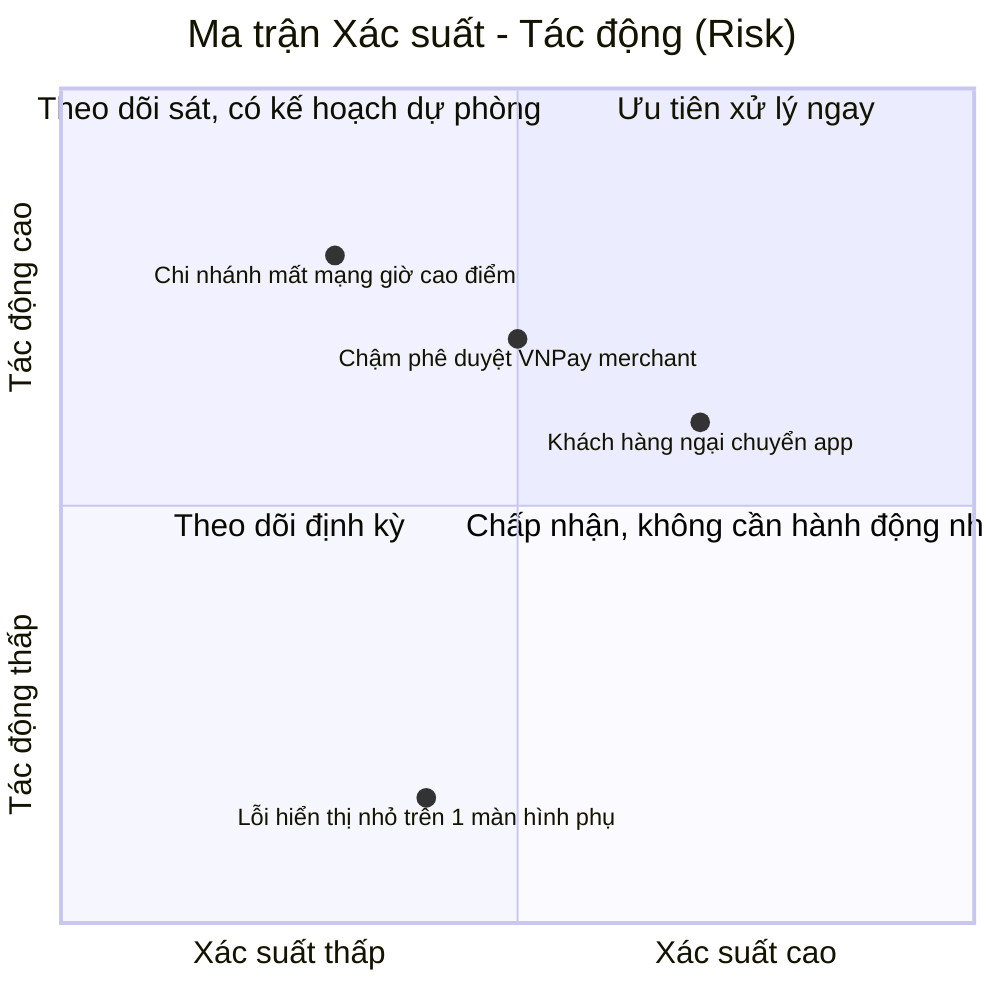

# Chương 31: RAID Log: quản lý Risk, Assumption, Issue, Dependency

## Mục tiêu học

- Giải thích được 4 thành phần của RAID: Risk, Assumption, Issue, Dependency — và phân biệt rõ
  ràng giữa chúng (dễ nhầm lẫn Risk với Issue).
- Xây dựng và duy trì được một RAID Log cho dự án thực tế.
- Biết cách đánh giá mức độ ưu tiên xử lý rủi ro bằng ma trận Xác suất — Tác động.

## 31.1 Bốn thành phần của RAID

| Thành phần | Định nghĩa | Điểm khác biệt chính |
|---|---|---|
| **R — Risk (Rủi ro)** | Sự kiện **có thể** xảy ra trong tương lai, gây ảnh hưởng xấu (hoặc đôi khi tốt) đến dự án | Chưa xảy ra — mang tính xác suất |
| **A — Assumption (Giả định)** | Điều được **cho là đúng** mà chưa được xác minh chắc chắn, dự án dựa vào đó để lập kế hoạch | Nếu giả định sai, có thể phát sinh rủi ro/vấn đề mới |
| **I — Issue (Vấn đề)** | Sự kiện xấu **đã thực sự xảy ra**, cần xử lý ngay | Đã xảy ra — không còn là xác suất |
| **D — Dependency (Phụ thuộc)** | Việc gì đó cần hoàn thành trước, bên ngoài tầm kiểm soát trực tiếp của đội | Không phải "xấu" hay "tốt", chỉ là một ràng buộc về trình tự |

**Cách nhớ dễ nhất phân biệt Risk và Issue**: Risk là "có thể sẽ" xảy ra, Issue là "đã" xảy ra rồi
— khi một Risk trở thành hiện thực, nó **chuyển thành** một Issue, cần được ghi nhận lại và xử lý
theo hướng khác (không còn phòng ngừa được, chỉ có thể khắc phục).

## 31.2 Ví dụ minh hoạ 4 loại cho dự án FoodNow

- **Risk**: "Khách hàng có thể không sẵn sàng chuyển từ app bên thứ ba sang app riêng của FoodNow"
  (chưa xảy ra, chỉ là khả năng — liên hệ mục 7 trong BRD, Chương 19).
- **Assumption**: "Giả định toàn bộ 12 chi nhánh có kết nối Internet ổn định để dùng hệ thống quản
  trị" (giả định chưa xác minh chắc chắn — nếu sai, phát sinh rủi ro mới).
- **Issue**: "Chi nhánh Quận 7 hiện đang mất kết nối Internet thường xuyên, không thể dùng hệ thống
  quản trị mới trong giờ cao điểm" (đã thực sự xảy ra — đây là hệ quả nếu Assumption ở trên sai).
- **Dependency**: "Việc tích hợp cổng thanh toán VNPay phụ thuộc vào việc VNPay phê duyệt tài khoản
  merchant của FoodNow, dự kiến mất 2 tuần xử lý" (ràng buộc trình tự, ngoài tầm kiểm soát trực tiếp).

Lưu ý cách các mục này liên kết với nhau: Assumption sai → trở thành Issue thực tế; Dependency
chưa hoàn thành đúng hạn → có thể trở thành Risk cho tiến độ chung.

## 31.3 Ma trận Xác suất — Tác động (Probability — Impact Matrix)

Không phải mọi Risk đều cần xử lý ngay — cần đánh giá theo 2 trục: **xác suất xảy ra** và **mức độ
tác động** nếu xảy ra, để ưu tiên nguồn lực xử lý hợp lý.

Risk nằm ở góc "Xác suất cao, Tác động cao" (ví dụ: chậm phê duyệt VNPay merchant) cần **ưu tiên
xử lý ngay** — có thể là bắt đầu thủ tục đăng ký merchant càng sớm càng tốt, ngay từ đầu dự án thay
vì để đến gần lúc cần tích hợp mới bắt đầu.

## 31.4 Mẫu RAID Log

| ID | Loại | Mô tả | Xác suất/Trạng thái | Tác động | Người phụ trách | Biện pháp xử lý | Ngày cập nhật |
|---|---|---|---|---|---|---|---|
| R-01 | Risk | Khách hàng ngại chuyển từ app bên thứ ba sang app riêng | Cao | Cao | Phòng Marketing | Chương trình khuyến mãi ra mắt, ưu đãi độc quyền | 2024-03-01 |
| A-01 | Assumption | Toàn bộ 12 chi nhánh có kết nối Internet ổn định | Chưa xác minh | Cao nếu sai | BA | Khảo sát thực tế từng chi nhánh trước Increment 2 | 2024-03-01 |
| I-01 | Issue | Chi nhánh Quận 7 mất kết nối Internet thường xuyên giờ cao điểm | Đã xảy ra | Trung bình | IT Admin | Lắp đặt đường truyền dự phòng (4G backup) | 2024-03-15 |
| D-01 | Dependency | Tích hợp VNPay phụ thuộc phê duyệt merchant, dự kiến 2 tuần | Đang xử lý | Cao nếu trễ | BA + Trưởng nhóm Dev | Nộp hồ sơ đăng ký merchant ngay từ tuần đầu dự án | 2024-02-05 |

## 31.5 Duy trì RAID Log — không phải "viết một lần rồi bỏ quên"

RAID Log cần được **rà soát định kỳ** (ví dụ: đầu mỗi Sprint Planning hoặc mỗi buổi họp tiến độ
dự án), không phải tài liệu viết một lần khi bắt đầu dự án rồi không cập nhật:

- Risk có thể chuyển thành Issue (cần cập nhật loại, mức độ ưu tiên xử lý thay đổi hoàn toàn).
- Assumption có thể được xác minh đúng/sai (cần đóng lại hoặc chuyển thành Risk/Issue tương ứng).
- Dependency có thể đã hoàn thành (đóng lại) hoặc bị trễ (nâng mức độ rủi ro liên quan).

## Bài tập

1. Thêm 2 mục mới vào RAID Log (mục 31.4) — mỗi mục một loại khác nhau trong 4 loại — dựa trên các
   yêu cầu/bối cảnh FoodNow đã học ở các chương trước.
2. Với Risk "Khách hàng ngại chuyển app" (R-01), giả sử sau 1 tháng ra mắt Increment 1, tỷ lệ
   chuyển đổi thực tế rất thấp — mô tả cách bạn sẽ cập nhật RAID Log để phản ánh Risk này đã trở
   thành Issue.

## Sai lầm thường gặp

- **Nhầm lẫn Risk và Issue, ghi Issue nhưng gắn nhãn "Risk"**: gây hiểu lầm về mức độ khẩn cấp —
  Issue cần xử lý ngay, Risk cần biện pháp phòng ngừa/theo dõi.
- **Không rà soát định kỳ RAID Log**: khiến tài liệu lỗi thời, mất tác dụng cảnh báo sớm.
- **Chỉ ghi nhận Risk/Issue mà bỏ qua Assumption và Dependency**: Assumption sai là nguồn gốc phổ
  biến của Issue phát sinh bất ngờ; Dependency bị trễ là nguyên nhân phổ biến của trễ tiến độ —
  cả 4 thành phần đều cần được theo dõi đầy đủ.

## Tóm tắt & tiếp theo

RAID Log theo dõi 4 thành phần: Risk (chưa xảy ra), Assumption (chưa xác minh), Issue (đã xảy ra),
Dependency (ràng buộc trình tự bên ngoài) — cần đánh giá theo ma trận Xác suất - Tác động và rà
soát định kỳ, không viết một lần rồi bỏ quên. Đây là chương khép lại Phần 4. Từ Chương 32, sách
bước vào Phần 5 — Giao tiếp, kiểm thử & nghiệm thu, bắt đầu với kỹ năng giao tiếp hiệu quả của BA
với các cấp stakeholder khác nhau.
