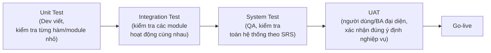

# Chương 34: BA & QA: viết test case cơ bản, UAT — mẫu UAT checklist

## Mục tiêu học

- Hiểu mối quan hệ hợp tác giữa BA và QA — không trùng lặp công việc, nhưng bổ sung cho nhau.
- Viết được test case cơ bản dựa trên Acceptance Criteria (Chương 23).
- Hiểu UAT (User Acceptance Testing) là gì, khác gì với các loại test khác, và vai trò cụ thể của
  BA trong UAT.
- Có sẵn mẫu UAT checklist trong `templates/uat/`.

## 34.1 BA và QA — ai làm gì, tránh trùng lặp

| | BA | QA |
|---|---|---|
| Trọng tâm | Yêu cầu có đúng ý định nghiệp vụ không (Validation — Chương 17) | Sản phẩm có đúng theo đặc tả không (Verification), có lỗi kỹ thuật không |
| Loại kiểm tra chính | UAT (mục 34.3) | Unit test, Integration test, System test, Regression test |
| Nguồn thông tin | Acceptance Criteria, ý định nghiệp vụ thật | SRS, test case chi tiết kỹ thuật |
| Câu hỏi đặc trưng | "Đây có phải điều khách hàng thực sự cần không?" | "Chức năng này có hoạt động đúng như đặc tả trong mọi trường hợp không, kể cả các edge case kỹ thuật?" |

BA và QA **không làm thay việc của nhau**, nhưng cần phối hợp chặt chẽ: BA cung cấp Acceptance
Criteria rõ ràng để QA viết test case chính xác; QA phát hiện các trường hợp kỹ thuật mà BA có thể
chưa nghĩ tới (ví dụ: điều gì xảy ra nếu mất kết nối mạng giữa chừng khi thanh toán) và hỏi lại BA
để làm rõ ý định nghiệp vụ cho trường hợp đó.

## 34.2 Từ Acceptance Criteria đến Test Case

Chương 23 đã giới thiệu Acceptance Criteria theo Gherkin — đây gần như là "bản nháp" của test case.
QA (hoặc BA hỗ trợ QA) chuyển hoá thành test case có cấu trúc chi tiết hơn:

| Trường | Nội dung |
|---|---|
| Test Case ID | TC-PAY-05 |
| Liên kết yêu cầu | FR-PAY-04, US-106 (liên hệ RTM — Chương 16) |
| Mô tả | Kiểm tra áp dụng mã giảm giá hợp lệ khi thanh toán |
| Điều kiện tiên quyết | Giỏ hàng có tổng 200.000đ; mã "FOODNOW10" đang hiệu lực, giảm 10% |
| Các bước thực hiện | 1. Vào màn hình thanh toán. 2. Nhập mã "FOODNOW10". 3. Bấm "Áp dụng" |
| Kết quả mong đợi | Tổng tiền hiển thị giảm còn 180.000đ; thông báo "Đã áp dụng mã giảm giá FOODNOW10" xuất hiện |
| Kết quả thực tế | *(QA điền khi thực hiện test)* |
| Đạt/Không đạt | *(QA điền khi thực hiện test)* |

Nhận thấy: Test Case TC-PAY-05 gần như là bản mở rộng trực tiếp từ "Scenario 1" trong Acceptance
Criteria đã viết ở Chương 23 — đây chính là giá trị của việc viết Acceptance Criteria rõ ràng ngay
từ đầu.

## 34.3 UAT (User Acceptance Testing) là gì?

**UAT** là vòng kiểm thử **cuối cùng**, thực hiện bởi (hoặc đại diện cho) **người dùng thực tế/
người có thẩm quyền nghiệp vụ** — không phải bởi Dev hay QA kỹ thuật — nhằm xác nhận sản phẩm sẵn
sàng để đưa vào sử dụng thật. Đây là bước hiện thực hoá khái niệm **Validation** đã học ở Chương 17
ở giai đoạn cuối cùng trước khi go-live.

**Khác biệt quan trọng nhất giữa System Test và UAT**: System Test hỏi "hệ thống có đúng theo SRS
không" (Verification); UAT hỏi "SRS (và sản phẩm dựa trên đó) có thực sự đúng ý định nghiệp vụ,
dùng được trong thực tế không" (Validation) — một tính năng có thể **pass System Test hoàn toàn**
(đúng 100% theo SRS) nhưng vẫn **fail UAT** nếu bản thân SRS đã hiểu sai ý định nghiệp vụ từ đầu.

## 34.4 Vai trò của BA trong UAT

- **Chuẩn bị kịch bản UAT**: dựa trên các use case/User Story quan trọng nhất (thường ưu tiên các
  luồng "Must have" theo MoSCoW — Chương 26), viết thành các kịch bản kiểm thử theo góc nhìn người
  dùng thực tế, không phải theo góc nhìn kỹ thuật.
- **Điều phối người tham gia UAT**: mời đúng đại diện người dùng thực tế (ví dụ: mời một vài nhân
  viên chi nhánh thực tế thử hệ thống quản trị đơn hàng, không chỉ để QA nội bộ tự test).
- **Tổng hợp phản hồi và phân loại**: phân biệt phản hồi nào là **lỗi thực sự cần sửa trước
  go-live** và phản hồi nào là **đề xuất cải tiến có thể làm sau** (liên hệ MoSCoW).
- **Xác nhận sign-off cuối cùng**: sau khi UAT đạt yêu cầu, BA phối hợp thu thập xác nhận chính
  thức từ người có thẩm quyền (Chương 35).

## 34.5 Mẫu UAT Checklist

Một mẫu UAT checklist đầy đủ cho Increment 1 của FoodNow (module Đặt món & Thanh toán) được lưu tại:

> **`templates/uat/FoodNow-UAT-Checklist.md`**

## Bài tập

1. Dựa vào Acceptance Criteria "Scenario 2" đã viết ở Chương 23 (mã giảm giá hết hạn), viết một
   Test Case đầy đủ theo cấu trúc ở mục 34.2.
2. Với module "Theo dõi đơn hàng" (Epic B), đề xuất 3 người/nhóm người bạn sẽ mời tham gia UAT, và
   giải thích vì sao chọn họ (không chỉ chọn người trong đội dự án).

## Sai lầm thường gặp

- **Để chính đội Dev/QA đóng luôn vai trò UAT**: mất đi giá trị cốt lõi của UAT — cần góc nhìn của
  người dùng thực tế, những người chưa "quen mắt" với sản phẩm như đội phát triển.
- **Coi UAT chỉ là thủ tục hình thức, làm qua loa**: bỏ lỡ cơ hội cuối cùng để phát hiện sai lệch
  giữa yêu cầu và ý định nghiệp vụ thật — nhớ lại chi phí sửa lỗi tăng mạnh nếu phát hiện sau go-live
  (Chương 2).
- **Không phân loại rõ phản hồi UAT là "lỗi cần sửa ngay" hay "cải tiến làm sau"**: dẫn đến trì
  hoãn go-live không cần thiết vì cố gắng sửa mọi phản hồi, kể cả những cải tiến không quan trọng.

## Tóm tắt & tiếp theo

BA và QA bổ sung cho nhau: QA tập trung Verification (đúng đặc tả), BA tập trung Validation (đúng
ý định nghiệp vụ) qua UAT — vòng kiểm thử cuối cùng với người dùng thực tế trước go-live. Chương 35
sẽ học bước tiếp theo sau khi UAT đạt yêu cầu: quy trình **Sign-off và nghiệm thu chính thức**.
