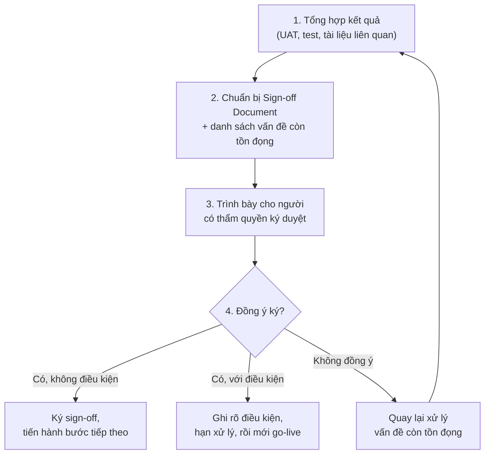

# Chương 35: Sign-off & nghiệm thu: quy trình ký duyệt, mẫu Sign-off Document

## Mục tiêu học

- Hiểu Sign-off là gì, vì sao cần thiết dù dự án làm theo mô hình nào.
- Nắm được quy trình chuẩn để tổ chức một buổi nghiệm thu/sign-off.
- Biết xử lý tình huống khi có bên không đồng ý ký duyệt.
- Có sẵn mẫu Sign-off Document trong `templates/sign-off/`.

## 35.1 Sign-off là gì, vì sao cần thiết?

**Sign-off** là hành động **xác nhận chính thức** (thường bằng chữ ký hoặc xác nhận bằng văn bản)
của người có thẩm quyền, thể hiện rằng một tài liệu/tính năng/giai đoạn dự án đã đạt yêu cầu và có
thể tiến hành bước tiếp theo (ví dụ: go-live, chuyển sang giai đoạn kế tiếp, đóng dự án).

Vì sao cần thiết, kể cả trong Agile (nơi mọi thứ có vẻ "linh hoạt")?

- **Trách nhiệm giải trình rõ ràng**: nếu sau này phát sinh vấn đề, có bằng chứng ai đã xác nhận
  điều gì, khi nào — tránh tình trạng "tôi không nhớ đã đồng ý việc này".
- **Điểm dừng tâm lý quan trọng**: sign-off tạo ra một mốc rõ ràng để cả đội và stakeholder cùng
  thống nhất "đã xong, có thể tiến tiếp" — tránh tình trạng dự án kéo dài vô thời hạn vì không ai
  chính thức xác nhận hoàn thành.
- **Yêu cầu pháp lý/hợp đồng**: nhiều dự án (đặc biệt làm với nhà thầu bên ngoài) yêu cầu sign-off
  chính thức để làm căn cứ thanh toán theo từng giai đoạn.

## 35.2 Các loại Sign-off phổ biến

| Loại | Khi nào | Ai ký |
|---|---|---|
| Sign-off BRD/SRS | Sau khi tài liệu yêu cầu hoàn tất, trước khi bắt đầu Design/Implementation (đặc biệt trong Waterfall — Chương 6) | Sponsor, các trưởng phòng liên quan |
| Sign-off UAT | Sau khi UAT (Chương 34) đạt yêu cầu, trước khi go-live | Đại diện người dùng, Product Owner/Sponsor |
| Sign-off giai đoạn/Increment | Sau mỗi Increment hoàn thành (Chương 28-29), xác nhận đủ điều kiện chuyển increment tiếp theo | PO, đại diện các bên liên quan đến increment đó |
| Sign-off đóng dự án (Project Closure) | Khi toàn bộ dự án hoàn thành, chuyển sang giai đoạn vận hành | Sponsor, PM |

## 35.3 Quy trình tổ chức một buổi Sign-off

**Bước 1-2**: BA tổng hợp toàn bộ kết quả liên quan (ví dụ: kết quả UAT Checklist ở Chương 34),
đặc biệt làm rõ **các vấn đề còn tồn đọng** (nếu có) — không che giấu để "dễ được ký" hơn, vì điều
này gây rủi ro lớn hơn nhiều nếu vấn đề bộc lộ sau khi đã go-live.

**Bước 3**: Trình bày ngắn gọn theo nguyên tắc BLUF (Chương 32) — kết luận trước (đề xuất go-live
hay chưa), sau đó giải thích căn cứ.

**Bước 4**: Ba khả năng xảy ra — đồng ý không điều kiện, đồng ý có điều kiện (ví dụ: "ký duyệt
nhưng yêu cầu sửa lỗi X trong vòng 1 tuần sau go-live"), hoặc không đồng ý (cần quay lại xử lý vấn
đề tồn đọng trước khi trình lại).

## 35.4 Xử lý khi có bên không đồng ý ký duyệt

Đây là tình huống nhạy cảm, cần xử lý khéo léo:

- **Không nên coi đây là "thất bại của BA"**: việc phát hiện vấn đề trước sign-off (thay vì sau
  go-live) chính là **giá trị của quy trình này đang hoạt động đúng** — nhớ lại nguyên lý chi phí
  sửa lỗi tăng theo giai đoạn (Chương 2).
- **Làm rõ lý do cụ thể không đồng ý**: dùng kỹ thuật elicitation (Chương 12) để hiểu chính xác vấn
  đề, tránh phản ứng phòng thủ.
- **Đề xuất phương án**: sign-off có điều kiện (nếu vấn đề nhỏ, không chặn go-live) hoặc hoãn
  sign-off đến khi xử lý xong (nếu vấn đề nghiêm trọng).
- **Ghi nhận đầy đủ vào biên bản**: dù kết quả thế nào, cần ghi chép lại quyết định và lý do để
  tham chiếu sau này.

## 35.5 Mẫu Sign-off Document

Mẫu Sign-off Document đầy đủ cho Increment 1 của FoodNow được lưu tại:

> **`templates/sign-off/FoodNow-SignOff-Increment1.md`**

## Bài tập

1. Giả sử kết quả UAT ở Chương 34 (mục 34.5, `templates/uat/FoodNow-UAT-Checklist.md`) có 2 kịch
   bản "Không đạt" (UAT-04 và UAT-09), trong đó UAT-04 là lỗi nghiêm trọng còn UAT-09 chỉ là vấn đề
   nhỏ về câu chữ thông báo lỗi. Đề xuất quyết định sign-off phù hợp (không điều kiện/có điều
   kiện/không đồng ý) và giải thích lý do.
2. Viết một đoạn hội thoại ngắn (giả định) giữa BA và Sponsor khi Sponsor ban đầu không đồng ý ký
   sign-off vì lo ngại tốc độ tải trang — áp dụng kỹ thuật elicitation để làm rõ mối lo ngại cụ thể.

## Sai lầm thường gặp

- **Che giấu vấn đề tồn đọng để dễ được ký duyệt**: rủi ro rất lớn — vấn đề sẽ bộc lộ sau go-live
  với chi phí sửa cao hơn nhiều, và mất uy tín nghiêm trọng hơn khi bị phát hiện đã biết trước mà
  không báo cáo.
- **Coi sign-off là thủ tục hình thức, không thực sự trình bày đầy đủ căn cứ**: làm giảm giá trị
  của quy trình — người ký cần đủ thông tin để đưa ra quyết định có trách nhiệm, không phải ký cho
  có.
- **Không ghi chép rõ ràng khi sign-off có điều kiện**: dẫn đến tranh cãi sau này về việc điều kiện
  đã được thoả mãn hay chưa.

## Tóm tắt & tiếp theo

Sign-off là bước xác nhận chính thức tạo trách nhiệm giải trình rõ ràng và điểm dừng tâm lý cho dự
án — cần trình bày minh bạch cả kết quả tốt lẫn vấn đề tồn đọng, xử lý khéo léo khi có bên không
đồng ý ký duyệt. Chương 36 sẽ khép lại Phần 5 với chủ đề đo lường thành công **sau khi** sản phẩm
đã go-live: KPI, OKR, và thu thập phản hồi người dùng thực tế.
