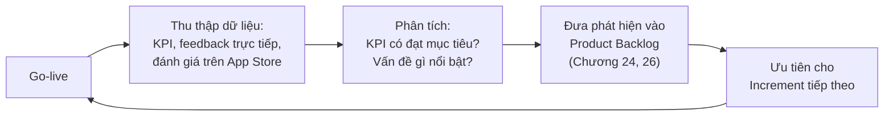

# Chương 36: Đo lường thành công sau go-live: KPI, OKR, thu thập feedback

## Mục tiêu học

- Phân biệt KPI và OKR — hai công cụ đo lường hay bị dùng lẫn lộn.
- Thiết kế được bộ KPI phù hợp để đo lường thành công của một tính năng/sản phẩm sau go-live.
- Xây dựng được vòng lặp thu thập phản hồi liên tục sau go-live, kết nối ngược lại vào backlog.

## 36.1 Vì sao công việc BA không kết thúc ở go-live?

Nhắc lại từ Chương 1 và Chương 2: nhiều BA mới nghĩ công việc kết thúc khi sản phẩm go-live thành
công (sign-off — Chương 35). Thực tế, **go-live chỉ là điểm khởi đầu để kiểm chứng** liệu các mục
tiêu kinh doanh đề ra từ BRD (Chương 19) có thực sự đạt được không — Business Requirements (như
BO-01, BO-02, BO-03 của FoodNow) chỉ được xác nhận **sau một khoảng thời gian vận hành thực tế**,
không phải ngay tại thời điểm ra mắt.

## 36.2 KPI vs OKR — khác nhau ở đâu?

| | KPI (Key Performance Indicator) | OKR (Objectives and Key Results) |
|---|---|---|
| Bản chất | Chỉ số đo lường hiệu suất liên tục, thường theo dõi dài hạn | Khung đặt mục tiêu theo chu kỳ (thường theo quý), gồm Objective (định tính, truyền cảm hứng) + Key Results (định lượng, đo được) |
| Ví dụ | "Tỷ lệ chuyển đổi đặt hàng: 55%" (theo dõi liên tục) | "Objective: Trở thành kênh đặt hàng ưa thích nhất của khách hàng FoodNow. Key Result 1: Tỷ trọng đơn qua app riêng đạt 40%. Key Result 2: Điểm đánh giá app đạt 4.2/5" |
| Mục đích | Giám sát sức khoẻ vận hành liên tục | Định hướng và tạo động lực cho một giai đoạn cụ thể, thường tham vọng hơn KPI thông thường |
| Quan hệ với BRD | KPI thường map trực tiếp từ "Chỉ số đo lường" trong Business Objectives (Chương 19, mục 2) | OKR có thể bao trùm nhiều KPI, đặt trong bối cảnh mục tiêu truyền cảm hứng hơn |

Trong thực tế, nhiều tổ chức dùng cả hai song song: **OKR** để định hướng ưu tiên theo quý (giúp
trả lời "quý này tập trung vào điều gì"), **KPI** để giám sát liên tục sức khoẻ vận hành hằng ngày.

## 36.3 Thiết kế bộ KPI cho FoodNow (sau go-live Increment 1)

| KPI | Công thức/Cách đo | Mục tiêu | Nguồn dữ liệu |
|---|---|---|---|
| Tỷ lệ hoàn tất đặt hàng (Conversion rate) | Số đơn hoàn tất / Số lượt mở app đến bước giỏ hàng | ≥ 60% | Analytics trong app |
| Thời gian trung bình hoàn tất đơn hàng | Thời gian từ mở app đến thanh toán xong, trung bình | < 2 phút | Analytics trong app |
| Tỷ lệ đơn hàng lỗi/khiếu nại | Số đơn có khiếu nại / Tổng số đơn | < 2% | Hệ thống hỗ trợ khách hàng |
| Tỷ lệ khách quay lại (Retention) | % khách đặt đơn thứ 2 trong vòng 30 ngày | ≥ 35% | CRM/dữ liệu khách hàng |
| Tỷ trọng đơn qua app riêng | Số đơn qua app riêng / Tổng đơn online | ≥ 40% (trong 6 tháng) | Đối soát doanh thu theo kênh |

Các KPI này **truy vết trực tiếp** về Business Objectives (BO-01, BO-02, BO-03) và Success Criteria
trong BRD (Chương 19) — một lần nữa áp dụng tư duy truy vết đã học ở Chương 16 (RTM), nhưng lần
này áp dụng cho **giai đoạn sau go-live** thay vì giai đoạn phát triển.

## 36.4 Vòng lặp thu thập phản hồi liên tục

Đây là cách kết nối trực tiếp giữa "đo lường sau go-live" và "lập kế hoạch phát triển tiếp theo" —
BA không chỉ báo cáo số liệu rồi dừng lại, mà cần **biến phát hiện thành hành động cụ thể** trong
backlog. Ví dụ: nếu KPI "Tỷ lệ hoàn tất đặt hàng" chỉ đạt 45% (dưới mục tiêu 60%), BA cần điều tra
nguyên nhân (có thể qua phỏng vấn khách hàng — Chương 12) và đề xuất User Story mới để cải thiện
(ví dụ: đơn giản hoá luồng thanh toán nếu phát hiện khách hàng bỏ ngang ở bước đó).

## 36.5 Các nguồn thu thập phản hồi

- **Định lượng**: Analytics trong app (conversion, thời gian thao tác), đánh giá sao trên App
  Store/Google Play.
- **Định tính**: phỏng vấn/khảo sát khách hàng (Chương 12), phản hồi từ nhân viên chi nhánh trực
  tiếp vận hành hệ thống hằng ngày, bình luận trên App Store/mạng xã hội.
- **Bán định lượng**: Net Promoter Score (NPS) — hỏi khách hàng "Anh/chị có sẵn sàng giới thiệu app
  FoodNow cho bạn bè không, theo thang điểm 0-10?" — vừa đo lường được, vừa phản ánh cảm nhận thực.

## Bài tập

1. Viết một OKR cho quý tiếp theo sau khi FoodNow hoàn thành cả 3 Increment (liên hệ lại BRD —
   Chương 19), theo cấu trúc Objective + 2-3 Key Results.
2. Giả sử KPI "Tỷ lệ khách quay lại" chỉ đạt 20% (mục tiêu 35%). Đề xuất 2 hành động cụ thể (có thể
   liên quan đến chương trình khách hàng thân thiết — Epic C) để cải thiện, và giải thích cách bạn
   sẽ xác minh giả thuyết trước khi đầu tư phát triển.

## Sai lầm thường gặp

- **Chỉ đo KPI mà không hành động dựa trên kết quả**: biến việc đo lường thành báo cáo hình thức,
  mất đi giá trị thực sự — luôn cần vòng lặp khép kín như mục 36.4.
- **Đặt KPI không liên kết với Business Objectives ban đầu**: đo những con số "dễ đo" nhưng không
  phản ánh đúng mục tiêu kinh doanh thật sự của dự án.
- **Coi go-live là điểm kết thúc công việc của BA**: bỏ lỡ giai đoạn quan trọng để chứng minh (hoặc
  phát hiện sớm nếu chưa đạt) giá trị thực sự mà dự án mang lại.

## Tóm tắt & tiếp theo

KPI theo dõi liên tục sức khoẻ vận hành, OKR định hướng mục tiêu theo chu kỳ — cả hai cần truy vết
về Business Objectives ban đầu, và phát hiện từ đo lường cần được đưa vào vòng lặp cải tiến backlog
liên tục, không dừng lại ở việc báo cáo số liệu. Đây là chương khép lại Phần 5. Từ Chương 37, sách
bước vào Phần 6 — Công cụ & kỹ năng nâng cao, bắt đầu với cách dùng Jira & Confluence hiệu quả
trong công việc BA hằng ngày.
