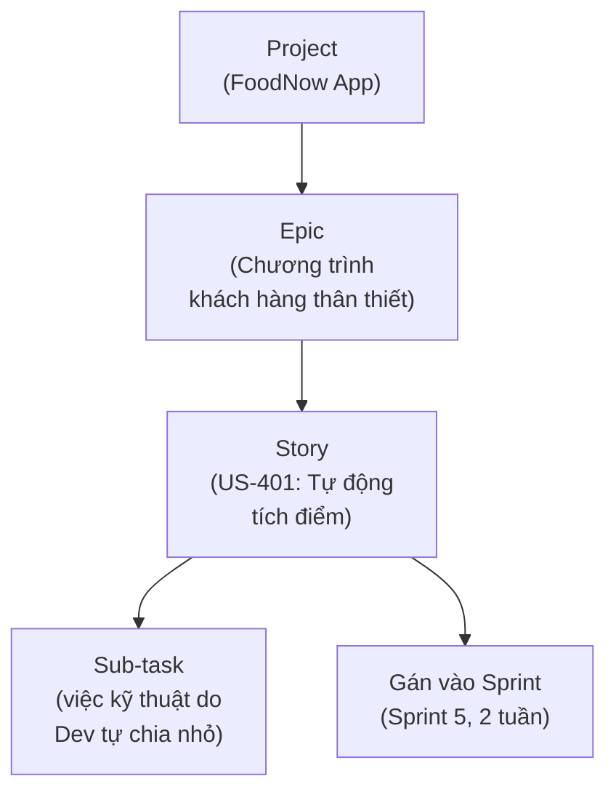

# Chương 37: Jira & Confluence cho BA: quản lý backlog, viết & liên kết tài liệu

## Mục tiêu học

- Hiểu cấu trúc dữ liệu cơ bản của Jira (Epic, Story, Task, Sprint) và cách nó ánh xạ vào những
  khái niệm đã học (Chương 8, 24).
- Dùng Confluence để tổ chức tài liệu BA (BRD/SRS/User Story) liên kết với Jira.
- Nắm được vài thao tác/thiết lập cơ bản BA cần biết — không đi sâu vào việc quản trị Jira.

## 37.1 Vì sao BA cần biết Jira & Confluence, ở mức nào?

Đây là bộ công cụ phổ biến nhất trong ngành phần mềm hiện nay để quản lý backlog (Jira) và viết/
lưu trữ tài liệu (Confluence). Như đã nói ở Chương 5, sách này **không hướng dẫn cấu hình/quản trị
hệ thống** (đó là việc của PM/IT Admin) — chỉ tập trung vào **quy trình làm việc hằng ngày** mà một
BA cần thành thạo.

## 37.2 Cấu trúc dữ liệu trong Jira, ánh xạ vào khái niệm đã học

| Khái niệm Jira | Tương ứng với | Chương liên quan |
|---|---|---|
| Epic | Epic (nhóm User Story lớn) | Chương 24 |
| Story | User Story | Chương 23-24 |
| Sub-task | Task kỹ thuật (Dev tự quản lý) | Chương 24 |
| Sprint | Sprint trong Scrum | Chương 8 |
| Board (Scrum/Kanban) | Trực quan hoá Sprint Backlog hoặc luồng Kanban | Chương 8, 10 |
| Story Points (custom field) | Ước lượng tương đối | Chương 30 |
| Epic Link/Parent Link | Liên kết truy vết Story → Epic | Chương 16 (RTM) |

**Việc BA cần làm thành thạo trong Jira**:

- Tạo Epic và Story đúng cấu trúc (vai trò - nhu cầu - lợi ích, kèm Acceptance Criteria trong phần
  mô tả hoặc trường riêng).
- Sắp xếp thứ tự ưu tiên trong Backlog view (kéo-thả theo độ ưu tiên MoSCoW/WSJF — Chương 26).
- Gắn nhãn (label)/thành phần (component) để lọc, báo cáo theo nhóm tính năng.
- Theo dõi Sprint Board trong Daily Scrum (Chương 8), cập nhật trạng thái khi cần trao đổi thêm.
- Dùng bộ lọc (JQL cơ bản hoặc filter có sẵn) để tra cứu nhanh: "tất cả Story thuộc Epic C chưa
  Done", "tất cả Story tôi đang phụ trách làm rõ yêu cầu".

## 37.3 Confluence — tổ chức tài liệu liên kết với Jira

**Confluence** là công cụ wiki nội bộ, nơi BA viết và lưu trữ BRD, SRS, biên bản họp, RAID Log...
Điểm mạnh lớn nhất khi dùng chung với Jira: **liên kết hai chiều** — một trang Confluence (ví dụ
SRS) có thể nhúng trực tiếp danh sách Story liên quan từ Jira (tự động cập nhật trạng thái), và
ngược lại, một Story trong Jira có thể link ngược về trang Confluence chứa yêu cầu chi tiết.

| Loại tài liệu | Nên lưu ở đâu | Lý do |
|---|---|---|
| BRD, SRS, Use Case Spec | Confluence | Văn bản dài, cần định dạng, versioning, review comment |
| User Story, Epic, Sprint Backlog | Jira | Cần trạng thái động, kéo-thả ưu tiên, theo dõi tiến độ |
| RAID Log | Confluence (dạng bảng) hoặc Excel/Jira issue riêng | Tuỳ quy mô — dự án nhỏ dùng Confluence table là đủ |
| Biên bản họp (meeting minutes) | Confluence | Dễ tìm kiếm lại, liên kết chéo với các trang liên quan |

## 37.4 Ví dụ quy trình làm việc thực tế của BA với Jira + Confluence

1. Viết BRD/PRD/SRS đầy đủ trên Confluence (theo mẫu đã học Chương 19-21).
2. Từ SRS, phân rã thành Epic + User Story (Chương 24), tạo trực tiếp trong Jira.
3. Mỗi User Story trong Jira link ngược về mục tương ứng trong trang SRS trên Confluence (để Dev
   cần chi tiết hơn có thể bấm vào xem).
4. Trong buổi Backlog Refinement (Chương 27), cập nhật trực tiếp Acceptance Criteria vào phần mô tả
   Story trong Jira.
5. Sau Sprint Review, cập nhật kết quả/phản hồi vào biên bản trên Confluence, tạo Story mới trong
   Jira nếu có yêu cầu phát sinh (liên hệ Change Request — Chương 18).

## 37.5 Một vài mẹo thực dụng (không cần quyền admin)

- **Dùng Jira Filter đã lưu (Saved Filter)** để có view riêng theo dõi công việc của mình, tránh
  phải lọc lại thủ công mỗi ngày.
- **Dùng template Confluence có sẵn** (nhiều tổ chức có sẵn template BRD/SRS/Meeting Notes) thay vì
  tạo trang trắng mỗi lần — giúp nhất quán định dạng giữa các tài liệu.
- **Gắn nhãn phiên bản (version label)** trên các trang Confluence quan trọng để dễ theo dõi lịch
  sử thay đổi, đặc biệt hữu ích khi tài liệu qua nhiều lần Change Request (Chương 18).

## Bài tập

1. Nếu bạn có tài khoản Jira/Confluence dùng thử (miễn phí cho cá nhân/nhóm nhỏ), thử tạo 1 Epic
   và 3 Story cho Epic C (Chương trình khách hàng thân thiết) của FoodNow, dựa theo nội dung ở
   `templates/user-story-epic/FoodNow-UserStories.md`.
2. Thiết kế cấu trúc trang Confluence (chỉ cần liệt kê tên các trang và cách chúng liên kết nhau)
   cho toàn bộ tài liệu dự án FoodNow đã học từ Chương 19 đến Chương 31.

## Sai lầm thường gặp

- **Trùng lặp thông tin giữa Jira và Confluence mà không liên kết**: dẫn đến hai nguồn thông tin
  không đồng bộ — chỉnh sửa ở một nơi nhưng quên cập nhật nơi kia.
- **Nhồi nhét toàn bộ chi tiết kỹ thuật vào mô tả Story trên Jira**: làm Story khó đọc — chi tiết
  dài nên để ở Confluence, Story trên Jira chỉ giữ đủ để Dev hiểu nhanh + link tham chiếu.
- **Không dùng Epic Link, để Story rời rạc không thuộc Epic nào**: mất khả năng theo dõi tiến độ
  tổng thể theo từng nhóm tính năng lớn.

## Tóm tắt & tiếp theo

Jira quản lý backlog động (Epic/Story/Sprint), Confluence lưu trữ tài liệu tĩnh có cấu trúc
(BRD/SRS/biên bản họp) — hai công cụ nên liên kết hai chiều để tránh trùng lặp và mất đồng bộ.
Chương 38 sẽ học kỹ năng thường bị BA bỏ qua nhưng ngày càng cần thiết: đọc hiểu dữ liệu và viết
SQL cơ bản.
