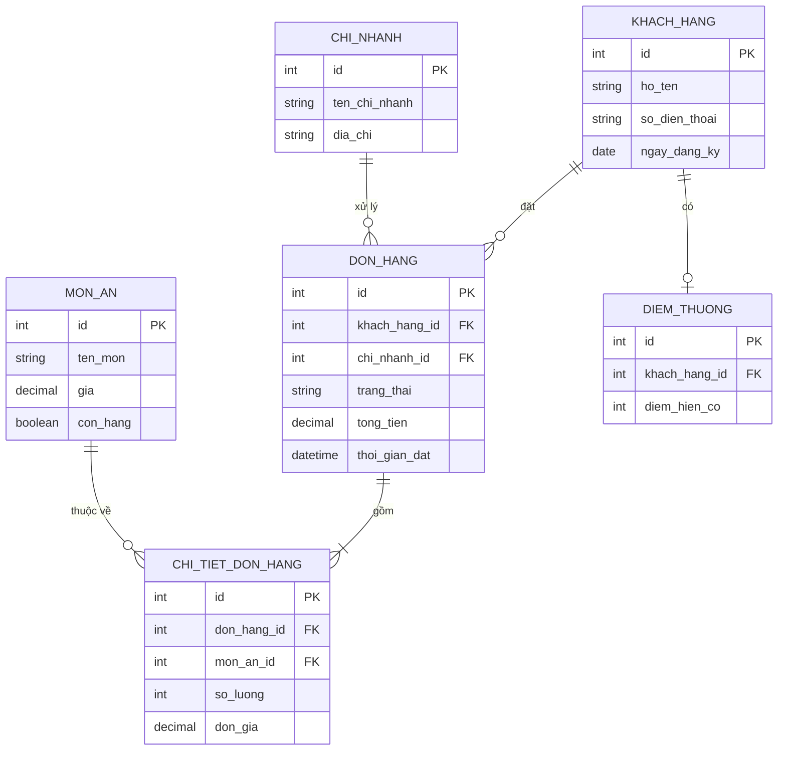

# Chương 38: Data & SQL cơ bản cho BA: đọc hiểu mô hình dữ liệu, SELECT query

## Mục tiêu học

- Đọc hiểu được một sơ đồ ERD (Entity-Relationship Diagram) đơn giản.
- Viết được câu lệnh SELECT cơ bản để tự tra cứu dữ liệu, không cần nhờ Dev.
- Hiểu vì sao kỹ năng này ngày càng quan trọng với BA, dù không cần biết lập trình.

## 38.1 Vì sao BA cần biết SQL cơ bản?

Chương 5 đã nói: BA không cần biết lập trình. Nhưng **đọc hiểu dữ liệu** là một kỹ năng khác — ngày
càng nhiều công việc BA đòi hỏi tự tra cứu số liệu thực tế thay vì luôn phải nhờ Dev/Data Analyst:
kiểm tra một giả định trong RAID Log (Chương 31) có đúng không, xác minh một KPI (Chương 36) đang ở
mức nào, hoặc chỉ đơn giản là hiểu rõ hơn cấu trúc dữ liệu khi viết yêu cầu (giúp yêu cầu chính xác
và khả thi hơn).

> Mức độ cần đạt: đọc hiểu ERD và viết được SELECT cơ bản (lọc, sắp xếp, nhóm) — **không cần** biết
> thiết kế database, viết stored procedure, hay tối ưu hiệu năng truy vấn (đó là công việc của
> Dev/DBA).

## 38.2 Đọc hiểu ERD (Entity-Relationship Diagram)

ERD mô tả các **bảng dữ liệu (entity)** và **mối quan hệ** giữa chúng — hữu ích để BA hiểu hệ thống
lưu trữ thông tin gì, từ đó viết yêu cầu chính xác hơn.



**Cách đọc ký hiệu quan hệ**: `||--o{` nghĩa là "một-nhiều" (một khách hàng có thể có nhiều đơn
hàng, nhưng mỗi đơn hàng chỉ thuộc về một khách hàng). Hiểu được mối quan hệ này giúp BA đặt đúng
câu hỏi khi viết yêu cầu — ví dụ: "một đơn hàng có được phép chứa món từ nhiều chi nhánh khác nhau
không?" (nhìn vào ERD, câu trả lời là KHÔNG — mỗi đơn hàng chỉ liên kết với một `chi_nhanh_id`).

## 38.3 Viết SELECT cơ bản

### Truy vấn đơn giản: lấy dữ liệu từ một bảng

```sql
-- Lấy danh sách đơn hàng có tổng tiền trên 200.000đ, sắp xếp mới nhất trước
SELECT id, khach_hang_id, tong_tien, thoi_gian_dat
FROM DON_HANG
WHERE tong_tien > 200000
ORDER BY thoi_gian_dat DESC;
```

### Truy vấn kết hợp nhiều bảng (JOIN)

```sql
-- Lấy tên khách hàng và tổng tiền các đơn hàng của họ trong tháng 3/2024
SELECT kh.ho_ten, dh.id AS ma_don, dh.tong_tien, dh.thoi_gian_dat
FROM DON_HANG dh
JOIN KHACH_HANG kh ON dh.khach_hang_id = kh.id
WHERE dh.thoi_gian_dat BETWEEN '2024-03-01' AND '2024-03-31'
ORDER BY dh.thoi_gian_dat;
```

### Truy vấn tổng hợp (GROUP BY) — hữu ích để tự kiểm tra KPI

```sql
-- Đếm số đơn hàng và tổng doanh thu theo từng chi nhánh trong tháng 3/2024
SELECT cn.ten_chi_nhanh,
       COUNT(dh.id) AS so_don_hang,
       SUM(dh.tong_tien) AS tong_doanh_thu
FROM DON_HANG dh
JOIN CHI_NHANH cn ON dh.chi_nhanh_id = cn.id
WHERE dh.thoi_gian_dat BETWEEN '2024-03-01' AND '2024-03-31'
GROUP BY cn.ten_chi_nhanh
ORDER BY tong_doanh_thu DESC;
```

Câu lệnh trên chính là cách BA **tự kiểm tra** một phần dữ liệu cho KPI "Tỷ lệ hoàn tất đặt hàng
theo chi nhánh" đã nói ở Chương 36, mà không cần chờ Dev/Data Analyst chạy báo cáo hộ.

## 38.4 Bảng tổng hợp các mệnh đề SQL cơ bản cần biết

| Mệnh đề | Chức năng | Ví dụ dùng cho FoodNow |
|---|---|---|
| `SELECT ... FROM` | Chọn cột, chọn bảng | Lấy danh sách đơn hàng |
| `WHERE` | Lọc điều kiện | Chỉ lấy đơn hàng có trạng thái "Đã giao" |
| `JOIN` | Kết hợp dữ liệu từ nhiều bảng | Lấy tên khách hàng cùng với đơn hàng của họ |
| `GROUP BY` | Nhóm dữ liệu để tổng hợp | Tổng doanh thu theo từng chi nhánh |
| `ORDER BY` | Sắp xếp kết quả | Sắp xếp đơn hàng mới nhất trước |
| `COUNT`, `SUM`, `AVG` | Hàm tổng hợp | Đếm số đơn, tính tổng/trung bình tiền |

## Bài tập

1. Dựa vào ERD ở mục 38.2, viết một câu SELECT lấy danh sách 5 món ăn bán chạy nhất (theo tổng số
   lượng đã bán) trong tháng 3/2024.
2. Giải thích bằng lời (không cần viết SQL): để trả lời câu hỏi "khách hàng nào đã tích luỹ nhiều
   điểm thưởng nhất nhưng chưa từng đổi điểm lần nào", cần kết hợp (JOIN) những bảng nào trong ERD?

## Sai lầm thường gặp

- **Cố học sâu về tối ưu hiệu năng SQL, thiết kế database**: vượt quá phạm vi cần thiết cho BA —
  nên dừng ở mức đọc hiểu ERD và viết SELECT cơ bản, việc còn lại là chuyên môn của Dev/DBA.
- **Chạy query trực tiếp trên database production mà không hỏi ý kiến Dev/DBA trước**: có thể ảnh
  hưởng hiệu năng hệ thống thật — nên dùng môi trường báo cáo/staging riêng nếu có, hoặc luôn hỏi
  trước khi truy vấn trên hệ thống thật.
- **Không hiểu mối quan hệ một-nhiều/nhiều-nhiều trước khi viết yêu cầu liên quan đến dữ liệu**: dễ
  viết yêu cầu không khả thi hoặc mâu thuẫn với cấu trúc dữ liệu thực tế của hệ thống.

## Tóm tắt & tiếp theo

BA nên biết đọc hiểu ERD và viết SELECT cơ bản (lọc, JOIN, GROUP BY) để tự tra cứu dữ liệu, hỗ trợ
xác minh giả định và KPI mà không luôn phải nhờ Dev — không cần học sâu về thiết kế/tối ưu database.
Chương 39 sẽ mở rộng góc nhìn sang **domain knowledge** — vì sao hiểu biết chuyên sâu về một ngành
cụ thể (Banking, E-commerce, Insurance) tạo ra lợi thế cạnh tranh lớn cho BA.
