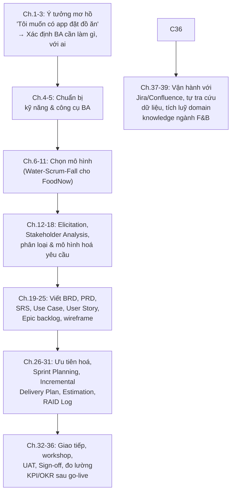

# Chương 40: Case study tổng hợp "FoodNow": nhìn lại toàn bộ vòng đời dự án

## Mục tiêu học

- Nhìn lại toàn bộ hành trình dự án FoodNow qua lăng kính BA, kết nối lại tất cả khái niệm đã học.
- Tự đánh giá lại bản thân theo bảng kỹ năng đã lập ở Chương 4.
- Có một bức tranh tổng thể để tham chiếu khi bắt đầu dự án thực tế đầu tiên của chính bạn.

## 40.1 Hành trình FoodNow từ đầu đến cuối

## 40.2 Tổng hợp bộ tài liệu FoodNow đã tạo ra xuyên suốt sách

| Tài liệu | Chương giới thiệu | Vị trí file mẫu |
|---|---|---|
| BRD (Business Requirements Document) | Chương 19 | `templates/brd-prd/FoodNow-BRD.md` |
| PRD (Product Requirements Document) | Chương 19 | `templates/brd-prd/FoodNow-PRD.md` |
| SRS (Software Requirements Specification) | Chương 20 | `templates/srs/FoodNow-SRS.md` |
| Use Case Specification | Chương 22 | `templates/use-case/FoodNow-UC01-DatMonThanhToan.md` |
| Product Backlog (Epic + User Story) | Chương 23-24 | `templates/user-story-epic/FoodNow-UserStories.md` |
| Incremental Delivery Plan | Chương 28-29 | `templates/incremental-delivery/FoodNow-IncrementalDeliveryPlan.md` |
| RAID Log | Chương 31 | `templates/raid-log/FoodNow-RAIDLog.md` |
| UAT Checklist | Chương 34 | `templates/uat/FoodNow-UAT-Checklist.md` |
| Sign-off Document | Chương 35 | `templates/sign-off/FoodNow-SignOff-Increment1.md` |

Nhận xét quan trọng: đây **không phải các tài liệu rời rạc** — mỗi tài liệu đều truy vết được ngược
lên tài liệu trước đó (BRD → PRD → SRS → User Story → Test Case → UAT → Sign-off), đúng tinh thần
Requirements Traceability đã học ở Chương 16. Khi bạn làm dự án thực tế, hãy giữ nguyên tắc này:
mọi tài liệu đều nên "kể tiếp câu chuyện" của tài liệu trước, không phải là các mảnh ghép tách biệt.

## 40.3 Những quyết định quan trọng đã đưa ra trong hành trình FoodNow — và bài học tương ứng

| Quyết định | Chương | Bài học tổng quát |
|---|---|---|
| Chọn mô hình Water-Scrum-Fall thay vì Waterfall/Scrum thuần | 11 | Mô hình lai (Hybrid) phổ biến hơn "thuần" trong thực tế |
| Chỉ cho áp dụng 1 mã giảm giá/đơn (Simple Design) | 9 | Đơn giản hoá hợp lý khi chưa chắc chắn cần độ phức tạp cao hơn |
| Chia 3 Increment theo tính năng + phân khúc người dùng | 28-29 | Giao hàng từng phần giảm rủi ro so với giao hàng một lần |
| Sign-off có điều kiện cho Increment 1 (chấp nhận lỗi nhỏ, không chặn go-live) | 35 | Không phải mọi vấn đề đều cần chặn tiến độ — cần phân loại mức độ nghiêm trọng |
| Đặt KPI truy vết trực tiếp về Business Objectives trong BRD | 36 | Đo lường sau go-live phải liên kết với lý do dự án tồn tại từ đầu |

## 40.4 Nếu bạn bắt đầu một dự án thực tế đầu tiên — checklist tổng hợp

Dựa trên toàn bộ hành trình FoodNow, đây là checklist tổng hợp khi bạn bắt đầu vai trò BA cho một
dự án mới:

- [ ] Xác định rõ mô hình đội đang áp dụng (Chương 11) — quan sát cách làm thực tế, không chỉ tên gọi.
- [ ] Làm Stakeholder Analysis + RACI trước khi elicitation sâu (Chương 13).
- [ ] Dùng kỹ thuật "5 Whys" để tìm vấn đề gốc rễ đằng sau mọi yêu cầu ban đầu (Chương 12).
- [ ] Viết BRD/PRD/SRS (hoặc User Story + Acceptance Criteria nếu Agile) đạt tiêu chí Verification
      (Chương 17) và luôn Validate lại với đúng người có thẩm quyền.
- [ ] Xây RTM ở mức phù hợp quy mô dự án (Chương 16), duy trì cập nhật liên tục.
- [ ] Lập kế hoạch giao hàng Incremental nếu có thể (Chương 28-29), tránh đặt cược vào một lần ra
      mắt duy nhất.
- [ ] Duy trì RAID Log, rà soát định kỳ (Chương 31).
- [ ] Chuẩn bị và điều phối UAT nghiêm túc trước go-live, không làm hình thức (Chương 34).
- [ ] Đặt KPI/OKR truy vết về mục tiêu kinh doanh ban đầu, duy trì vòng lặp phản hồi sau go-live
      (Chương 36).
- [ ] Đầu tư domain knowledge của ngành bạn đang làm việc, song song với kỹ năng tổng quát (Chương 39).

## 40.5 Tự đánh giá lại (quay lại bảng Chương 4)

Quay lại bảng tự đánh giá ở Chương 4, mục 4.3, chấm điểm lại (1-5) cho từng kỹ năng — so sánh với
lần chấm đầu tiên trước khi đọc sách. Ghi chú lại những kỹ năng còn yếu để tiếp tục thực hành thêm,
đặc biệt qua các dự án cá nhân/thực tập/công việc đầu tiên.

## Bài tập tổng hợp cuối sách

1. Viết một bản tóm tắt (dưới 300 từ) kể lại toàn bộ hành trình FoodNow theo góc nhìn của bạn — như
   thể bạn đang giải thích cho một người bạn chưa biết gì về BA, dựa trên những gì đã học.
2. Chọn một sản phẩm/dự án thực tế bạn quan tâm (có thể là ý tưởng khởi nghiệp riêng, hoặc một sản
   phẩm bạn quen dùng), áp dụng checklist ở mục 40.4 để phác thảo bước đầu tiên bạn sẽ làm với tư
   cách BA cho dự án đó.

## Tóm tắt & lời kết

Xuyên suốt 40 chương, dự án FoodNow đã đi từ một câu nói mơ hồ của ban giám đốc đến một bộ tài liệu
đầy đủ, được kiểm thử, ký duyệt, ra mắt theo từng giai đoạn, và đo lường thành công dựa trên đúng
mục tiêu kinh doanh ban đầu — đây chính là bản chất công việc của một Business Analyst: không phải
người ghi chép yêu cầu, mà là người đảm bảo **cả một đội hiểu đúng, hiểu giống nhau, và cùng đi
đúng hướng** xuyên suốt vòng đời một sản phẩm phần mềm. Phần Phụ lục (A-F) tiếp theo tổng hợp lại
toàn bộ các mẫu tài liệu đầy đủ để bạn tiện tra cứu và tái sử dụng cho công việc thực tế.
