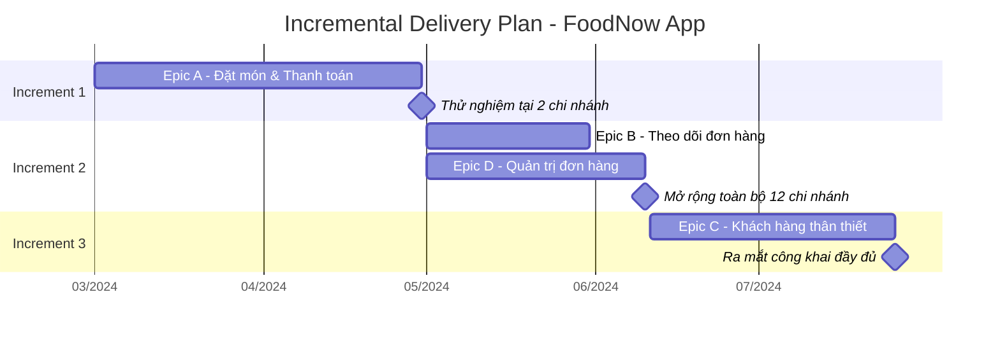

# Phụ lục D: Mẫu Incremental Delivery Plan đầy đủ (dự án FoodNow)

> Nội dung dưới đây in lại đầy đủ từ file mẫu gốc:
> `templates/incremental-delivery/FoodNow-IncrementalDeliveryPlan.md`. Xem giải thích khái niệm
> Incremental/Iterative Delivery tại Chương 28 và cách trình bày kế hoạch tại Chương 29.

---

## 1. Tổng quan

Kế hoạch chia việc phát triển FoodNow App thành 3 increment, mỗi increment mang lại giá trị sử
dụng được ngay, kết hợp chiến lược "theo tính năng" và "theo phân khúc người dùng" (mở rộng dần từ
2 chi nhánh thí điểm ra toàn bộ 12 chi nhánh).

## 2. Bảng chi tiết các Increment

**Increment 1 — Nền tảng đặt món & thanh toán (thí điểm)**
- Nội dung: Epic A (US-101 đến US-106).
- Đối tượng: khách hàng tại 2 chi nhánh thí điểm (Quận 1, Quận 3).
- Thời gian: Tháng 3-4.
- Tiêu chí chuyển Increment 2: conversion ≥ 50%; không có critical bug tồn đọng quá 48 giờ.
- Rủi ro chính: tích hợp cổng thanh toán VNPay phức tạp hơn dự kiến.

**Increment 2 — Theo dõi đơn hàng & Quản trị chi nhánh (mở rộng toàn bộ)**
- Nội dung: Epic B (US-201 đến US-204), Epic D (US-301 đến US-304).
- Đối tượng: toàn bộ 12 chi nhánh.
- Thời gian: Tháng 5 đến giữa tháng 6.
- Tiêu chí chuyển Increment 3: 12/12 chi nhánh vận hành ổn định ≥ 2 tuần liên tục; khiếu nại < 2%.
- Rủi ro chính: 10 chi nhánh còn lại cần thời gian đào tạo.

**Increment 3 — Chương trình khách hàng thân thiết (ra mắt công khai đầy đủ)**
- Nội dung: Epic C (US-401 đến US-406).
- Đối tượng: toàn bộ khách hàng, công khai trên App Store/Google Play.
- Thời gian: Giữa tháng 6 đến cuối tháng 7.
- Tiêu chí thành công: đạt các chỉ số BO-01, BO-02, BO-03 trong BRD.
- Rủi ro chính: khách hàng chưa quen thao tác tích/đổi điểm.

## 3. Timeline trực quan

## 4. Kế hoạch truyền thông/đào tạo đi kèm

| Increment | Đối tượng đào tạo | Nội dung | Thời điểm |
|---|---|---|---|
| 1 | Nhân viên 2 chi nhánh thí điểm | Sử dụng hệ thống quản trị đơn hàng cơ bản | Tuần cuối trước go-live Increment 1 |
| 2 | Nhân viên 10 chi nhánh còn lại | Sử dụng hệ thống quản trị đơn hàng đầy đủ | 2 tuần trước go-live Increment 2 |
| 2 | Toàn bộ khách hàng hiện tại | Giới thiệu app mới, hướng dẫn tải và đặt hàng lần đầu | Trùng go-live Increment 2 |
| 3 | Toàn bộ khách hàng | Giới thiệu chương trình tích điểm, cách đổi ưu đãi | Trùng go-live Increment 3 |

## 5. Điều kiện điều chỉnh kế hoạch

Mọi thay đổi về nội dung/thứ tự increment phải qua quy trình Change Request (Chương 18), phê duyệt
bởi Ban giám đốc (thay đổi phạm vi/ngân sách tổng thể) hoặc Product Owner (điều chỉnh thứ tự ưu
tiên trong ngân sách đã duyệt).
